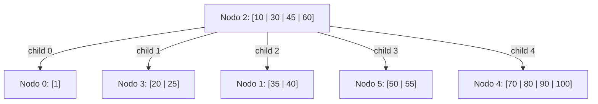

# FOD - Examen de trabajos prácticos - Primera Fecha - 07/06/2022

## 1) Archivos secuenciales

Una red de librerías posee varios puntos de ventas y debe procesar un archivo con las ventas realizadas en sus locales. El archivo recibido tiene el siguiente formato: razón social librería, género literario, nombre del libro, precio y cantidad vendida. El archivo se encuentra ordenado por librería, luego por género y por último por nombre del libro. Escriba un programa (programa principal, estructuras y módulos) que dado el archivo descripto, realice un informe por pantalla con el siguiente formato:

```text
Librería: A
    Género: A
        Nombre de libro: X
        Total vendido libro X __________
        .............
        Nombre de libro: N
        Total vendido libro N __________
    Monto vendido género A __________
    ........
    Género: N
        Nombre de libro: X
        Total vendido libro X __________
        .............
        Nombre de libro: N
        Total vendido libro N __________
    Monto vendido género N __________
    ............
Monto vendido librería A __________
.............
Librería: N
    Género: A
        Nombre de libro: X
        Total vendido libro X __________
        .............
        Nombre de libro: N
        Total vendido libro N __________
    Monto vendido género A __________
    ........
    Género: N
        Nombre de libro: X
        Total vendido libro X __________
        .............
        Nombre de libro: N
        Total vendido libro N __________
    Monto vendido género N __________
    ............
Monto vendido librería N __________
.....
Monto total librerías __________
```

## 2) Árboles en archivos

Dado un árbol B de orden 5 y con política izquierda para la resolución de underflow, para cada operación dada:
a) Dibuje el árbol resultante
b) Explique las decisiones tomadas
c) Escriba las lecturas y escrituras

Operaciones: `-1 +120 -10 -70 -80`

**Árbol Inicial:**



*   **Nodo 2 (Raíz):** Claves `10, 30, 45, 60`. Hijos: `0, 3, 1, 5, 4`.
*   **Nodo 0:** Clave `1`.
*   **Nodo 3:** Claves `20, 25`.
*   **Nodo 1:** Claves `35, 40`.
*   **Nodo 5:** Claves `50, 55`.
*   **Nodo 4:** Claves `70, 80, 90, 100`.

## 3) Archivos directos

Dado el archivo dispersado a continuación, grafique los estados sucesivos para las siguientes operaciones: `+12 +89 -59 -56`.
**NOTA:** indicar lecturas y escrituras en todas las operaciones.
Técnica de resolución de colisiones: saturación progresiva $f(x) = x \pmod{11}$.
Calcular densidad de empaquetamiento.

### Tabla Inicial

| Dirección | Clave | Clave |
| :--- | :--- | :--- |
| **0** | 44 | |
| **1** | 34 | 56 |
| **2** | 57 | |
| **3** | | |
| **4** | 59 | |
| **5** | 60 | |
| **6** | 28 | |
| **7** | 84 | |
| **8** | | |
| **9** | 42 | |
| **10** | 54 | 65 |
