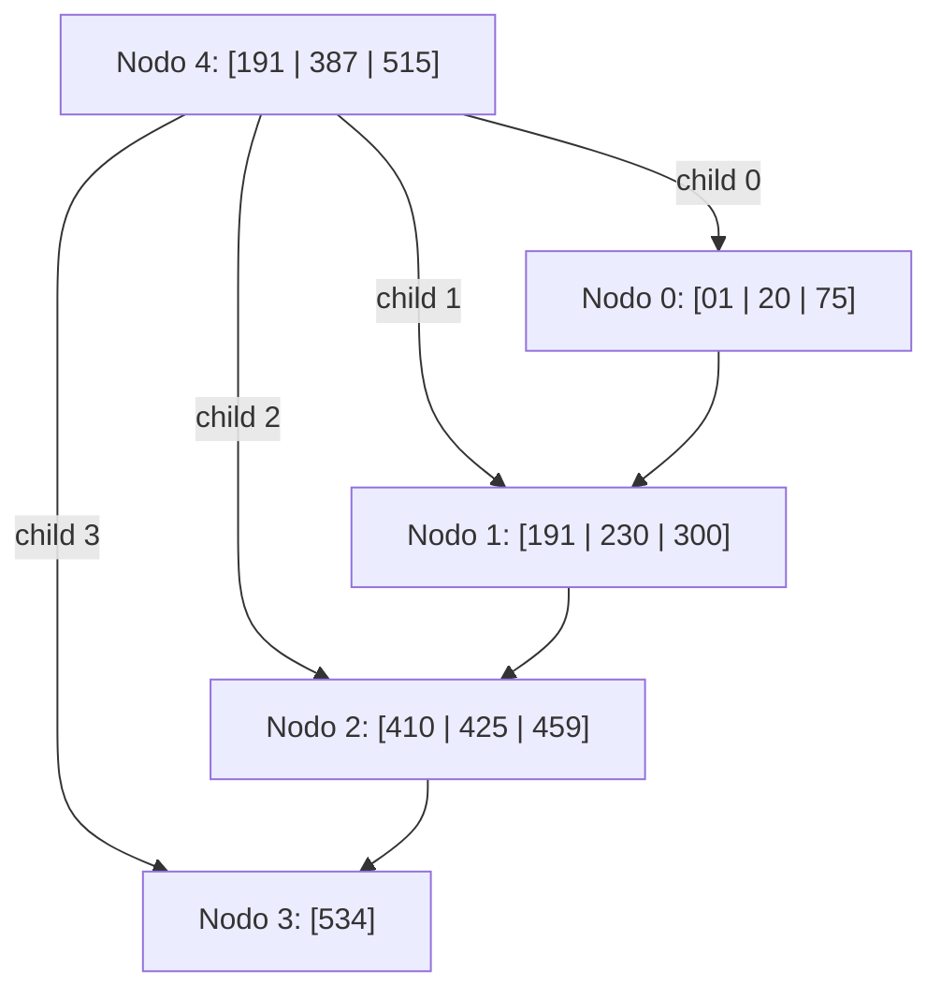

# FOD - Examen de trabajos prácticos - Segunda Fecha - 29/06/2022

## 1) Archivos secuenciales

Se cuenta con un archivo que contiene información de los diferentes municipios de la Provincia de Buenos Aires. De cada municipio se conoce: nombre de municipio (no puede repetirse), descripción, cantidad de habitantes, extensión en mts2 y año de creación.

Este archivo debe ser mantenido realizando bajas lógicas y utilizando la técnica de reutilización de espacio libre llamada **lista invertida con registro cabecera**. Escriba la definición de las estructuras de datos necesarias y los siguientes procedimientos:

* **ExisteMunicipio**: módulo que recibe por parámetro un nombre y devuelve verdadero si el municipio existe en el archivo o falso en caso contrario.
* **AltaMunicipio**: módulo que lee por teclado los datos de un nuevo municipio y lo agrega al archivo reutilizando espacio disponible en caso de que exista. (El control de unicidad lo debe realizar el módulo anterior). En caso de que el municipio que se quiere agregar ya exista se debe informar "ya existe el municipio en el archivo".
* **BajaMunicipio**: módulo que da de baja lógicamente un municipio cuyo nombre se lee por teclado. Para marcar un municipio como borrado se debe utilizar el campo cantidad de habitantes para mantener actualizada la lista invertida. Para verificar que el municipio a borrar exista debe usar el módulo `ExisteMunicipio`. En caso de no existir se debe informar "Municipio no existe".

## 2) Árboles en archivos

Dado un árbol B+ de orden 4 y con política de resolución de underflows a derecha, para cada operación dada:
a. Dibuje el árbol resultante
b. Explique las decisiones tomadas
c. Escriba las lecturas y escrituras en el orden de ocurrencia

Operaciones: `+80 +27 -387 -534`

**Árbol Inicial:**

* **Nodo 4 (Raíz / Índice):** Claves `191, 387, 515`. Hijos: `0, 1, 2, 3`.
* **Nodo 0 (Hoja):** Claves `01, 20, 75`.
* **Nodo 1 (Hoja):** Claves `191, 230, 300`.
* **Nodo 2 (Hoja):** Claves `410, 425, 459`.
* **Nodo 3 (Hoja):** Claves `534` (siguiente link: `-1`).

## 3) Archivos directos

Realice el proceso de dispersión mediante el método de hashing extensible, sabiendo que cada registro tiene capacidad para dos claves. El número natural indica el orden de llegada de las mismas. Deberá explicar los pasos que realiza en cada operación y dibujar los estados sucesivos correspondientes.

### Tabla de Claves

| Nro. | Clave | Valor Binario |
| :--- | :--- | :--- |
| **1** | Aconcagua | 10100111 |
| **2** | Kilimanjaro | 10101010 |
| **3** | Mont Blanc | 00111110 |
| **4** | Cervino | 01101111 |
| **5** | Etna | 0110101 |
| **6** | Chañi | 11110000 |
| **7** | Cho Oyu | 01011101 |
| **8** | Vinicunca | 01011011 |
| **9** | Manaslu | 00110100 |
| **10** | Monte Tai | 11110011 |
