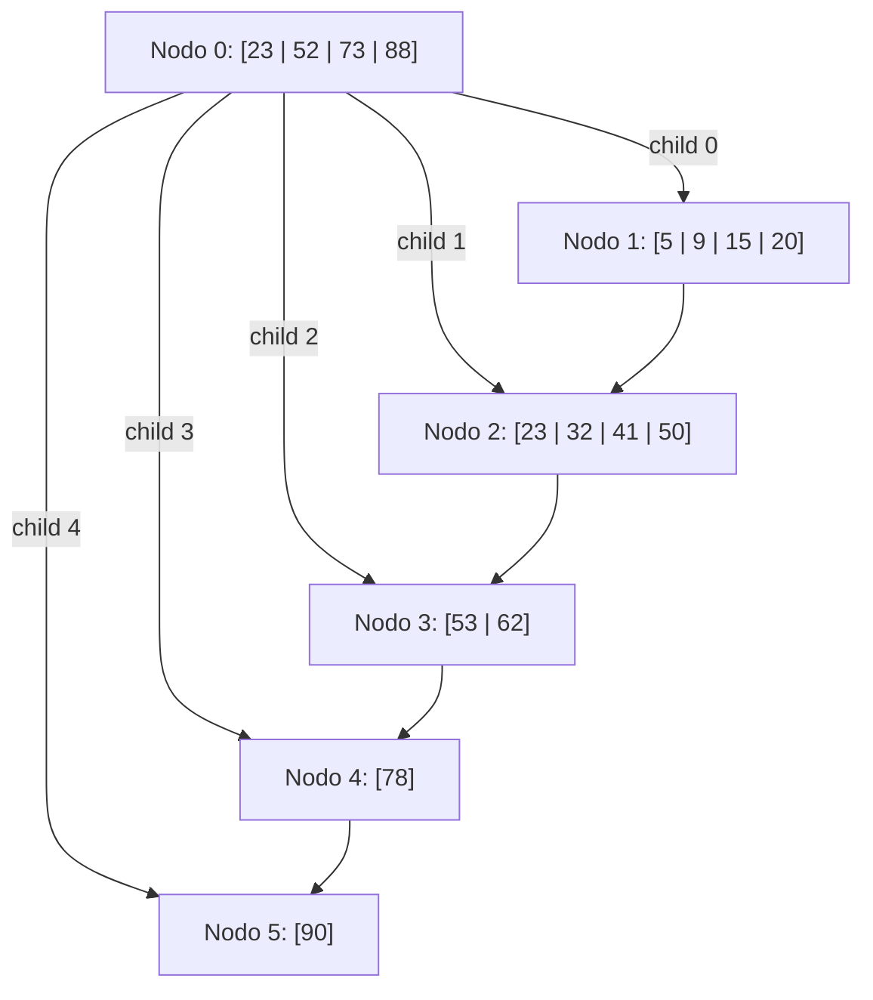

# Examen Práctica CBD / FOD - Primera Fecha - 23/05/2023

## Archivos

Se desea manejar un archivo con información de profesionales de una clínica. Se sabe que el archivo utiliza la técnica de lista invertida para aprovechamiento de espacio. Es decir, las bajas se realizan apilando registros borrados y las altas reutilizando registros borrados. El registro en la posición 0 del archivo se usa como cabecera de la pila de registros borrados.

```pascal
Type
    profesional = Record
        DNI: integer;
        nombre: String;
        apellido: String;
        sueldo: real;
    End;
    tArchivo = File of profesional;
```

**Nota:** El valor 0 en el campo DNI significa que no existen registros borrados, y $-N$ indica que el próximo registro a reutilizar es el $N$, siendo éste un número relativo de registro válido.

Se solicita implementar los siguientes módulos:

* `procedure crear (var arch: tArchivo; var info: TEXT);`
    *(Crear el Archivo Maestro con un archivo de texto que se recibe como parámetro. Asumir que en el programa principal sólo está hecho el `assign` de los archivos. Tenga en cuenta la restricción de lectura de los campos en los archivos de texto).*
* `procedure agregar (var arch: tArchivo; p: profesional);`
    *(Abre el archivo y agrega una persona. La persona se recibe como parámetro y debe utilizar la política descripta anteriormente para recuperación de espacio).*
* `procedure eliminar (var arch: tArchivo; DNI: integer; var bajas: TEXT);`
    *(Abre el archivo y elimina la persona que tiene el DNI que se recibe como parámetro manteniendo la política descripta anteriormente. La persona puede no existir. Si existe, se agrega al archivo de bajas. Tenga en cuenta la restricción de lectura de los campos en los archivos de texto).*

---

## Árboles

Dado el siguiente árbol B+ de orden 5. La raíz se debe mantener en la posición 0 del archivo. Política de Derecha. Realizar las operaciones: `+52 +51 -88 -90`. Indicar el costo de cada operación (Lecturas y Escrituras).

**Estructura del Árbol Inicial:**

* **Nodo 0 (Raíz / Interno):** `4, i, 1 (23) 2 (52) 3 (73) 4 (88) 5`
* **Nodo 1 (Hoja):** `4, h, (5) (9) (15) (20) --> 2`
* **Nodo 2 (Hoja):** `3, h, (23) (32) (41) (50) --> 3`
* **Nodo 3 (Hoja):** `2, h, (53) (62) --> 4`
* **Nodo 4 (Hoja):** `1, h, (78) --> 5`
* **Nodo 5 (Hoja):** `1, h, (90) --> -1`



---

## Hashing

Realice el proceso de dispersión mediante el método de hashing extensible, sabiendo que cada registro tiene capacidad para dos claves. El número natural indica el orden de llegada de las claves. Deberá explicar los pasos que realiza en cada operación y dibujar los estados sucesivos correspondientes. Justifique brevemente.

### Tabla de Claves

| Nro. | Clave | Valor Binario |
| :--- | :--- | :--- |
| **1** | Java | 0100111 |
| **2** | C | 0101010 |
| **3** | Ruby | 1011110 |
| **4** | Haskell | 1001111 |
| **5** | Kotlin | 1010111 |
| **6** | Python | 1110000 |
| **7** | PHP | 1011101 |
| **8** | SQL | 0011011 |
