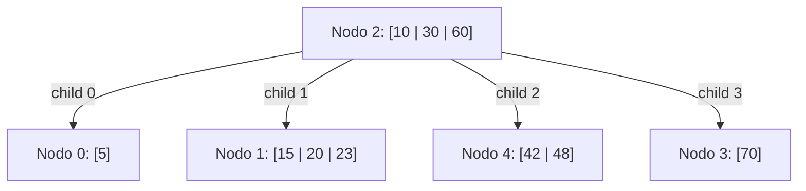

# FOD - Examen de trabajos prácticos - Primera Fecha - 06/06/2023 (Tema 1)

## 1. Archivos Secuenciales

Suponga que tiene un archivo con información referente a los productos que se comercializan en un supermercado. De cada producto se conoce código de producto (único), nombre del producto, descripción, precio de compra, precio de venta y ubicación en depósito.

Se solicita hacer el mantenimiento de este archivo utilizando la técnica de reutilización de espacio llamada **lista invertida**.

Declare las estructuras de datos necesarias e implemente los siguientes módulos:

*   **Agregar producto**: recibe el archivo sin abrir y solicita al usuario que ingrese los datos del producto y lo agrega al archivo sólo si el código ingresado no existe. Suponga que existe una función llamada `existeProducto` que recibe un código de producto y un archivo y devuelve verdadero si el código existe en el archivo o falso en caso contrario. La función `existeProducto` no debe implementarla. Si el producto ya existe debe informarlo en pantalla.
*   **Quitar producto**: recibe el archivo sin abrir y solicita al usuario que ingrese un código y lo elimina del archivo solo si este código existe. Puede utilizar la función `existeProducto`. En caso de que el producto no exista debe informarse en pantalla.

*Nota: Los módulos que debe implementar deberán guardar en memoria secundaria todo cambio que se produzca en el archivo.*

---

## 2. Árboles

Dado un árbol B de orden 4 y con política izquierda para la resolución de underflow, para cada operación dada debe:
a. Dibujar el árbol resultante.
b. Explicar las decisiones tomadas.
c. Indicar las lecturas y escrituras en el orden de ocurrencia.

Las operaciones a realizar son: `+25, -30, -5, -48`.

**Árbol Inicial:**

*   **Nodo 2 (Raíz):** Claves `10, 30, 60`. Hijos: `0, 1, 4, 3`.
*   **Nodo 0:** Clave `5`.
*   **Nodo 1:** Claves `15, 20, 23`.
*   **Nodo 4:** Claves `42, 48`.
*   **Nodo 3:** Clave `70`.

---

## 3. Hashing

Dado el archivo dispersado a continuación, grafique los estados sucesivos para las siguientes operaciones: `+78, +89, -70, -12`. Indique las lecturas y escrituras en cada operación, y calcule la densidad de empaquetamiento después de la última operación.

Técnica de resolución de colisiones: **Saturación progresiva** (cubetas de tamaño 2).
Función de dispersión: $f(x) = x \pmod{11}$.

### Tabla Inicial

| Dirección | Clave | Clave |
| :--- | :--- | :--- |
| **0** | 55 | |
| **1** | 23 | 12 |
| **2** | 46 | |
| **3** | | |
| **4** | 70 | |
| **5** | 60 | |
| **6** | 50 | |
| **7** | 84 | |
| **8** | | |
| **9** | 42 | |
| **10** | 21 | 65 |
