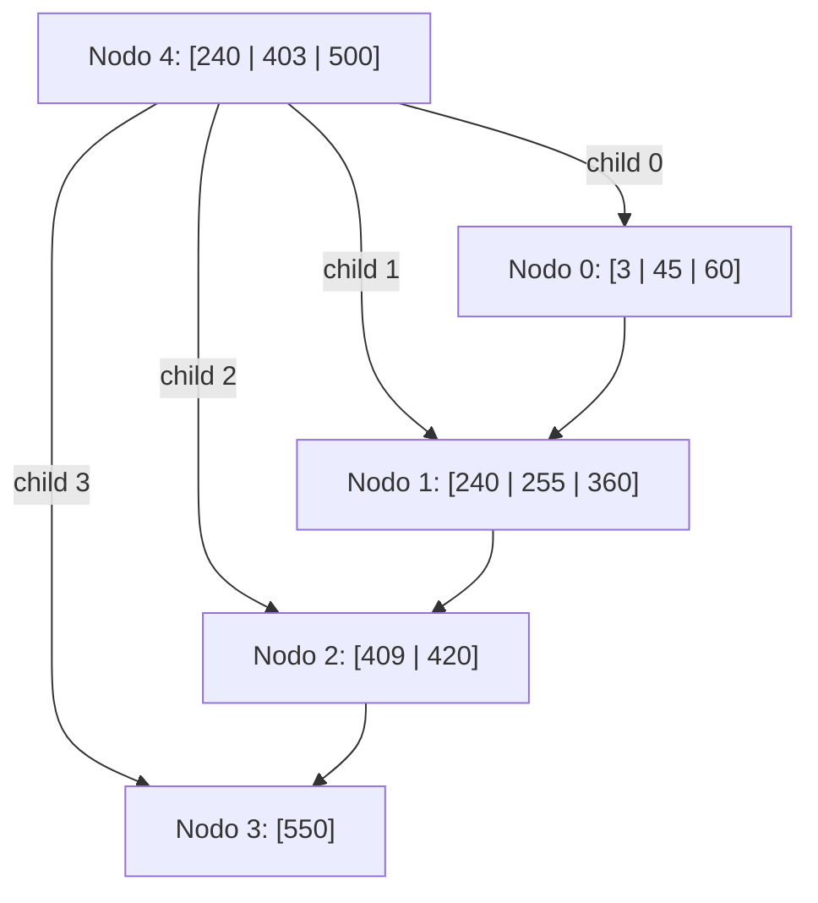

# FOD - Examen de trabajos prácticos - Segunda Fecha - 04/07/2023

## 1. Archivos Secuenciales

Suponga que tiene un archivo con información de los partidos de los últimos años de los equipos de primera división del fútbol Argentino. Dicho archivo contiene: código de equipo, nombre de equipo, año, código de torneo, código de equipo rival, goles a favor, goles en contra, puntos obtenidos (0, 1 o 3 dependiendo de si perdió, ganó o empató el partido). El archivo está ordenado por los siguientes criterios: año, código de torneo y código de equipo.

Se le solicita definir las estructuras de datos necesarias y escribir el módulo que reciba el archivo y genere un informe por pantalla con el siguiente formato de ejemplo:

```text
Informe resumen por equipo del fútbol Argentino
Año 1
    cod_torneo 1
        cod_equipo 1 nombre equipo 1
            cantidad total de goles a favor equipo 1
            cantidad total de goles en contra equipo 1
            diferencia de gol (resta de goles a favor - goles en contra) equipo 1
            cantidad de partidos ganados equipo 1
            cantidad de partidos perdidos equipo 1
            cantidad de partidos empatados equipo 1
            cantidad total de puntos en el torneo equipo 1
        -----------------------------------------
        cod_equipo n nombre equipo n
            idem anterior para equipo n
        El equipo "nombre equipo" fue campeón del torneo codigo de torneo 1 del año 1
        -----------------------------------------
    cod_torneo n
        Idem anterior para cada equipo en el torneo n
        El equipo "nombre equipo" fue campeón del torneo codigo de torneo n del año 1
-----------------------------------------
Año n
    Idem anterior para cada torneo del año n
```

*Nota: se asume que por torneo hay un único equipo campeón con mayor puntaje.*

---

## 2. Árboles

Dado el siguiente árbol B+ de orden 4 y con política de resolución de underflows a derecha, realice las siguientes operaciones indicando lecturas y escrituras en el orden de ocurrencia. Además, debe describir detalladamente lo que sucede en cada operación.

Operaciones: `+58, -403, +260, -550`

**Árbol Inicial:**



* **Nodo 4 (Raíz / Índice):** Claves `240, 403, 500`. Hijos: `0, 1, 2, 3`.
* **Nodo 0 (Hoja):** Claves `3, 45, 60`. Enlace: `1`.
* **Nodo 1 (Hoja):** Claves `240, 255, 360`. Enlace: `2`.
* **Nodo 2 (Hoja):** Claves `409, 420`. Enlace: `3`.
* **Nodo 3 (Hoja):** Clave `550`. Enlace: `-1`.

---

## 3. Hashing

Dado el archivo dispersado a continuación, grafique los estados sucesivos para las siguientes operaciones: `+90, +46, +82, -90`. La técnica de resolución de colisiones a emplear es **saturación progresiva encadenada** (coalesced hashing / encadenamiento). Además, indique las lecturas y escrituras necesarias en cada operación. Finalmente, después de todas las operaciones, indicar la densidad de empaquetamiento.

La función de dispersión a utilizar es $f(x) = x \pmod{11}$.

### Tabla Inicial

| Dir | Enlace | Clave |
| :--- | :--- | :--- |
| **0** | -1 | |
| **1** | -1 | 12 |
| **2** | 8 | 24 |
| **3** | -1 | |
| **4** | -1 | 59 |
| **5** | -1 | |
| **6** | -1 | 17 |
| **7** | -1 | 73 |
| **8** | -1 | 57 |
| **9** | -1 | |
| **10** | -1 | |
