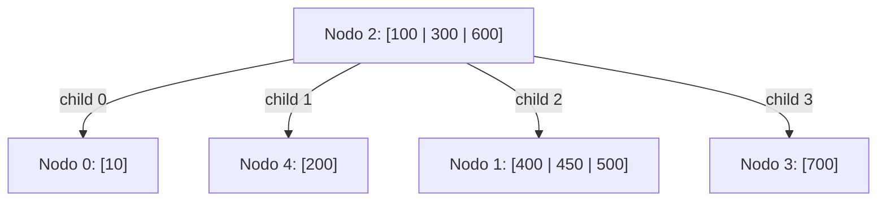

# FOD - Examen de trabajos prácticos - Tercera Fecha - 08/08/2023

## 1. Archivos Secuenciales

Una empresa dedicada a la venta de golosinas posee un archivo que contiene información sobre los productos que tiene a la venta. De cada producto se registran los siguientes datos: código de producto, nombre comercial, precio de venta, stock actual y stock mínimo.

La empresa cuenta con 20 sucursales. Diariamente, se recibe un archivo detalle de cada una de las 20 sucursales de la empresa que indica las ventas diarias efectuadas por cada sucursal. De cada venta se registra código de producto y cantidad vendida.

Se debe realizar un procedimiento que actualice el stock en el archivo maestro con la información disponible en los archivos detalles y que además informe en un archivo de texto aquellos productos cuyo monto total vendido en el día supere los $10.000. En el archivo de texto a exportar, por cada producto incluido, se deben informar todos sus datos. Los datos de un producto se deben organizar en el archivo de texto para facilitar el uso eventual del mismo como un archivo de carga. El objetivo del ejercicio es escribir el procedimiento solicitado, junto con las estructuras de datos y módulos usados en el mismo.

**Notas:**
*   Todos los archivos se encuentran ordenados por código de producto.
*   En un archivo detalles pueden haber 0, 1 o N registros de un producto determinado.
*   Cada archivo detalle solo contiene productos que seguro existen en el archivo maestro.
*   Los archivos se recorren una sola vez. En el mismo recorrido, se debe realizar la actualización del archivo maestro con los archivos detalles, así como la generación del archivo de texto solicitado.

---

## 2. Árboles

Dado el siguiente árbol B de orden 4 y con política de resolución de underflows derecha o izquierda, realice las siguientes operaciones indicando lecturas y escrituras en el orden de ocurrencia. Además, debe describir detalladamente lo que sucede en cada operación.

Operaciones: `+410, -200, -500, -100`

**Árbol Inicial:**

*   **Nodo 2 (Raíz):** Claves `100, 300, 600`. Hijos: `0, 4, 1, 3`.
*   **Nodo 0:** Clave `10`.
*   **Nodo 4:** Clave `200`.
*   **Nodo 1:** Claves `400, 450, 500`.
*   **Nodo 3:** Clave `700`.

---

## 3. Hashing

Dado el archivo dispersado a continuación, grafique los estados sucesivos para las siguientes operaciones: `+47, +63, +23, -23, -12`.
**NOTA:** indicar lecturas y escrituras necesarias para cada operación.

Técnicas de resolución de colisiones: **Dispersión Doble** (Double Hashing).
Funciones de dispersión:
*   $f_1(x) = x \pmod{11}$
*   $f_2(x) = (x \pmod{7}) + 1$

### Tabla Inicial

| Dirección | Clave |
| :--- | :--- |
| **0** | |
| **1** | 12 |
| **2** | |
| **3** | 36 |
| **4** | 37 |
| **5** | |
| **6** | 72 |
| **7** | |
| **8** | 41 |
| **9** | |
| **10** | |
