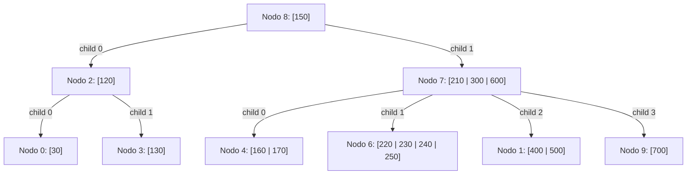

# FOD - Examen de trabajos prácticos - Segunda Fecha - 24/06/2024

## 1 - Archivos Secuenciales

Se desea automatizar el manejo de información referente a los casos positivos de dengue para la Provincia de Buenos Aires. Para esto se cuenta con un archivo maestro que contiene la siguiente información: código de municipio, nombre municipio y cantidad de casos positivos. Dicho archivo está ordenado por código de municipio.

Todos los meses se reciben 30 archivos que contienen la siguiente información: código de municipio y cantidad de casos positivos. El orden de cada archivo detalle es por código de municipio. En cada archivo puede venir información de cualquier municipio, y municipio puede aparecer cero o más de una vez en cada archivo.

Realice el sistema completo que permita la actualización de la información del archivo maestro a partir de los archivos detalle recalculando la cantidad de casos positivos e informando por pantalla aquellos municipios (código y nombre) donde la cantidad total de casos positivos es mayor a 15.

**Nota:** cada archivo debe recorrerse una única vez.
**Nota 1:** Los nombres de los archivos deben pedirse por teclado. Se puede suponer que los nombres ingresados corresponden a archivos existentes.
**Nota 2:** El informe debe incluir cualquier municipio que cumpla la condición, independientemente de si se actualiza o no.

---

## 2 - Árboles

Considere un árbol B de orden 5 que representa un índice primario a un archivo de datos que contiene información de los clientes de un supermercado. Dicho índice proporciona acceso indizado por el número de cliente. A continuación se presenta el estado del árbol B en un momento determinado:

**Árbol Inicial:**

*   **Nodo 8 (Raíz):** Clave `150`. Hijos: `2, 7`.
*   **Nodo 2:** Clave `120`. Hijos: `0, 3`.
*   **Nodo 7:** Claves `210, 300, 600`. Hijos: `4, 6, 1, 9`.
*   **Nodo 0 (Hoja):** Clave `30`.
*   **Nodo 3 (Hoja):** Clave `130`.
*   **Nodo 4 (Hoja):** Claves `160, 170`.
*   **Nodo 6 (Hoja):** Claves `220, 230, 240, 250`.
*   **Nodo 1 (Hoja):** Claves `400, 500`.
*   **Nodo 9 (Hoja):** Clave `700`.

### Resuelva los siguientes incisos:

a) Definir en Pascal los tipos necesarios para definir la estructura de un árbol B (índice) con las características indicadas.

b) Realizar el alta de la clave 280 sobre el árbol B dado. Graficar el árbol B resultante. Indicar los nodos leídos y escritos. Explicar las decisiones tomadas para resolver la operación.

c) Realizar la baja de la clave 120 sobre el árbol B resultante del punto b, considerando política derecha para la resolución de underflows. Graficar el árbol B resultante. Indicar los nodos leídos y escritos. Explicar las decisiones tomadas para resolver la operación.
