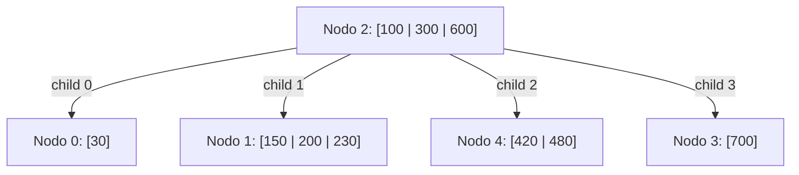

# FOD - Examen de trabajos prácticos - Primera Fecha - 10/06/2025

## 1. Archivos Secuenciales

Una plataforma digital organiza cada año una serie de eventos de sesiones musicales en vivo. Cada evento cuenta con múltiples presentaciones realizadas en distintas fechas, y un mismo artista puede participar varias veces en el mismo evento un mismo año.

Se dispone de un archivo que contiene la información de cada presentación individual. Cada registro indica: el código del artista, el nombre del artista, el año en el que se realizó la presentación, el código del evento, el nombre del evento, la cantidad de "likes" recibidos durante esa presentación, la cantidad de "dislikes" recibidos, y el puntaje otorgado por el jurado técnico a dicha presentación. El archivo está ordenado por año, luego por código de evento, y finalmente por código de artista.

Se solicita definir las estructuras de datos necesarias y escribir el módulo que reciba el archivo y genere un informe por pantalla con el siguiente formato de ejemplo:

```text
Resumen de menor influencia por evento.
Año: 2022
  Evento: nombreEvento1 (Código: codigoEvento1)
    Artista: nombreArtista1 (Código: codigoArtista1)
      Likes totales: total likes artista 1
      Dislikes totales: total dislikes artista 1
      Diferencia: diferencia (likes totales - dislikes totales) de artista 1
      Puntaje total del jurado: puntaje total obtenido por el artista 1
    ...
    Artista: nombreArtistaN (Código: codigoArtistaN)
      idem anterior para artista N
    El artista "nomArtistaMenosInfluyente" fue el menos influyente de nombreEvento1 del año 2022.
  ...
  Evento: nombreEventoN (Código: codigoEventoN)
    idem anterior para cada artista en el evento N
  Durante el año 2022 se registraron "nroPresentaciones" de presentaciones de artistas.
Año: N
  idem anterior para cada evento del año N
  Durante el año N se registraron "nroPresentaciones" de presentaciones de artistas.
El promedio total de presentaciones por año es de: "promedioPresentacionesPorAño" presentaciones.
```

**Nota:** El artista menos influyente del evento es aquel con menor puntaje total del jurado acumulado. En caso de empate, se debe elegir al que haya recibido más dislikes, independientemente de la diferencia. En caso de que haya empate nuevamente, elegir cualquiera de los que tiene el menor puntaje total del jurado y la mayor cantidad de dislikes.

---

## 2 - Árboles B / Hashing

Dado un árbol B de orden 4 y con política izquierda para la resolución de underflow, para cada operación dada debe:
a. Dibujar el árbol resultante.
b. Explicar las decisiones tomadas.
c. Indicar las lecturas y escrituras en el orden de ocurrencia.

Las operaciones a realizar son: `+240, -300, -30, -700`.

**Árbol Inicial:**



*   **Nodo 2 (Raíz):** Claves `100, 300, 600`. Hijos: `0, 1, 4, 3`.
*   **Nodo 0:** Clave `30`.
*   **Nodo 1:** Claves `150, 200, 230`.
*   **Nodo 4:** Claves `420, 480`.
*   **Nodo 3:** Clave `700`.
