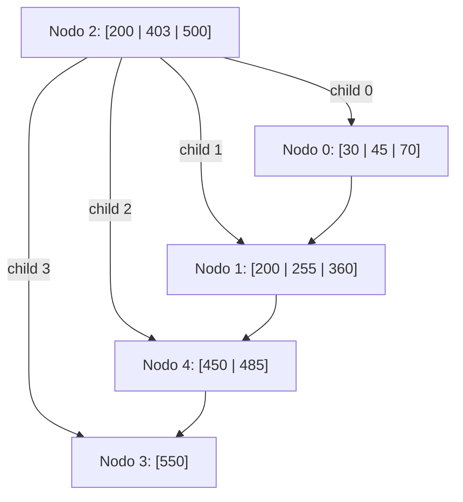

# FOD - Examen de trabajos prácticos - Tercera Fecha - 15/07/2025

## 1. Archivos Secuenciales

Se cuenta con un archivo con información de las diferentes mascotas que están registradas en una veterinaria. De cada mascota se conoce: código, nombre, especie, edad, nombre del dueño y teléfono de contacto. El código de mascota no puede repetirse.

Este archivo debe ser mantenido realizando bajas lógicas y utilizando la técnica de reutilización de espacio libre mediante una **lista invertida con registro cabecera**. (Si el campo código en el registro cabecera es cero, significa que no hay espacio disponible para reutilizar).

Se pide escribir la definición de las estructuras de datos necesarias y los siguientes procedimientos:

* **ExisteMascota**: Módulo que, dado un código de mascota, devuelve la posición (NRR) en el archivo donde se encuentra la mascota con el código especificado (en caso de que exista). Si no existe una mascota con ese código, el módulo debe devolver el valor cero.
* **AltaMascota**: Módulo que lee por teclado los datos de una nueva mascota y la agrega al archivo, reutilizando espacio disponible en caso de que hubiera. Si la mascota que se desea agregar ya existe en el archivo (mismo código), se debe informar por pantalla que ya existe la mascota registrada (el control de unicidad debe realizarse utilizando el módulo `ExisteMascota`).
* **BajaMascota**: Módulo que da de baja lógicamente una mascota, cuyo código se lee por teclado. Para marcar una mascota como borrada se debe utilizar el campo código, manteniendo actualizada la lista invertida. Para buscar la mascota a borrar y verificar que exista se debe utilizar el módulo `ExisteMascota`. Si no existe, se debe informar por pantalla: "Mascota no registrada".

---

## 2 - Árboles/Hashing

Dado el siguiente árbol B+ de orden 4 y con política de resolución de underflows a derecha, realice las siguientes operaciones indicando lecturas y escrituras en el orden de ocurrencia. Además, debe describir detalladamente lo que sucede en cada operación.

Operaciones: `+220, -500, -550, -450`

**Árbol Inicial:**

* **Nodo 2 (Raíz / Índice):** Claves `200, 403, 500`. Hijos: `0, 1, 4, 3`.
* **Nodo 0 (Hoja):** Claves `30, 45, 70`. Enlace: `1`.
* **Nodo 1 (Hoja):** Claves `200, 255, 360`. Enlace: `4`.
* **Nodo 4 (Hoja):** Claves `450, 485`. Enlace: `3`.
* **Nodo 3 (Hoja):** Clave `550`. Enlace: `-1`.
