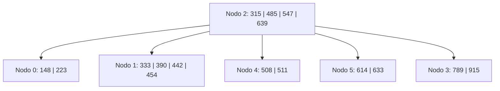
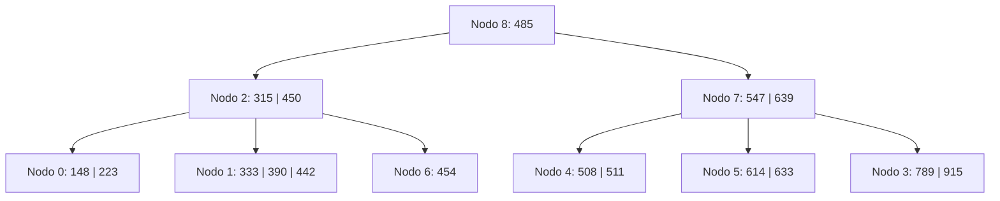
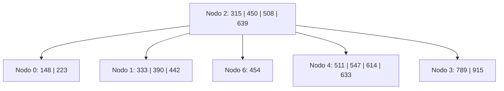
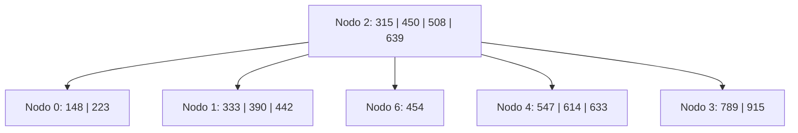
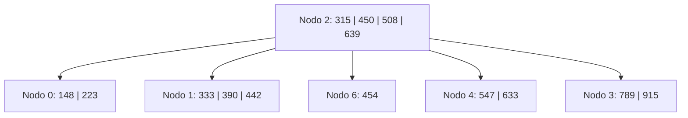

# Ejercicio 10 - Árbol B Orden 5 (Política Underflow: Derecha)

## Estado Inicial

```
Nodo 2: 4 i 0(315)1(485)4(547)5(639)3
Nodo 0: 2 h (148)(223)
Nodo 1: 4 h (333)(390)(442)(454)
Nodo 4: 2 h (508)(511)
Nodo 5: 2 h (614)(633)
Nodo 3: 2 h (789)(915)
```

**Parámetros del orden 5:**

- Máximo de claves por nodo: 4
- Mínimo de claves por nodo (excepto raíz): 2 = ⌈5/2⌉ − 1
- Al hacer split de 5 claves: se promueve la clave de la posición 3 (el medio)



---

## Operación: +450

**Justificación:**

1. Buscar dónde insertar 450: raíz (nodo 2) → 450 > 315, 450 < 485 → bajar a **nodo 1**.
2. Nodo 1: [333, 390, 442, 454]. Insertar 450 → [333, 390, 442, 450, 454] = **5 claves → OVERFLOW**.
3. Orden 5 impar → promover posición 3 = **450**.
   - Nodo 1 queda: [333, 390, 442]
   - Se crea **nodo 6**: [454]
   - 450 sube al padre (nodo 2).
4. Nodo 2 recibe 450: 0(315)1(450)6(485)4(547)5(639)3 → [315, 450, 485, 547, 639] = **5 claves → OVERFLOW**.
5. Orden 5 impar → promover posición 3 = **485**.
   - Nodo 2 queda: [315, 450] con hijos [0, 1, 6]
   - Se crea **nodo 7**: [547, 639] con hijos [4, 5, 3]
   - 485 sube → nodo 2 era raíz → se crea **nueva raíz**.
6. Se crea **nodo 8** (nueva raíz): [485] con hijos [2, 7].

**L/E:** `L2, L1, E1, E6, E2, E7, E8`

**Árbol resultante:**

```
Nodo 8: 1 i 2(485)7
Nodo 2: 2 i 0(315)1(450)6
Nodo 7: 2 i 4(547)5(639)3
Nodo 0: 2 h (148)(223)
Nodo 1: 3 h (333)(390)(442)
Nodo 6: 1 h (454)
Nodo 4: 2 h (508)(511)
Nodo 5: 2 h (614)(633)
Nodo 3: 2 h (789)(915)
```



---

## Operación: -485

**Justificación:**

1. Buscar 485: está en **nodo 8** (raíz), que es un nodo **interno**.
2. Para borrar de un nodo interno: reemplazar con el **sucesor** (mínimo del subárbol derecho de 485).
   - Subárbol derecho = nodo 7 → hijo más izquierdo = nodo 4 → primer elemento = **508**.
3. Reemplazar 485 → **508** en nodo 8. Eliminar 508 de **nodo 4**.
4. Nodo 4: [508, 511] → quita 508 → [511] = **1 clave → UNDERFLOW** (mínimo = 2).
5. **Política DERECHA.** Hermano derecho de nodo 4 = **nodo 5** (separador 547 en nodo 7). Nodo 5: [614, 633] = 2 claves = mínimo → **no puede donar**.
6. → **FUSIONAR** nodo 4 con nodo 5: [511] + **547** (separador) + [614, 633] = [511, 547, 614, 633] → 4 claves → en **nodo 4**. **Nodo 5 se libera**.
7. Nodo 7 pierde clave 547 y puntero a nodo 5 → nodo 7: [639] con hijos [4, 3] = **1 clave → UNDERFLOW**.
8. Padre = nodo 8: [508] con hijos [2, 7]. **Política DERECHA.** Nodo 7 es el hijo más derecho → **sin hermano derecho** → caso especial: usar hermano izquierdo.
9. Hermano izquierdo de nodo 7 = **nodo 2** (separador 508 en nodo 8). Nodo 2: [315, 450] = 2 claves = mínimo → **no puede donar**.
10. → **FUSIONAR** nodo 2 con nodo 7: [315, 450] + **508** (separador) + [639] con hijos [0, 1, 6, 4, 3] = [315, 450, 508, 639] → 4 claves → en **nodo 2**. **Nodo 7 se libera**.
11. Raíz (nodo 8) pierde clave 508 y puntero a nodo 7 → nodo 8 queda vacío → **raíz colapsa**.
12. La nueva raíz es **nodo 2**. **Nodo 8 se libera**.
13. Lista de libres (LIFO): [8, 7, 5].

**L/E:** `L8, L7, L4, E8, E4, L5, E4, L2, E2`

**Árbol resultante:**

```
Nodo 2: 4 i 0(315)1(450)6(508)4(639)3
Nodo 0: 2 h (148)(223)
Nodo 1: 3 h (333)(390)(442)
Nodo 6: 1 h (454)
Nodo 4: 4 h (511)(547)(614)(633)
Nodo 3: 2 h (789)(915)
Nodos libres (LIFO): 8, 7, 5
```



---

## Operación: -511

**Justificación:**

1. Buscar 511: raíz (nodo 2) → 511 > 508, 511 < 639 → bajar al hijo entre 508 y 639 = **nodo 4**.
2. 511 está en **nodo 4** (hoja): [511, 547, 614, 633]. Eliminar → [547, 614, 633] = **3 claves → OK** (mínimo = 2).
3. No hay underflow.

**L/E:** `L2, L4, E4`

**Árbol resultante:**

```
Nodo 2: 4 i 0(315)1(450)6(508)4(639)3
Nodo 0: 2 h (148)(223)
Nodo 1: 3 h (333)(390)(442)
Nodo 6: 1 h (454)
Nodo 4: 3 h (547)(614)(633)
Nodo 3: 2 h (789)(915)
```



---

## Operación: -614

**Justificación:**

1. Buscar 614: raíz (nodo 2) → 614 > 508, 614 < 639 → bajar al hijo entre 508 y 639 = **nodo 4**.
2. 614 está en **nodo 4** (hoja): [547, 614, 633]. Eliminar → [547, 633] = **2 claves → OK** (mínimo = 2).
3. No hay underflow.

**L/E:** `L2, L4, E4`

**Árbol final:**

```
Nodo 2: 4 i 0(315)1(450)6(508)4(639)3
Nodo 0: 2 h (148)(223)
Nodo 1: 3 h (333)(390)(442)
Nodo 6: 1 h (454)
Nodo 4: 2 h (547)(633)
Nodo 3: 2 h (789)(915)
```


