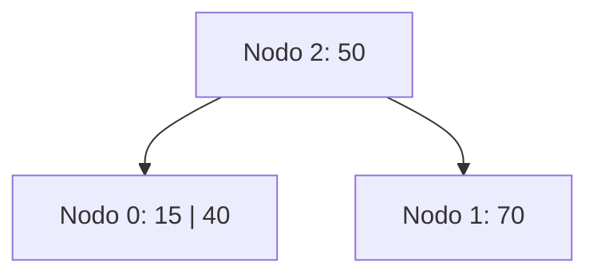
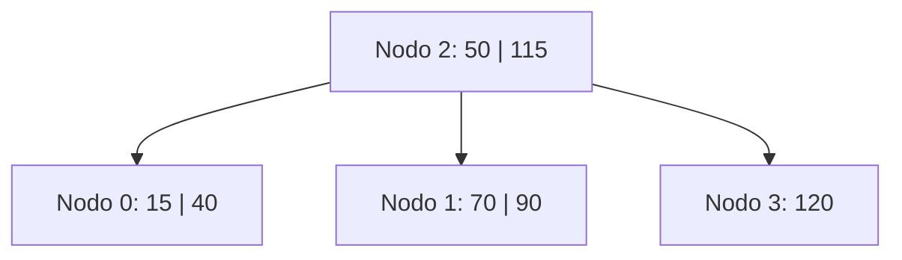
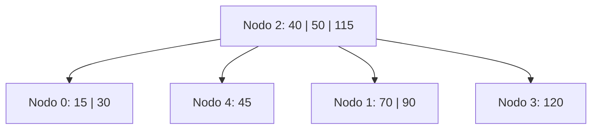
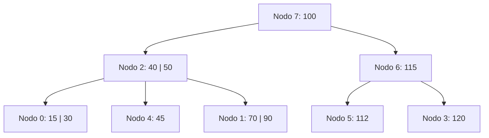
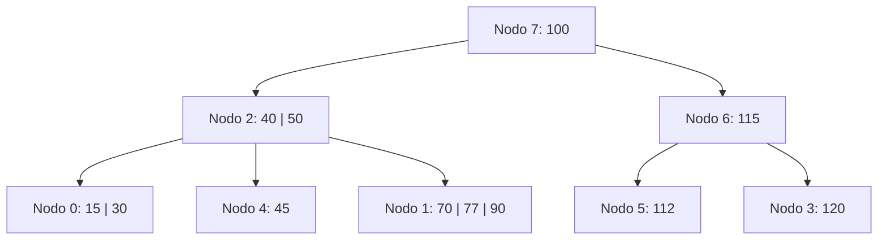
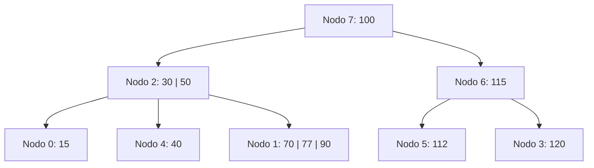
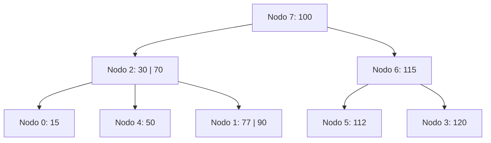
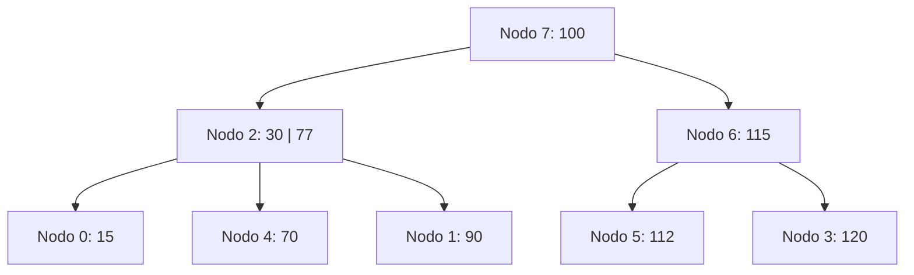
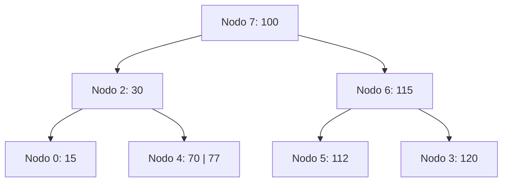
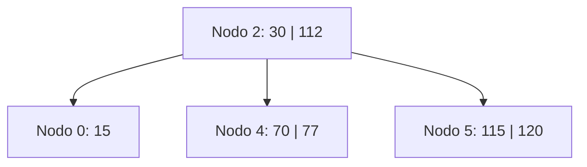

# Ejercicio 11 - Árbol B Orden 4 - Construcción Paso a Paso (Política Underflow: Izquierda o Derecha)

## Parámetros del orden 4

- Máximo de claves por nodo: 3
- Mínimo de claves por nodo (excepto raíz): 1 = ⌈4/2⌉ − 1
- Al hacer split de 4 claves: [a, b, c, d] → izquierda [a, b], promover **c**, derecha [d]
- **Política underflow:** primero se intenta redistribuir con hermano izquierdo; si no puede, con el hermano derecho; si tampoco puede, se fusiona con el hermano izquierdo.
- **Casos especiales:** si un nodo es extremo del árbol (no tiene hermano en la dirección preferida), se usa el hermano que posea.

---

## Inserciones

### +50

**Justificación:** Árbol vacío → crear primer nodo (nodo 0) con [50].

**L/E:** `E0`

```
Nodo 0: 1 h (50)
```

---

### +70

**Justificación:** Insertar 70 en nodo 0: [50, 70] = 2 claves. OK.

**L/E:** `L0, E0`

```
Nodo 0: 2 h (50)(70)
```

---

### +40

**Justificación:** Insertar 40 en nodo 0: [40, 50, 70] = 3 claves = máximo. OK.

**L/E:** `L0, E0`

```
Nodo 0: 3 h (40)(50)(70)
```

---

### +15 → **OVERFLOW**

**Justificación:**

1. Insertar 15 en nodo 0: [15, 40, 50, 70] = 4 claves → **OVERFLOW**.
2. Orden 4 par → dividir: [15, 40] | promover **50** | [70].
   - Nodo 0 queda: [15, 40]
   - Se crea **nodo 1**: [70]
   - 50 sube → nodo 0 era raíz → se crea **nueva raíz**.
3. Se crea **nodo 2** (nueva raíz): [50] con hijos [0, 1].

**L/E:** `L0, E0, E1, E2`

**Árbol:**

```
Nodo 2: 1 i 0(50)1
Nodo 0: 2 h (15)(40)
Nodo 1: 1 h (70)
```



---

### +90

**Justificación:** 90 > 50 → nodo 1: [70, 90] = 2 claves. OK.

**L/E:** `L2, L1, E1`

```
Nodo 2: 1 i 0(50)1
Nodo 0: 2 h (15)(40)
Nodo 1: 2 h (70)(90)
```

---

### +120

**Justificación:** 120 > 50 → nodo 1: [70, 90, 120] = 3 claves = máximo. OK.

**L/E:** `L2, L1, E1`

```
Nodo 2: 1 i 0(50)1
Nodo 0: 2 h (15)(40)
Nodo 1: 3 h (70)(90)(120)
```

---

### +115 → **OVERFLOW**

**Justificación:**

1. 115 > 50 → nodo 1: [70, 90, 115, 120] = 4 claves → **OVERFLOW**.
2. Dividir: [70, 90] | promover **115** | [120].
   - Nodo 1 queda: [70, 90]
   - Se crea **nodo 3**: [120]
   - 115 sube al padre (nodo 2).
3. Nodo 2 recibe 115: 0(50)1(115)3 → [50, 115] = 2 claves. OK.

**L/E:** `L2, L1, E1, E3, E2`

**Árbol:**

```
Nodo 2: 2 i 0(50)1(115)3
Nodo 0: 2 h (15)(40)
Nodo 1: 2 h (70)(90)
Nodo 3: 1 h (120)
```



---

### +45

**Justificación:** 45 < 50 → nodo 0: [15, 40, 45] = 3 claves = máximo. OK.

**L/E:** `L2, L0, E0`

```
Nodo 2: 2 i 0(50)1(115)3
Nodo 0: 3 h (15)(40)(45)
Nodo 1: 2 h (70)(90)
Nodo 3: 1 h (120)
```

---

### +30 → **OVERFLOW**

**Justificación:**

1. 30 < 50 → nodo 0: [15, 30, 40, 45] = 4 claves → **OVERFLOW**.
2. Dividir: [15, 30] | promover **40** | [45].
   - Nodo 0 queda: [15, 30]
   - Se crea **nodo 4**: [45]
   - 40 sube al padre (nodo 2).
3. Nodo 2 recibe 40: 0(40)4(50)1(115)3 → [40, 50, 115] = 3 claves = máximo. OK.

**L/E:** `L2, L0, E0, E4, E2`

**Árbol:**

```
Nodo 2: 3 i 0(40)4(50)1(115)3
Nodo 0: 2 h (15)(30)
Nodo 4: 1 h (45)
Nodo 1: 2 h (70)(90)
Nodo 3: 1 h (120)
```



---

### +100

**Justificación:** 100 > 50, 100 < 115 → nodo 1: [70, 90, 100] = 3 claves = máximo. OK.

**L/E:** `L2, L1, E1`

```
Nodo 2: 3 i 0(40)4(50)1(115)3
Nodo 0: 2 h (15)(30)
Nodo 4: 1 h (45)
Nodo 1: 3 h (70)(90)(100)
Nodo 3: 1 h (120)
```

---

### +112 → **OVERFLOW en cadena**

**Justificación:**

1. 112 > 50, 112 < 115 → nodo 1: [70, 90, 100, 112] = 4 claves → **OVERFLOW**.
2. Dividir: [70, 90] | promover **100** | [112].
   - Nodo 1 queda: [70, 90]
   - Se crea **nodo 5**: [112]
   - 100 sube al padre (nodo 2).
3. Nodo 2 recibe 100: 0(40)4(50)1(100)5(115)3 → [40, 50, 100, 115] = 4 claves → **OVERFLOW**.
4. Dividir la raíz: [40, 50] | promover **100** | [115].
   - Nodo 2 queda: [40, 50] con hijos [0, 4, 1]
   - Se crea **nodo 6**: [115] con hijos [5, 3]
   - 100 sube → nodo 2 era raíz → se crea **nueva raíz**.
5. Se crea **nodo 7** (nueva raíz): [100] con hijos [2, 6].

**L/E:** `L2, L1, E1, E5, E2, E6, E7`

**Árbol:**

```
Nodo 7: 1 i 2(100)6
Nodo 2: 2 i 0(40)4(50)1
Nodo 6: 1 i 5(115)3
Nodo 0: 2 h (15)(30)
Nodo 4: 1 h (45)
Nodo 1: 2 h (70)(90)
Nodo 5: 1 h (112)
Nodo 3: 1 h (120)
```



---

### +77

**Justificación:** 77 < 100 → nodo 2 → 77 > 50 → nodo 1: [70, 77, 90] = 3 claves = máximo. OK.

**L/E:** `L7, L2, L1, E1`

**Árbol (estado antes de las bajas):**

```
Nodo 7: 1 i 2(100)6
Nodo 2: 2 i 0(40)4(50)1
Nodo 6: 1 i 5(115)3
Nodo 0: 2 h (15)(30)
Nodo 4: 1 h (45)
Nodo 1: 3 h (70)(77)(90)
Nodo 5: 1 h (112)
Nodo 3: 1 h (120)
```



---

## Bajas (Eliminaciones)

### -45 → **UNDERFLOW + REDISTRIBUCIÓN**

**Justificación:**

1. Buscar 45: raíz (nodo 7) → nodo 2 → 45 > 40, 45 < 50 → **nodo 4**: [45]. Eliminar → [] = **0 claves → UNDERFLOW** (mínimo = 1).
2. **Política IZQ-DER.** Hermano izquierdo de nodo 4 = **nodo 0** (separador 40 en nodo 2). Nodo 0: [15, 30] = 2 claves > mínimo → **puede donar**.
3. → **REDISTRIBUIR** con hermano izquierdo:
   - El separador (40) baja del padre (nodo 2) a nodo 4: nodo 4 → [40]
   - El máximo del hermano izquierdo (30) sube al padre como nuevo separador.
   - Nodo 0: pierde 30 → [15]
   - Nodo 2: separador queda como 30.

**L/E:** `L7, L2, L4, L0, E4, E0, E2`

**Árbol resultante:**

```
Nodo 7: 1 i 2(100)6
Nodo 2: 2 i 0(30)4(50)1
Nodo 6: 1 i 5(115)3
Nodo 0: 1 h (15)
Nodo 4: 1 h (40)
Nodo 1: 3 h (70)(77)(90)
Nodo 5: 1 h (112)
Nodo 3: 1 h (120)
```



---

### -40 → **UNDERFLOW + REDISTRIBUCIÓN (con derecho)**

**Justificación:**

1. Buscar 40: raíz (nodo 7) → nodo 2 → 40 > 30, 40 < 50 → **nodo 4**: [40]. Eliminar → [] = **0 claves → UNDERFLOW**.
2. **Política IZQ-DER.** Hermano izquierdo = **nodo 0** (sep 30). Nodo 0: [15] = 1 clave = mínimo → **no puede donar**.
3. Intentar con hermano derecho = **nodo 1** (sep 50). Nodo 1: [70, 77, 90] = 3 claves > mínimo → **puede donar**.
4. → **REDISTRIBUIR** con hermano derecho:
   - El separador (50) baja del padre (nodo 2) a nodo 4: nodo 4 → [50]
   - El mínimo del hermano derecho (70) sube al padre como nuevo separador.
   - Nodo 1: pierde 70 → [77, 90]
   - Nodo 2: separador queda como 70.

**L/E:** `L7, L2, L4, L0, L1, E4, E1, E2`

**Árbol resultante:**

```
Nodo 7: 1 i 2(100)6
Nodo 2: 2 i 0(30)4(70)1
Nodo 6: 1 i 5(115)3
Nodo 0: 1 h (15)
Nodo 4: 1 h (50)
Nodo 1: 2 h (77)(90)
Nodo 5: 1 h (112)
Nodo 3: 1 h (120)
```



---

### -50 → **UNDERFLOW + REDISTRIBUCIÓN (con derecho)**

**Justificación:**

1. Buscar 50: raíz (nodo 7) → nodo 2 → 50 > 30, 50 < 70 → **nodo 4**: [50]. Eliminar → [] = **0 claves → UNDERFLOW**.
2. **Política IZQ-DER.** Hermano izquierdo = **nodo 0** (sep 30). Nodo 0: [15] = 1 = mínimo → **no puede donar**.
3. Hermano derecho = **nodo 1** (sep 70). Nodo 1: [77, 90] = 2 claves > mínimo → **puede donar**.
4. → **REDISTRIBUIR** con hermano derecho:
   - El separador (70) baja al nodo 4: nodo 4 → [70]
   - El mínimo del hermano derecho (77) sube al padre.
   - Nodo 1: [90]
   - Nodo 2: separador queda como 77.

**L/E:** `L7, L2, L4, L0, L1, E4, E1, E2`

**Árbol resultante:**

```
Nodo 7: 1 i 2(100)6
Nodo 2: 2 i 0(30)4(77)1
Nodo 6: 1 i 5(115)3
Nodo 0: 1 h (15)
Nodo 4: 1 h (70)
Nodo 1: 1 h (90)
Nodo 5: 1 h (112)
Nodo 3: 1 h (120)
```



---

### -90 → **UNDERFLOW + FUSIÓN**

**Justificación:**

1. Buscar 90: raíz (nodo 7) → nodo 2 → 90 > 77 → **nodo 1**: [90]. Eliminar → [] = **0 claves → UNDERFLOW**.
2. **Política IZQ-DER.** Hermano izquierdo = **nodo 4** (sep 77). Nodo 4: [70] = 1 = mínimo → **no puede donar**.
3. Hermano derecho = no hay (nodo 1 es hijo más derecho de nodo 2 con 3 hijos).

   > **Caso especial:** nodo 1 no tiene hermano derecho en nodo 2. Aplicar **FUSIÓN** con el hermano izquierdo.

4. → **FUSIONAR** nodo 1 (vacío) con nodo 4 (izquierdo), usando el separador 77:
   - Resultado: [70] + **77** + [] = [70, 77] → en **nodo 4**.
   - **Nodo 1 se libera**.
5. Nodo 2 pierde clave 77 y puntero a nodo 1 → nodo 2: [30] con hijos [0, 4] = **1 clave → OK** (mínimo = 1, nodo 2 es hijo de la raíz).

**L/E:** `L7, L2, L1, L4, E4, E2`

**Árbol resultante:**

```
Nodo 7: 1 i 2(100)6
Nodo 2: 1 i 0(30)4
Nodo 6: 1 i 5(115)3
Nodo 0: 1 h (15)
Nodo 4: 2 h (70)(77)
Nodo 5: 1 h (112)
Nodo 3: 1 h (120)
Nodos libres (LIFO): 1
```



---

### -100 → **UNDERFLOW en cascada + Colapso de raíz**

**Justificación:**

1. Buscar 100: está en **nodo 7** (raíz), que es un nodo **interno**.
2. Para borrar de un nodo interno: reemplazar con el **sucesor** (mínimo del subárbol derecho).
   - Subárbol derecho de 100 = nodo 6 → hijo más izquierdo = nodo 5 → primer elemento = **112**.
3. Reemplazar 100 → **112** en nodo 7. Eliminar 112 de **nodo 5**.
4. Nodo 5: [112] → quita 112 → [] = **0 claves → UNDERFLOW** (mínimo = 1).
5. **Política IZQ-DER.** Nodo 5 es el hijo más izquierdo de nodo 6 → **sin hermano izquierdo** → caso especial: usar hermano derecho = **nodo 3** (sep 115). Nodo 3: [120] = 1 = mínimo → **no puede donar**.
6. → **FUSIONAR** nodo 5 con nodo 3 (a la derecha): [] + **115** (separador) + [120] = [115, 120] → en **nodo 5**. **Nodo 3 se libera**.
7. Nodo 6 pierde clave 115 y puntero a nodo 3 → nodo 6: [] con un solo hijo [nodo 5] = **0 claves → UNDERFLOW**.
8. Padre = raíz nodo 7: [112] con hijos [2, 6]. **Política IZQ-DER.** Hermano izquierdo de nodo 6 = **nodo 2** (sep 112). Nodo 2: [30] = 1 clave = mínimo → **no puede donar**.
9. → **FUSIONAR** nodo 2 con nodo 6: [30] + **112** (separador) + [] con hijos [0, 4, 5] = [30, 112] con hijos [0, 4, 5] → en **nodo 2**. **Nodo 6 se libera**.
10. Raíz (nodo 7) queda vacía → **raíz colapsa**. La nueva raíz es **nodo 2**. **Nodo 7 se libera**.
11. Lista de libres (LIFO): [7, 6, 3, 1].

**L/E:** `L7, L6, L5, E7, E5, L3, E5, L2, E2`

**Árbol final:**

```
Nodo 2: 2 i 0(30)4(112)5
Nodo 0: 1 h (15)
Nodo 4: 2 h (70)(77)
Nodo 5: 2 h (115)(120)
Nodos libres (LIFO): 7, 6, 3, 1
```


