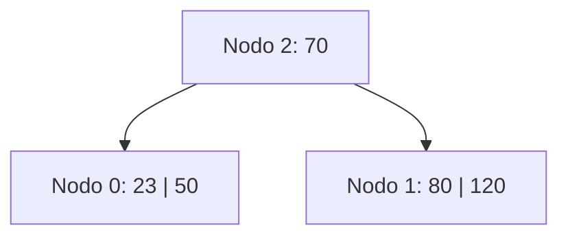
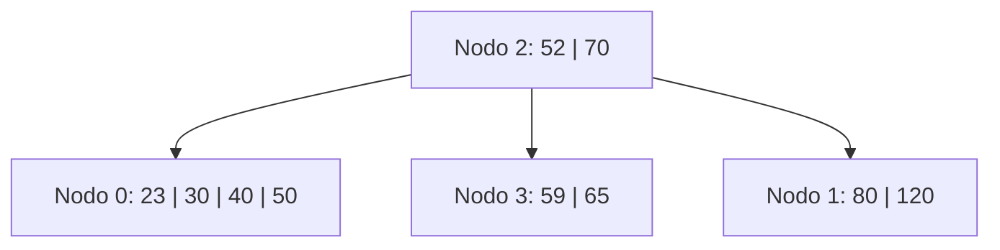
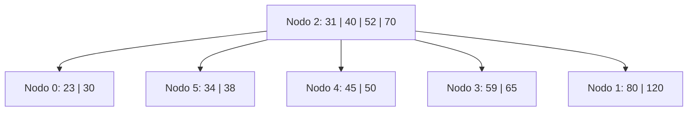
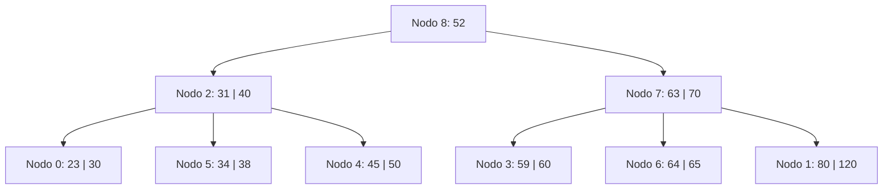
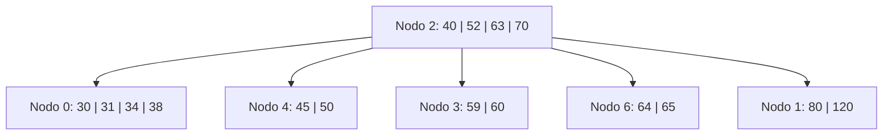
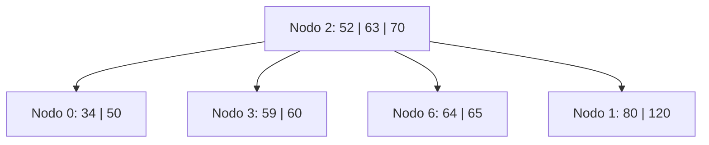

# Ejercicio 12 - Construcción de Árbol B (Paso a Paso Completo)

**Enunciado:** Construir un árbol B de orden 5 con política IZQUIERDA aplicando las siguientes operaciones: `+80, +50, +70, +120, +23, +52, +59, +65, +30, +40, +45, +31, +34, +38, +60, +63, +64, -23, -30, -31, -40, -45, -38`.

**Consideraciones:**
- Orden M = 5.
- Máximo de claves por nodo: M - 1 = 4.
- Mínimo de claves por nodo (excepto raíz): ⌈M/2⌉ - 1 = 2.
- Split en orden impar: se promueve la clave del medio (posición 3).

## 1. Operaciones iniciales sin desborde
**+80, +50, +70, +120:**
- Se crea el nodo 0 y se insertan ordenadamente.
- Nodo 0: `[50, 70, 80, 120]` (Lleno).

## 2. Inserción con desborde (+23)
- Al insertar `+23`, el nodo 0 queda con 5 claves: `[23, 50, 70, 80, 120]` -> **OVERFLOW**.
- Split: promueve la clave del medio (70).
- Nodo 0 queda: `[23, 50]`. Nuevo nodo 1: `[80, 120]`. Nueva raíz nodo 2: `[70]`.

## 3. Inserciones secuenciales (+52, +59, +65, +30, +40)
- `+52`: Va a nodo 0 -> `[23, 50, 52]`
- `+59`: Va a nodo 0 -> `[23, 50, 52, 59]` (Lleno)
- `+65`: Va a nodo 0 -> `[23, 50, 52, 59, 65]` -> **OVERFLOW**.
  - Split: promueve 52. Nodo 0 queda `[23, 50]`. Nuevo nodo 3: `[59, 65]`.
  - Nodo 2 recibe 52 -> `[52, 70]` con hijos `[0, 3, 1]`.
- `+30`: Va a nodo 0 -> `[23, 30, 50]`
- `+40`: Va a nodo 0 -> `[23, 30, 40, 50]` (Lleno)

## 4. Inserción con desborde (+45)
- `+45`: Va a nodo 0 -> `[23, 30, 40, 45, 50]` -> **OVERFLOW**.
- Split: promueve 40. Nodo 0 queda `[23, 30]`. Nuevo nodo 4: `[45, 50]`.
- Nodo 2 recibe 40 -> `[40, 52, 70]` con hijos `[0, 4, 3, 1]`.

## 5. Inserciones secuenciales (+31, +34, +38)
- `+31`: Va a nodo 0 -> `[23, 30, 31]`
- `+34`: Va a nodo 0 -> `[23, 30, 31, 34]` (Lleno)
- `+38`: Va a nodo 0 -> `[23, 30, 31, 34, 38]` -> **OVERFLOW**.
  - Split: promueve 31. Nodo 0 queda `[23, 30]`. Nuevo nodo 5: `[34, 38]`.
  - Nodo 2 recibe 31 -> `[31, 40, 52, 70]` con hijos `[0, 5, 4, 3, 1]` (Lleno).

## 6. Inserciones secuenciales (+60, +63, +64)
- `+60`: Va a nodo 3 -> `[59, 60, 65]`
- `+63`: Va a nodo 3 -> `[59, 60, 63, 65]` (Lleno)
- `+64`: Va a nodo 3 -> `[59, 60, 63, 64, 65]` -> **OVERFLOW**.
  - Split: promueve 63. Nodo 3 queda `[59, 60]`. Nuevo nodo 6: `[64, 65]`.
  - Nodo 2 recibe 63 -> `[31, 40, 52, 63, 70]` -> **OVERFLOW en raíz**.
  - Split nodo 2: promueve 52. Nodo 2 queda `[31, 40]`. Nuevo nodo 7: `[63, 70]`. Nueva raíz nodo 8: `[52]`.

## 7. Bajas sin Underflow (-23)
- `-23`: Está en nodo 0. Nodo 0 queda `[30]` (1 clave). **UNDERFLOW**.
- Política Izquierda: Nodo 0 es hijo leftmost de nodo 2, no tiene hermano izquierdo. Usamos hermano derecho (nodo 5).
- Nodo 5 tiene `[34, 38]` (2 claves, el mínimo). No puede donar.
- **FUSIÓN:** Nodo 0 + separador 31 + nodo 5 -> `[30, 31, 34, 38]` en nodo 0. Nodo 5 liberado.
- Nodo 2 pierde clave 31 -> queda `[40]` (1 clave). **UNDERFLOW**.
- Política Izquierda: Nodo 2 es hijo leftmost de nodo 8. Sin hermano izquierdo, usamos derecho (nodo 7).
- Nodo 7 tiene `[63, 70]` (2 claves). No puede donar.
- **FUSIÓN:** Nodo 2 + separador 52 + nodo 7 -> `[40, 52, 63, 70]` en nodo 2 con hijos `[0, 4, 3, 6, 1]`. Nodo 7 liberado.
- Nodo 8 (raíz) queda vacío y colapsa. Nueva raíz es nodo 2. Nodo 8 liberado.

## 8. Resto de Bajas
- `-30`: Nodo 0 queda `[31, 34, 38]` (OK).
- `-31`: Nodo 0 queda `[34, 38]` (OK).
- `-40`: Es separador en nodo 2. Sucesor es 45 (nodo 4). Reemplaza 40 por 45 en nodo 2. Elimina 45 de nodo 4.
  - Nodo 4 queda `[50]`. **UNDERFLOW**.
  - Política Izquierda: Hermano izq nodo 0 con `[34, 38]`. Tiene mínimo (2). No dona.
  - **FUSIÓN:** Nodo 0 + sep 45 + nodo 4 -> `[34, 38, 45, 50]` en nodo 0. Nodo 4 liberado.
  - Nodo 2 pierde sep 45 -> queda `[52, 63, 70]` (3 claves). OK.
- `-45`: Nodo 0 queda `[34, 38, 50]` (OK).
- `-38`: Nodo 0 queda `[34, 50]` (OK).

## Árbol Final

