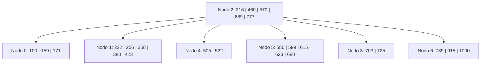
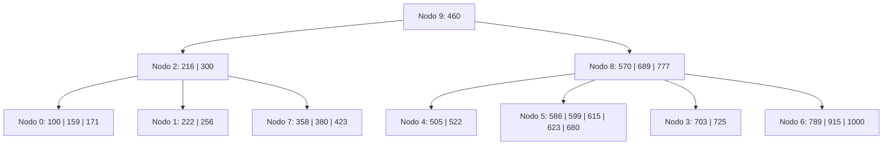
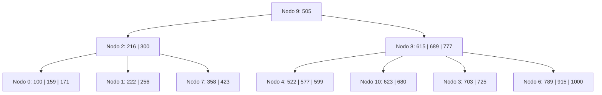

# Ejercicio 13 - Árbol B (Operaciones Varias)

**Enunciado:** Dado un Árbol B de orden 6 con política IZQUIERDA O DERECHA, aplicar las siguientes operaciones: `+300, +577, -586, -570, -380, -460`.

**Consideraciones:**

- Orden M = 6.
- Máximo de claves por nodo: M - 1 = 5.
- Mínimo de claves por nodo (excepto raíz): ⌈M/2⌉ - 1 = 2.
- Split en orden par: se divide la clave en posición M/2 = 3.

## Estado Inicial

## Operación: +300

**Justificación:**

- `300` va al nodo 1: `[222, 256, 300, 358, 380, 423]` -> **OVERFLOW** (6 claves).
- Split en posición 3 (300). Izq: `[222, 256]`, Der: `[358, 380, 423]` en el nuevo nodo 7. Promueve 300.
- Raíz (nodo 2) recibe 300: `[216, 300, 460, 570, 689, 777]` -> **OVERFLOW** en raíz.
- Split en posición 3 (460). Izq: `[216, 300]`, Der: `[570, 689, 777]` en nuevo nodo 8. Promueve 460 a nueva raíz nodo 9.
**L/E:** L2, L1, E1, E7, E2, E8, E9.

## Operación: +577

**Justificación:**

- `577` va al nodo 5: `[577, 586, 599, 615, 623, 680]` -> **OVERFLOW**.
- Split: promueve 599. Izq: `[577, 586]`, Der: `[615, 623, 680]` en nuevo nodo 10.
- Nodo 8 recibe 599: `[570, 599, 689, 777]`. OK.
**L/E:** L9, L8, L5, E5, E10, E8.

## Operación: -586

**Justificación:**

- Se elimina `586` del nodo 5. Queda `[577]` -> **UNDERFLOW** (1 clave, min 2).
- Política Izquierda-Derecha: Hermano izquierdo (nodo 4) tiene 2 claves, no puede donar. Hermano derecho (nodo 10) tiene 3 claves, puede donar.
- **Redistribución:** Sep 599 baja a nodo 5, mínima de nodo 10 (615) sube como nuevo separador en nodo 8. Nodo 5 queda `[577, 599]`.
**L/E:** L9, L8, L5, L4, L10, E5, E10, E8.

## Operación: -570

**Justificación:**

- `570` está en nodo interno (nodo 8). Su sucesor es el mínimo de su subárbol derecho (nodo 5 -> 577).
- Reemplazar 570 por 577 en nodo 8. Eliminar 577 del nodo 5.
- Nodo 5 queda `[599]` -> **UNDERFLOW**.
- Hermano izq (nodo 4) tiene 2 claves. Hermano der (nodo 10) ahora tiene 2 claves `[623, 680]`. Ninguno puede donar.
- **Fusión** con hermano izquierdo: Nodo 4 + sep 577 + Nodo 5 -> `[505, 522, 577, 599]` en nodo 4. Nodo 5 liberado. Nodo 8 pierde el separador 577.
**L/E:** L9, L8, L5, E8, E5, L4, L10, E4, E8.

## Operación: -380

**Justificación:**

- Eliminar `380` del nodo 7. Queda `[358, 423]`. Tiene 2 claves, mínimo cumplido. No hay underflow.
**L/E:** L9, L2, L7, E7.

## Operación: -460

**Justificación:**

- `460` está en la raíz (nodo 9). Su sucesor es el mínimo de su subárbol derecho (nodo 8 -> nodo 4 -> 505).
- Reemplazar 460 por 505 en nodo 9. Eliminar 505 del nodo 4.
- Nodo 4 queda `[522, 577, 599]`. Tiene 3 claves, mínimo cumplido. No hay underflow.
**L/E:** L9, L8, L4, E9, E4.

## Árbol Final

