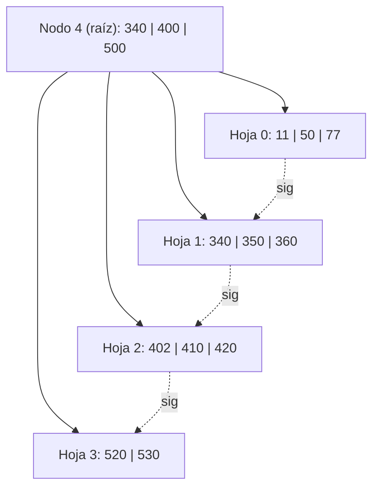
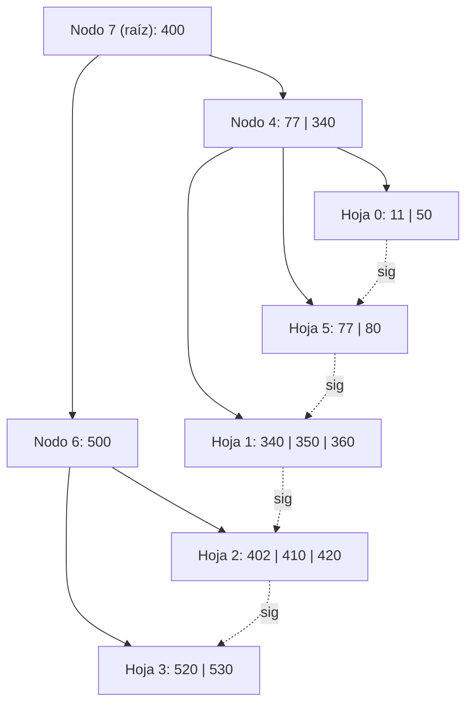
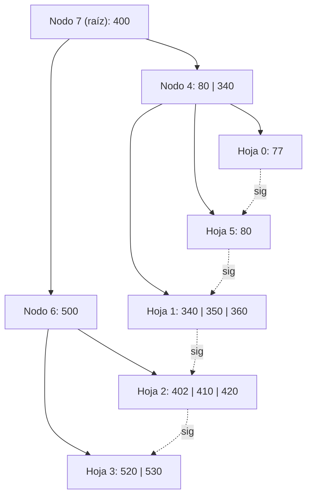
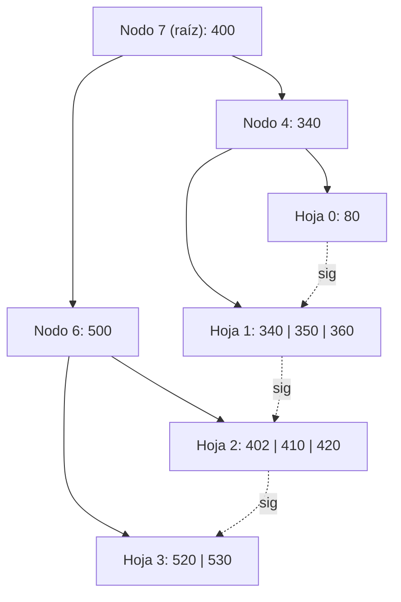

# Ejercicio 14 — Árbol B+ Orden 4, Política DERECHA

## Estado inicial

Árbol B+ de **orden 4** (máx. 3 claves por nodo, mín. 1 clave en hojas, mín. 1 clave en nodos internos no-raíz).  
Política de underflow: **DERECHA** (se intenta redistribuir con hermano derecho; si no puede, se fusiona con hermano derecho).

```
Nodo 4 (raíz): 3 i  0(340)1(400)2(500)3
Nodo 0:        3 h  (11)(50)(77) -> 1
Nodo 1:        3 h  (340)(350)(360) -> 2
Nodo 2:        3 h  (402)(410)(420) -> 3
Nodo 3:        2 h  (520)(530) -> -1
```



---

## Operación 1: +80

**Búsqueda de posición:** 80 < 340 → bajar por el primer hijo → **Nodo 0**: [11, 50, 77].  
80 > 77 → se inserta al final.

**Inserción:** Nodo 0 queda [11, 50, 77, 80] = **4 claves → OVERFLOW** (máx. es 3).

**Split de hoja (B+):** Se dividen las 4 claves equitativamente:
- Nodo 0 (izq): [11, 50] → 2 claves
- **Nuevo nodo 5** (der): [77, 80] → 2 claves
- Se **copia** (no se remueve) la primera clave del nodo derecho → **77** sube al padre como separador.

**Enlace de hojas:** Nodo 0 → Nodo 5 → Nodo 1.

**Actualizar padre (Nodo 4):** Se inserta separador 77:  
`0(77)5(340)1(400)2(500)3` → [77, 340, 400, 500] = **4 claves → OVERFLOW en nodo interno**.

**Split de nodo interno (B+):** [77, 340, 400, 500] → se promueve la clave de la **posición del medio** (posición 3 de 4 = la menor de las mayores = **400**):
- Nodo 4 (izq): [77, 340] con hijos [0, 5, 1]
- **Nuevo nodo 6** (der): [500] con hijos [2, 3]
- **400** se **promueve** al padre (en nodo interno no se copia, se remueve).
- Se crea **nueva raíz Nodo 7**: [400] con hijos [4, 6].

**L/E:** L4, L0, E0, E5, E4, E6, E7

### Estado después de +80:

```
Nodo 7 (raíz): 1 i  4(400)6
Nodo 4:        2 i  0(77)5(340)1
Nodo 6:        1 i  2(500)3
Nodo 0:        2 h  (11)(50) -> 5
Nodo 5:        2 h  (77)(80) -> 1
Nodo 1:        3 h  (340)(350)(360) -> 2
Nodo 2:        3 h  (402)(410)(420) -> 3
Nodo 3:        2 h  (520)(530) -> -1
```



---

## Operación 2: -400

**Búsqueda en hojas:** En árbol B+, los nodos internos son **separadores/copias**; los datos reales están en las hojas.  
Se busca 400 en las hojas: 400 ≥ 400 → subárbol derecho del separador 400 en Nodo 7 → Nodo 6 → 400 < 500 → primer hijo de Nodo 6 → **Nodo 2**: [402, 410, 420]. **400 no está**.

**Conclusión:** La clave 400 en Nodo 7 es un **separador puro** (copia de la primera clave que provocó el split del nodo raíz original). No existe como dato en ninguna hoja (los datos son: 11, 50, 77, 80, 340, 350, 360, 402, 410, 420, 520, 530). 

> En árbol B+, si la clave a borrar no existe en ninguna hoja, **la operación no tiene efecto**. El separador 400 permanece en Nodo 7 porque aún separa correctamente los datos ≤ 360 (lado izquierdo) de los datos ≥ 402 (lado derecho).

**L/E:** L7, L6, L2 *(búsqueda infructuosa, sin escrituras)*

### Estado después de -400 (sin cambios):

```
Nodo 7 (raíz): 1 i  4(400)6
Nodo 4:        2 i  0(77)5(340)1
Nodo 6:        1 i  2(500)3
Nodo 0:        2 h  (11)(50) -> 5
Nodo 5:        2 h  (77)(80) -> 1
Nodo 1:        3 h  (340)(350)(360) -> 2
Nodo 2:        3 h  (402)(410)(420) -> 3
Nodo 3:        2 h  (520)(530) -> -1
```

---

## Operación 3: -50

**Búsqueda:** 50 < 400 → Nodo 4 → 50 < 77 → **Nodo 0**: [11, 50]. Eliminar 50.

**Resultado:** Nodo 0: [11] = 1 clave. **OK** (mín. = 1 en hoja). No hay underflow.

**¿Actualizar separador?** El separador entre Nodo 0 y Nodo 5 en Nodo 4 es 77. La hoja Nodo 0 ahora tiene máximo 11, y 77 > 11: el orden se mantiene correctamente. **No se modifica el separador**.

**L/E:** L7, L4, L0, E0

### Estado después de -50:

```
Nodo 7 (raíz): 1 i  4(400)6
Nodo 4:        2 i  0(77)5(340)1
Nodo 6:        1 i  2(500)3
Nodo 0:        1 h  (11) -> 5
Nodo 5:        2 h  (77)(80) -> 1
Nodo 1:        3 h  (340)(350)(360) -> 2
Nodo 2:        3 h  (402)(410)(420) -> 3
Nodo 3:        2 h  (520)(530) -> -1
```

---

## Operación 4: -11

**Búsqueda:** 11 < 400 → Nodo 4 → 11 < 77 → **Nodo 0**: [11]. Eliminar 11.

**Resultado:** Nodo 0: [] = 0 claves → **UNDERFLOW** (mín. = 1).

**Política DERECHA:**  
Hermano derecho de Nodo 0 en Nodo 4: separador **77**, punta a **Nodo 5**: [77, 80] = 2 claves > mín. (1) → **puede ceder**.

**Redistribución (en hoja B+):**  
Se mueve la **primera clave del hermano derecho** (Nodo 5) hacia la hoja izquierda (Nodo 0):
- Nodo 0: [77] (recibe el 77 de Nodo 5)
- Nodo 5: [80] (pierde el 77)
- El separador en Nodo 4 entre Nodo 0 y Nodo 5 se actualiza con la **nueva primera clave de Nodo 5** = **80**

**Nodo 4 actualizado:** `0(80)5(340)1`

**L/E:** L7, L4, L0, L5, E0, E5, E4

### Estado después de -11:

```
Nodo 7 (raíz): 1 i  4(400)6
Nodo 4:        2 i  0(80)5(340)1
Nodo 6:        1 i  2(500)3
Nodo 0:        1 h  (77) -> 5
Nodo 5:        1 h  (80) -> 1
Nodo 1:        3 h  (340)(350)(360) -> 2
Nodo 2:        3 h  (402)(410)(420) -> 3
Nodo 3:        2 h  (520)(530) -> -1
```



---

## Operación 5: -77

**Búsqueda:** 77 < 400 → Nodo 4 → 77 < 80 → **Nodo 0**: [77]. Eliminar 77.

**Resultado:** Nodo 0: [] = 0 claves → **UNDERFLOW**.

**Política DERECHA:**  
Hermano derecho de Nodo 0 en Nodo 4: separador **80**, apunta a **Nodo 5**: [80] = 1 clave = mín. → **no puede ceder** (cedería llevaría a underflow en él).

**FUSIÓN (hojas B+):**  
Se combinan Nodo 0 (vacío) y Nodo 5 [80]:
- Nodo 0 absorbe el contenido de Nodo 5: Nodo 0 → [80]
- Se actualiza el enlace: Nodo 0 → Nodo 1 (el siguiente del Nodo 5)
- **Nodo 5 queda libre** (se agrega a la lista de libres LIFO).

**Actualizar padre (Nodo 4):** Se elimina el separador 80 (que apuntaba a Nodo 5) y el puntero a Nodo 5.  
Nodo 4: `0(340)1` → [340] = 1 clave. **OK** (mín. = 1 como nodo interno).

**L/E:** L7, L4, L0, L5, E0, E4 *(Nodo 5 queda libre, no se escribe)*

### Estado final después de -77:

```
Nodo 7 (raíz): 1 i  4(400)6
Nodo 4:        1 i  0(340)1
Nodo 6:        1 i  2(500)3
Nodo 0:        1 h  (80) -> 1
Nodo 1:        3 h  (340)(350)(360) -> 2
Nodo 2:        3 h  (402)(410)(420) -> 3
Nodo 3:        2 h  (520)(530) -> -1
```

**Nodo libre (LIFO):** Nodo 5



---

## Resumen de operaciones

| Operación | Resultado | L/E |
|-----------|-----------|-----|
| +80 | OVERFLOW hoja 0 → split → OVERFLOW nodo interno 4 → nueva raíz 7 | L4, L0, E0, E5, E4, E6, E7 |
| -400 | No encontrado en hojas (separador puro) | L7, L6, L2 |
| -50 | Eliminación simple, sin underflow | L7, L4, L0, E0 |
| -11 | UNDERFLOW nodo 0 → redistribución con Nodo 5 (derecha) | L7, L4, L0, L5, E0, E5, E4 |
| -77 | UNDERFLOW nodo 0 → fusión con Nodo 5 (derecha) | L7, L4, L0, L5, E0, E4 |
