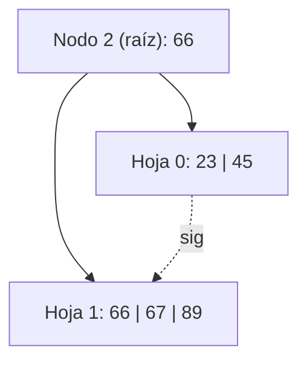
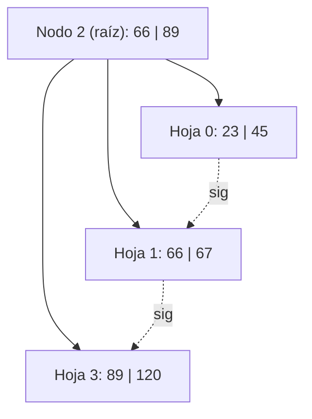
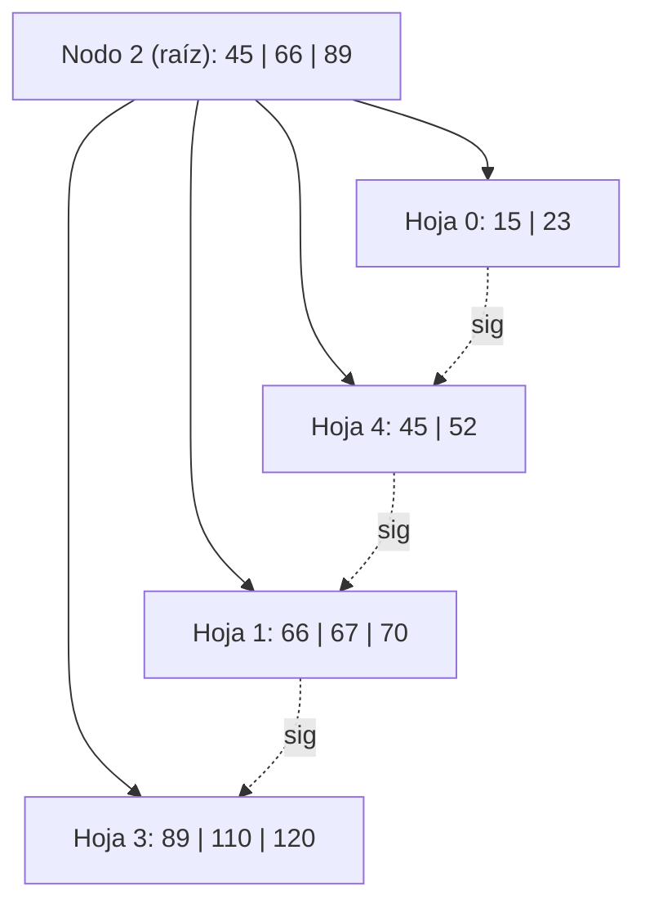
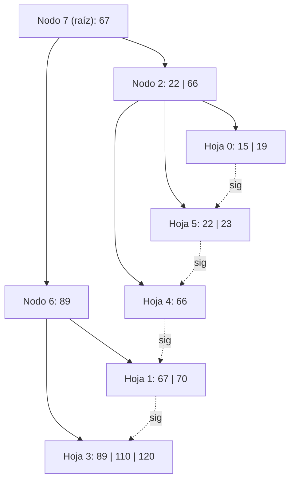
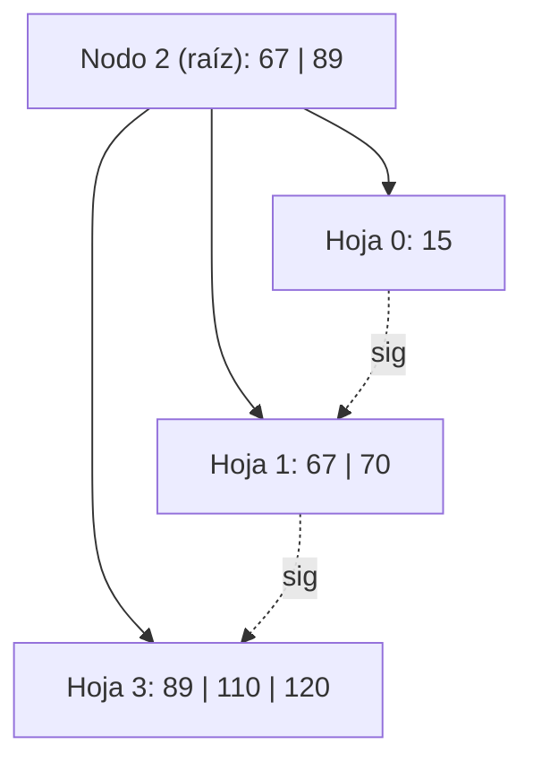
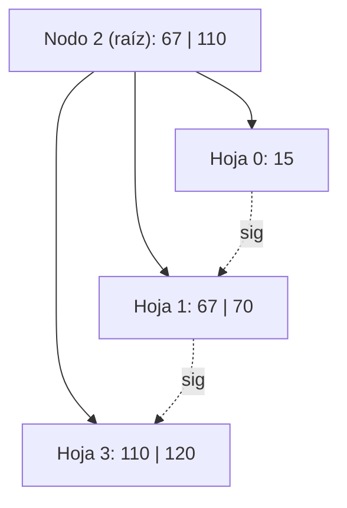

# Ejercicio 15 — Árbol B+ Orden 4, Política DERECHA

## Estado inicial

Árbol B+ de **orden 4** (máx. 3 claves por hoja, mín. 1 clave).  
Política de underflow: **DERECHA**.

```
Nodo 2 (raíz): 1 i  0(66)1
Nodo 0:        2 h  (23)(45) -> 1
Nodo 1:        3 h  (66)(67)(89) -> -1
```



---

## Operación 1: +120

**Búsqueda:** 120 ≥ 66 → **Nodo 1**: [66, 67, 89]. Insertar 120.  
Nodo 1: [66, 67, 89, 120] = 4 claves → **OVERFLOW**.

**Split de hoja:** [66, 67] | copiar **89** al padre | [89, 120].  

- Nodo 1 (izq): [66, 67]  
- **Nuevo Nodo 3** (der): [89, 120]  
- Enlace: Nodo 1 → Nodo 3 → -1  
- Separador **89** sube a Nodo 2: `0(66)1(89)3` → [66, 89] = 2 claves. OK.

**L/E:** L2, L1, E1, E3, E2

### Estado después de +120

```
Nodo 2 (raíz): 2 i  0(66)1(89)3
Nodo 0:        2 h  (23)(45) -> 1
Nodo 1:        2 h  (66)(67) -> 3
Nodo 3:        2 h  (89)(120) -> -1
```



---

## Operación 2: +110

**Búsqueda:** 110 ≥ 89 → **Nodo 3**: [89, 120]. Insertar 110.  
Nodo 3: [89, 110, 120] = 3 claves. OK (no overflow).

**L/E:** L2, L3, E3

### Estado después de +110

```
Nodo 2 (raíz): 2 i  0(66)1(89)3
Nodo 0:        2 h  (23)(45) -> 1
Nodo 1:        2 h  (66)(67) -> 3
Nodo 3:        3 h  (89)(110)(120) -> -1
```

---

## Operación 3: +52

**Búsqueda:** 52 < 66 → **Nodo 0**: [23, 45]. Insertar 52.  
Nodo 0: [23, 45, 52] = 3 claves. OK.

**L/E:** L2, L0, E0

### Estado después de +52

```
Nodo 2 (raíz): 2 i  0(66)1(89)3
Nodo 0:        3 h  (23)(45)(52) -> 1
Nodo 1:        2 h  (66)(67) -> 3
Nodo 3:        3 h  (89)(110)(120) -> -1
```

---

## Operación 4: +70

**Búsqueda:** 70 ≥ 66, 70 < 89 → **Nodo 1**: [66, 67]. Insertar 70.  
Nodo 1: [66, 67, 70] = 3 claves. OK.

**L/E:** L2, L1, E1

### Estado después de +70

```
Nodo 2 (raíz): 2 i  0(66)1(89)3
Nodo 0:        3 h  (23)(45)(52) -> 1
Nodo 1:        3 h  (66)(67)(70) -> 3
Nodo 3:        3 h  (89)(110)(120) -> -1
```

---

## Operación 5: +15

**Búsqueda:** 15 < 66 → **Nodo 0**: [23, 45, 52]. Insertar 15.  
Nodo 0: [15, 23, 45, 52] = 4 → **OVERFLOW**.

**Split de hoja:** [15, 23] | copiar **45** al padre | [45, 52].  

- Nodo 0 (izq): [15, 23]  
- **Nuevo Nodo 4** (der): [45, 52]  
- Enlace: Nodo 0 → Nodo 4 → Nodo 1  
- Separador **45** sube a Nodo 2: `0(45)4(66)1(89)3` → [45, 66, 89] = 3 claves. OK (lleno pero sin overflow).

**L/E:** L2, L0, E0, E4, E2

### Estado después de +15

```
Nodo 2 (raíz): 3 i  0(45)4(66)1(89)3
Nodo 0:        2 h  (15)(23) -> 4
Nodo 4:        2 h  (45)(52) -> 1
Nodo 1:        3 h  (66)(67)(70) -> 3
Nodo 3:        3 h  (89)(110)(120) -> -1
```



---

## Operación 6: -45

**Búsqueda:** 45 ≥ 45 → **Nodo 4**: [45, 52]. Eliminar 45.  
Nodo 4: [52] = 1 clave. OK (mín. = 1). Sin underflow.

**¿Actualizar separador?** El separador que apunta a Nodo 4 en Nodo 2 es 45. Ahora la primera clave de Nodo 4 es 52. En B+, si la clave borrada era el separador del padre, se actualiza con la nueva primera clave de esa hoja → **separador 45 → 52** en Nodo 2.  
Nodo 2: `0(52)4(66)1(89)3`.

**L/E:** L2, L4, E4, E2

### Estado después de -45

```
Nodo 2 (raíz): 3 i  0(52)4(66)1(89)3
Nodo 0:        2 h  (15)(23) -> 4
Nodo 4:        1 h  (52) -> 1
Nodo 1:        3 h  (66)(67)(70) -> 3
Nodo 3:        3 h  (89)(110)(120) -> -1
```

---

## Operación 7: -52

**Búsqueda:** 52 ≥ 52, 52 < 66 → **Nodo 4**: [52]. Eliminar 52.  
Nodo 4: [] = 0 claves → **UNDERFLOW**.

**Política DERECHA:** Hermano derecho de Nodo 4 en Nodo 2: sep **66**, apunta a **Nodo 1**: [66, 67, 70] = 3 claves > mín. → **puede ceder**.

**Redistribución (hoja B+):**  

- Se mueve la primera clave de Nodo 1 (**66**) a Nodo 4.  
- Nodo 4: [66]. Nodo 1: [67, 70].  
- El separador entre Nodo 4 y Nodo 1 en Nodo 2 se actualiza con la nueva primera clave de Nodo 1 = **67**.  
- Nodo 2: `0(52)4(67)1(89)3`.

**Nota:** El separador 52 que apuntaba a Nodo 4 permanece como está (la primera clave de Nodo 4 ahora es 66; el separador debería ser 66 también). Se actualiza el separador de Nodo 4 en Nodo 2 a **66** (primera clave de Nodo 4) → pero convencionalmente en UNLP el separador apunta a la primera clave de la hoja DERECHA del separador. El separador entre Nodo 4 y Nodo 1 se actualiza a 67. El separador entre Nodo 0 y Nodo 4 ahora debería ser la primera clave de Nodo 4 = 66.  
Nodo 2: `0(66)4(67)1(89)3`.

**L/E:** L2, L4, L1, E4, E1, E2

### Estado después de -52

```
Nodo 2 (raíz): 3 i  0(66)4(67)1(89)3
Nodo 0:        2 h  (15)(23) -> 4
Nodo 4:        1 h  (66) -> 1
Nodo 1:        2 h  (67)(70) -> 3
Nodo 3:        3 h  (89)(110)(120) -> -1
```

---

## Operación 8: +22

**Búsqueda:** 22 < 66 → **Nodo 0**: [15, 23]. Insertar 22.  
Nodo 0: [15, 22, 23] = 3 claves. OK.

**L/E:** L2, L0, E0

### Estado después de +22

```
Nodo 2 (raíz): 3 i  0(66)4(67)1(89)3
Nodo 0:        3 h  (15)(22)(23) -> 4
Nodo 4:        1 h  (66) -> 1
Nodo 1:        2 h  (67)(70) -> 3
Nodo 3:        3 h  (89)(110)(120) -> -1
```

---

## Operación 9: +19

**Búsqueda:** 19 < 66 → **Nodo 0**: [15, 22, 23]. Insertar 19.  
Nodo 0: [15, 19, 22, 23] = 4 → **OVERFLOW**.

**Split de hoja:** [15, 19] | copiar **22** al padre | [22, 23].  

- Nodo 0 (izq): [15, 19]  
- **Nuevo Nodo 5** (der): [22, 23]  
- Enlace: Nodo 0 → Nodo 5 → Nodo 4  
- Separador **22** sube a Nodo 2: `0(22)5(66)4(67)1(89)3` → [22, 66, 67, 89] = 4 → **OVERFLOW en raíz**.

**Split de raíz (nodo interno):** [22, 66, 67, 89] → clave del medio (posición 3 de 4, menor de las mayores) = **67**:

- Nodo 2 (izq): [22, 66] con hijos [0, 5, 4]
- **Nuevo Nodo 6** (der): [89] con hijos [1, 3]
- **67** se promueve a nueva raíz.
- **Nueva raíz Nodo 7**: [67] con hijos [2, 6].

**L/E:** L2, L0, E0, E5, E2, E6, E7

### Estado después de +19

```
Nodo 7 (raíz): 1 i  2(67)6
Nodo 2:        2 i  0(22)5(66)4
Nodo 6:        1 i  1(89)3
Nodo 0:        2 h  (15)(19) -> 5
Nodo 5:        2 h  (22)(23) -> 4
Nodo 4:        1 h  (66) -> 1
Nodo 1:        2 h  (67)(70) -> 3
Nodo 3:        3 h  (89)(110)(120) -> -1
```



---

## Operación 10: -66

**Búsqueda:** 66 < 67 → Nodo 2 → 66 ≥ 66 → **Nodo 4**: [66]. Eliminar 66.  
Nodo 4: [] → **UNDERFLOW**.

**El separador 66 en Nodo 2 era la primera clave de Nodo 4**, que ahora queda vacío.

**Política DERECHA:** Hermano derecho de Nodo 4 en Nodo 2: sep **66** apunta a Nodo 4 (ya vacío). Dentro de Nodo 2, después del hijo Nodo 4 no hay más hijos (Nodo 4 era el último hijo de Nodo 2). **No hay hermano derecho en Nodo 2.**  

**Caso especial (extremo):** Nodo 4 no tiene hermano derecho en su padre Nodo 2. En política DERECHA cuando no hay hermano derecho se fusiona con hermano **izquierdo**.  
Hermano izquierdo de Nodo 4 = **Nodo 5**: [22, 23] = 2 claves > mín → puede ceder → **redistribuir con izquierdo**.

**Redistribución (hoja B+):**  

- Se mueve la última clave de Nodo 5 (**23**) a Nodo 4.  
- Nodo 4: [23]. Nodo 5: [22].  
- El separador entre Nodo 5 y Nodo 4 en Nodo 2 se actualiza: primera clave de Nodo 4 = **23**.  
- Nodo 2: `0(22)5(23)4`.

**L/E:** L7, L2, L4, L5, E4, E5, E2

### Estado después de -66

```
Nodo 7 (raíz): 1 i  2(67)6
Nodo 2:        2 i  0(22)5(23)4
Nodo 6:        1 i  1(89)3
Nodo 0:        2 h  (15)(19) -> 5
Nodo 5:        1 h  (22) -> 4
Nodo 4:        1 h  (23) -> 1
Nodo 1:        2 h  (67)(70) -> 3
Nodo 3:        3 h  (89)(110)(120) -> -1
```

---

## Operación 11: -22

**Búsqueda:** 22 < 67 → Nodo 2 → 22 ≥ 22, 22 < 23 → **Nodo 5**: [22]. Eliminar 22.  
Nodo 5: [] → **UNDERFLOW**.

**Política DERECHA:** Hermano derecho de Nodo 5 en Nodo 2: sep **23**, apunta a **Nodo 4**: [23] = 1 clave = mín. → **no puede ceder**.  
**FUSIÓN con hermano derecho:** Nodo 5 [] + Nodo 4 [23] → Nodo 5: [23]. Enlace: Nodo 5 → Nodo 1. **Nodo 4 queda libre**.

**Actualizar Nodo 2:** Se elimina el separador 23 y puntero Nodo 4. Nodo 2: `0(22)5` → [22] = 1 clave. OK.

**Nota:** El separador del padre que apuntaba al inicio de Nodo 5 era 22, que sigue siendo la primera clave de Nodo 5 ahora con [23]... Nodo 5 ahora tiene [23], primera clave = 23 ≠ separador 22. Se actualiza el separador 22 → 23 en Nodo 2... en realidad el separador entre Nodo 0 y Nodo 5 debe ser la primera clave de Nodo 5 = 23. Nodo 2: `0(23)5`.

**L/E:** L7, L2, L5, L4, E5, E2

### Estado después de -22

```
Nodo 7 (raíz): 1 i  2(67)6
Nodo 2:        1 i  0(23)5
Nodo 6:        1 i  1(89)3
Nodo 0:        2 h  (15)(19) -> 5
Nodo 5:        1 h  (23) -> 1
Nodo 1:        2 h  (67)(70) -> 3
Nodo 3:        3 h  (89)(110)(120) -> -1
```

**Nodo libre (LIFO):** Nodo 4

---

## Operación 12: -19

**Búsqueda:** 19 < 67 → Nodo 2 → 19 < 23 → **Nodo 0**: [15, 19]. Eliminar 19.  
Nodo 0: [15] = 1 clave. OK (mín. = 1).

**L/E:** L7, L2, L0, E0

### Estado después de -19

```
Nodo 7 (raíz): 1 i  2(67)6
Nodo 2:        1 i  0(23)5
Nodo 6:        1 i  1(89)3
Nodo 0:        1 h  (15) -> 5
Nodo 5:        1 h  (23) -> 1
Nodo 1:        2 h  (67)(70) -> 3
Nodo 3:        3 h  (89)(110)(120) -> -1
```

---

## Operación 13: -23

**Búsqueda:** 23 < 67 → Nodo 2 → 23 ≥ 23 → **Nodo 5**: [23]. Eliminar 23.  
Nodo 5: [] → **UNDERFLOW**.

**El separador que apunta a Nodo 5 en Nodo 2 es 23** (que era la primera clave de Nodo 5, ahora vacío). Después de Nodo 5 no hay más hijos en Nodo 2 → **no hay hermano derecho**.

**Política DERECHA (caso extremo):** Fusionar con hermano **izquierdo** = Nodo 0: [15] = mín. (no puede ceder). → **FUSIÓN** con izquierdo.  
Nodo 0 [15] + Nodo 5 [] → Nodo 0: [15]. Enlace: Nodo 0 → Nodo 1. **Nodo 5 queda libre**.

**Actualizar Nodo 2:** Se elimina el separador 23 y puntero Nodo 5. Nodo 2: hijos [0] → 0 claves → **UNDERFLOW en Nodo 2**.

**Propagar underflow a Nodo 7:** Hermano derecho de Nodo 2 en Nodo 7 = **Nodo 6**: [89] = 1 clave = mín. → **no puede ceder**. **FUSIÓN**.  
Nodo 2 (0 claves, hijos [0]) + sep **67** (baja de Nodo 7) + Nodo 6 ([89], hijos [1, 3]):

En nodo interno B+: fusión → el separador del padre (67) **baja** al nodo fusionado:

- Nodo 2 absorbe sep 67 y los hijos/contenido de Nodo 6: [67, 89] con hijos [0, 1, 3].
- **Nodo 6 queda libre**. **Nodo 7 queda vacío** → colapso de raíz: **Nodo 2 pasa a ser la nueva raíz**.

**L/E:** L7, L2, L5, L0, E0, L6, E2

### Estado después de -23

```
Nodo 2 (raíz): 2 i  0(67)1(89)3
Nodo 0:        1 h  (15) -> 1
Nodo 1:        2 h  (67)(70) -> 3
Nodo 3:        3 h  (89)(110)(120) -> -1
```

**Nodos libres (LIFO):** Nodo 5, Nodo 6, Nodo 7 (raíz anterior)



---

## Operación 14: -89

**Búsqueda:** 89 ≥ 89 → **Nodo 3**: [89, 110, 120]. Eliminar 89.  
Nodo 3: [110, 120] = 2 claves. OK (mín. = 1).

**¿Actualizar separador?** El separador 89 en Nodo 2 apuntaba a Nodo 3. La nueva primera clave de Nodo 3 es 110 ≠ 89 → **actualizar separador 89 → 110** en Nodo 2.  
Nodo 2: `0(67)1(110)3`.

**L/E:** L2, L3, E3, E2

### Estado final después de -89

```
Nodo 2 (raíz): 2 i  0(67)1(110)3
Nodo 0:        1 h  (15) -> 1
Nodo 1:        2 h  (67)(70) -> 3
Nodo 3:        2 h  (110)(120) -> -1
```

**Nodos libres (LIFO):** 7, 6, 5, 4



---

## Resumen de operaciones

| # | Operación | Acción | L/E |
| --- | ----------- | -------- | ----- |
| 1 | +120 | OVERFLOW N1 → split → sep 89 sube | L2, L1, E1, E3, E2 |
| 2 | +110 | Inserción simple en N3 | L2, L3, E3 |
| 3 | +52 | Inserción simple en N0 | L2, L0, E0 |
| 4 | +70 | Inserción simple en N1 | L2, L1, E1 |
| 5 | +15 | OVERFLOW N0 → split → sep 45 sube | L2, L0, E0, E4, E2 |
| 6 | -45 | Baja simple, actualizar sep 45→52 | L2, L4, E4, E2 |
| 7 | -52 | UF N4 → redistribución con N1 (derecha) | L2, L4, L1, E4, E1, E2 |
| 8 | +22 | Inserción simple en N0 | L2, L0, E0 |
| 9 | +19 | OVERFLOW N0 → split → OVERFLOW N2 → nueva raíz N7 | L2, L0, E0, E5, E2, E6, E7 |
| 10 | -66 | UF N4 → redistribución con N5 (izquierdo) | L7, L2, L4, L5, E4, E5, E2 |
| 11 | -22 | UF N5 → fusión N5+N4, N4 libre | L7, L2, L5, L4, E5, E2 |
| 12 | -19 | Baja simple en N0 | L7, L2, L0, E0 |
| 13 | -23 | UF N5 → fusión N0+N5, UF N2 → fusión N2+N6, N2 nueva raíz | L7, L2, L5, L0, E0, L6, E2 |
| 14 | -89 | Baja simple, actualizar sep 89→110 | L2, L3, E3, E2 |
