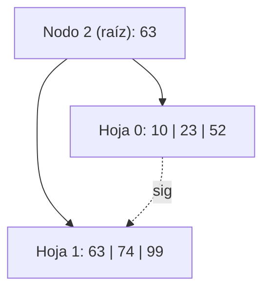
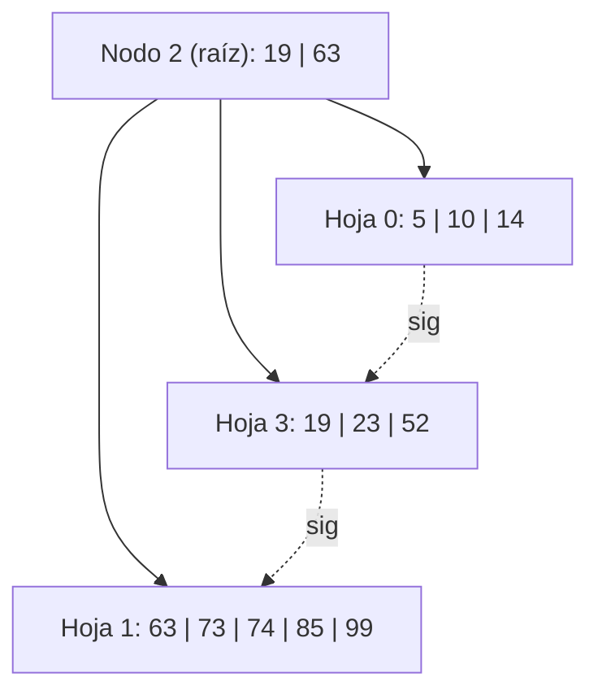
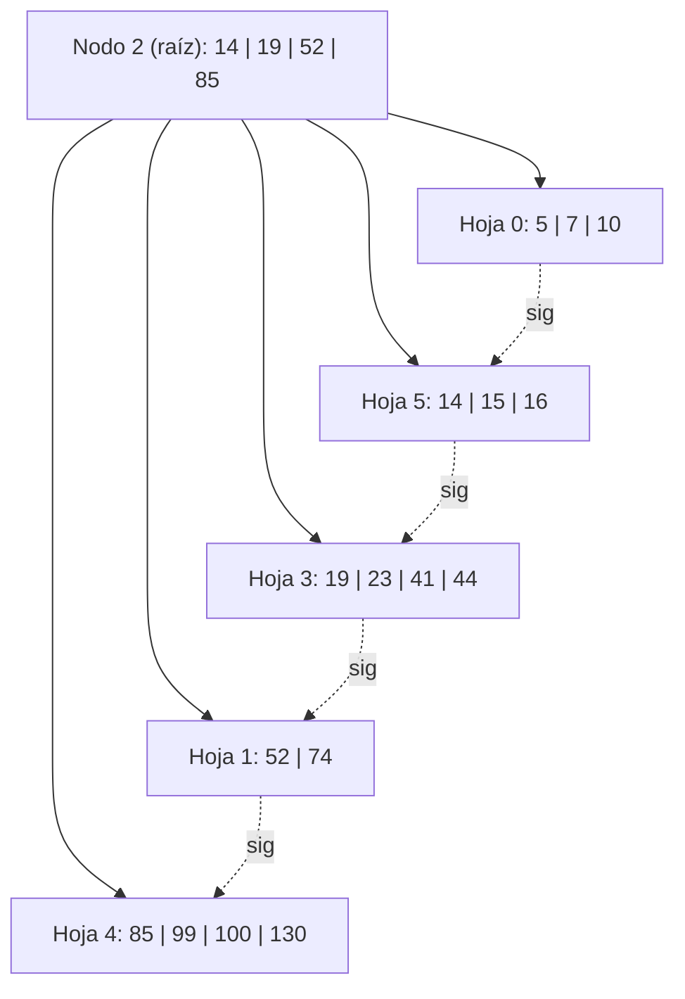
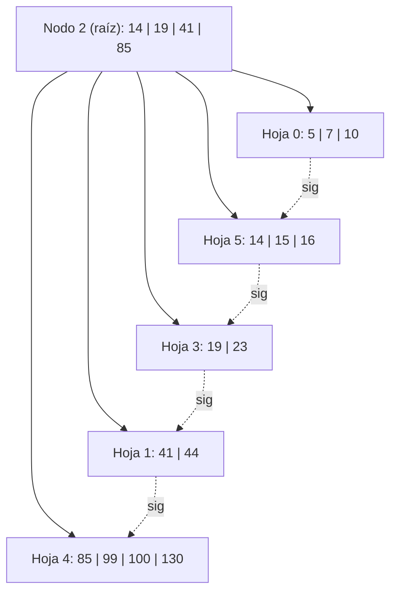

# Ejercicio 16 — Árbol B+ Orden 6, Construcción desde cero, Política IZQUIERDA

## Parámetros

- **Orden 6:** máx. 5 claves por nodo, mín. 2 claves (en hojas no-raíz y nodos internos no-raíz).  
- **Split de hoja:** con 6 claves → izq. 3, copiar la 4.ª (primero del der.) al padre, der. 3.  
- **Split de nodo interno:** con 6 claves → izq. 3, **promover** la 4.ª (no se copia), der. 3 (con hijos).  
- **Política underflow:** IZQUIERDA (redistribuir con hermano izq., si no puede, fusionar con hermano izq.).

**Operaciones:** +52, +23, +10, +99, +63, +74, +19, +85, +14, +73, +5, +7, +41, +100, +130, +44, -63, -73, +15, +16, -74, -52.

---

## Construcción inicial (sin splits)

**+52:** Estado → Nodo 0: [52] `E0`  
**+23:** Nodo 0: [23, 52] `L0, E0`  
**+10:** Nodo 0: [10, 23, 52] `L0, E0`  
**+99:** Nodo 0: [10, 23, 52, 99] `L0, E0`  
**+63:** Nodo 0: [10, 23, 52, 63, 99] → 5 claves (lleno). `L0, E0`

### Estado:
```
Nodo 0: 5 h  (10)(23)(52)(63)(99) -> -1
```

---

## +74 → OVERFLOW (1er split)

Nodo 0: [10, 23, 52, 63, 74, 99] = 6 → **OVERFLOW**.

**Split hoja:** 6 claves → izq. 3, copiar posición 4 = **63**, der. 3.
- Nodo 0 (izq): [10, 23, 52]
- **Nuevo Nodo 1** (der): [63, 74, 99]
- Separador **63** sube → se crea **raíz Nodo 2**: [63] hijos [0, 1]
- Enlace: Nodo 0 → Nodo 1 → -1

**L/E:** L0, E0, E1, E2

### Estado después de +74:

```
Nodo 2 (raíz): 1 i  0(63)1
Nodo 0:        3 h  (10)(23)(52) -> 1
Nodo 1:        3 h  (63)(74)(99) -> -1
```



---

## +19

19 < 63 → Nodo 0: [10, 19, 23, 52] = 4. OK. `L2, L0, E0`

---

## +85

85 ≥ 63 → Nodo 1: [63, 74, 85, 99] = 4. OK. `L2, L1, E1`

---

## +14

14 < 63 → Nodo 0: [10, 14, 19, 23, 52] = 5. OK (lleno). `L2, L0, E0`

---

## +73

73 ≥ 63 → Nodo 1: [63, 73, 74, 85, 99] = 5. OK (lleno). `L2, L1, E1`

### Estado:
```
Nodo 2 (raíz): 1 i  0(63)1
Nodo 0:        5 h  (10)(14)(19)(23)(52) -> 1
Nodo 1:        5 h  (63)(73)(74)(85)(99) -> -1
```

---

## +5 → OVERFLOW Nodo 0 (2.º split)

5 < 63 → Nodo 0: [5, 10, 14, 19, 23, 52] = 6 → **OVERFLOW**.

**Split hoja:** izq. 3, copiar posición 4 = **19**, der. 3.
- Nodo 0 (izq): [5, 10, 14]
- **Nuevo Nodo 3** (der): [19, 23, 52]
- Separador **19** sube a Nodo 2: `0(19)3(63)1` → [19, 63] = 2. OK.
- Enlace: Nodo 0 → Nodo 3 → Nodo 1

**L/E:** L2, L0, E0, E3, E2

### Estado después de +5:

```
Nodo 2 (raíz): 2 i  0(19)3(63)1
Nodo 0:        3 h  (5)(10)(14) -> 3
Nodo 3:        3 h  (19)(23)(52) -> 1
Nodo 1:        5 h  (63)(73)(74)(85)(99) -> -1
```



---

## +7

7 < 19 → Nodo 0: [5, 7, 10, 14] = 4. OK. `L2, L0, E0`

---

## +41

41 ≥ 19, 41 < 63 → Nodo 3: [19, 23, 41, 52] = 4. OK. `L2, L3, E3`

---

## +100

100 ≥ 63 → Nodo 1: [63, 73, 74, 85, 99, 100] = 6 → **OVERFLOW**.

**Split hoja:** izq. 3, copiar posición 4 = **85**, der. 3.
- Nodo 1 (izq): [63, 73, 74]
- **Nuevo Nodo 4** (der): [85, 99, 100]
- Separador **85** sube a Nodo 2: `0(19)3(63)1(85)4` → [19, 63, 85] = 3. OK.
- Enlace: Nodo 1 → Nodo 4 → -1

**L/E:** L2, L1, E1, E4, E2

### Estado después de +100:

```
Nodo 2 (raíz): 3 i  0(19)3(63)1(85)4
Nodo 0:        4 h  (5)(7)(10)(14) -> 3
Nodo 3:        4 h  (19)(23)(41)(52) -> 1
Nodo 1:        3 h  (63)(73)(74) -> 4
Nodo 4:        3 h  (85)(99)(100) -> -1
```

---

## +130

130 ≥ 85 → Nodo 4: [85, 99, 100, 130] = 4. OK. `L2, L4, E4`

---

## +44

44 ≥ 19, 44 < 63 → Nodo 3: [19, 23, 41, 44, 52] = 5. OK (lleno). `L2, L3, E3`

### Estado:
```
Nodo 2 (raíz): 3 i  0(19)3(63)1(85)4
Nodo 0:        4 h  (5)(7)(10)(14) -> 3
Nodo 3:        5 h  (19)(23)(41)(44)(52) -> 1
Nodo 1:        3 h  (63)(73)(74) -> 4
Nodo 4:        4 h  (85)(99)(100)(130) -> -1
```

---

## -63

63 ≥ 63, 63 < 85 → Nodo 1: [63, 73, 74]. Eliminar 63.  
Nodo 1: [73, 74] = 2. OK (mín. = 2).

**¿Actualizar separador?** El separador 63 en Nodo 2 apuntaba a Nodo 1. Nueva primera clave de Nodo 1 = 73. → **actualizar 63 → 73**. Nodo 2: `0(19)3(73)1(85)4`.

**L/E:** L2, L1, E1, E2

### Estado después de -63:

```
Nodo 2 (raíz): 3 i  0(19)3(73)1(85)4
Nodo 0:        4 h  (5)(7)(10)(14) -> 3
Nodo 3:        5 h  (19)(23)(41)(44)(52) -> 1
Nodo 1:        2 h  (73)(74) -> 4
Nodo 4:        4 h  (85)(99)(100)(130) -> -1
```

---

## -73

73 ≥ 73, 73 < 85 → Nodo 1: [73, 74]. Eliminar 73.  
Nodo 1: [74] = 1 clave < mín. (2) → **UNDERFLOW**.

**Política IZQUIERDA:** Hermano izquierdo de Nodo 1 en Nodo 2: sep **73** (antes de Nodo 1), apunta a **Nodo 3**: [19, 23, 41, 44, 52] = 5 > mín. → **puede ceder**.

**Redistribución (hoja B+):**  
- Se mueve la última clave de Nodo 3 (**52**) a Nodo 1.  
- Nodo 1: [52, 74]. Nodo 3: [19, 23, 41, 44].  
- El separador entre Nodo 3 y Nodo 1 en Nodo 2 se actualiza con la primera clave de Nodo 1 = **52**.  
- Nodo 2: `0(19)3(52)1(85)4`.

**L/E:** L2, L1, L3, E1, E3, E2

### Estado después de -73:

```
Nodo 2 (raíz): 3 i  0(19)3(52)1(85)4
Nodo 0:        4 h  (5)(7)(10)(14) -> 3
Nodo 3:        4 h  (19)(23)(41)(44) -> 1
Nodo 1:        2 h  (52)(74) -> 4
Nodo 4:        4 h  (85)(99)(100)(130) -> -1
```

---

## +15

15 < 19 → Nodo 0: [5, 7, 10, 14, 15] = 5. OK. `L2, L0, E0`

---

## +16

16 < 19 → Nodo 0: [5, 7, 10, 14, 15, 16] = 6 → **OVERFLOW**.

**Split hoja:** izq. 3, copiar posición 4 = **14**, der. 3.
- Nodo 0 (izq): [5, 7, 10]
- **Nuevo Nodo 5** (der): [14, 15, 16]
- Separador **14** sube a Nodo 2: `0(14)5(19)3(52)1(85)4` → [14, 19, 52, 85] = 4. OK.
- Enlace: Nodo 0 → Nodo 5 → Nodo 3

**L/E:** L2, L0, E0, E5, E2

### Estado después de +16:

```
Nodo 2 (raíz): 4 i  0(14)5(19)3(52)1(85)4
Nodo 0:        3 h  (5)(7)(10) -> 5
Nodo 5:        3 h  (14)(15)(16) -> 3
Nodo 3:        4 h  (19)(23)(41)(44) -> 1
Nodo 1:        2 h  (52)(74) -> 4
Nodo 4:        4 h  (85)(99)(100)(130) -> -1
```



---

## -74

74 ≥ 52, 74 < 85 → Nodo 1: [52, 74]. Eliminar 74.  
Nodo 1: [52] = 1 < mín. (2) → **UNDERFLOW**.

**Política IZQUIERDA:** Hermano izquierdo de Nodo 1 = **Nodo 3** (sep 52): [19, 23, 41, 44] = 4 > mín. → **puede ceder**.

**Redistribución:**  
- Última clave de Nodo 3 = **44** pasa a Nodo 1.  
- Nodo 1: [44, 52]. Nodo 3: [19, 23, 41].  
- Actualizar separador entre Nodo 3 y Nodo 1 = primera clave de Nodo 1 = **44**.  
- Nodo 2: `0(14)5(19)3(44)1(85)4`.

**L/E:** L2, L1, L3, E1, E3, E2

### Estado después de -74:

```
Nodo 2 (raíz): 4 i  0(14)5(19)3(44)1(85)4
Nodo 0:        3 h  (5)(7)(10) -> 5
Nodo 5:        3 h  (14)(15)(16) -> 3
Nodo 3:        3 h  (19)(23)(41) -> 1
Nodo 1:        2 h  (44)(52) -> 4
Nodo 4:        4 h  (85)(99)(100)(130) -> -1
```

---

## -52

52 ≥ 44, 52 < 85 → Nodo 1: [44, 52]. Eliminar 52.  
Nodo 1: [44] = 1 < mín. (2) → **UNDERFLOW**.

**Política IZQUIERDA:** Hermano izquierdo de Nodo 1 = **Nodo 3** (sep 44): [19, 23, 41] = 3 > mín. (2) → **puede ceder** (cedería 1 y quedaría con 2, ≥ mín.).

**Redistribución:**  
- Última clave de Nodo 3 = **41** pasa a Nodo 1.  
- Nodo 1: [41, 44]. Nodo 3: [19, 23].  
- Actualizar separador entre Nodo 3 y Nodo 1 = primera clave de Nodo 1 = **41**.  
- Nodo 2: `0(14)5(19)3(41)1(85)4`.

**L/E:** L2, L1, L3, E1, E3, E2

### Estado final después de -52:

```
Nodo 2 (raíz): 4 i  0(14)5(19)3(41)1(85)4
Nodo 0:        3 h  (5)(7)(10) -> 5
Nodo 5:        3 h  (14)(15)(16) -> 3
Nodo 3:        2 h  (19)(23) -> 1
Nodo 1:        2 h  (41)(44) -> 4
Nodo 4:        4 h  (85)(99)(100)(130) -> -1
```



---

## Resumen de operaciones

| # | Op | Acción | L/E |
|---|----|--------|-----|
| +52..+63 | Inserción simple | Sin split | E0 (cada uno) |
| +74 | OVERFLOW N0 → split → raíz N2 | 1er nivel creado | L0, E0, E1, E2 |
| +19, +85 | Inserción simple | - | L2, Lx, Ex |
| +14, +73 | Nodos llenos | - | L2, Lx, Ex |
| +5 | OVERFLOW N0 → split → sep 19 en N2 | N3 creado | L2, L0, E0, E3, E2 |
| +7, +41 | Inserción simple | - | L2, Lx, Ex |
| +100 | OVERFLOW N1 → split → sep 85 en N2 | N4 creado | L2, L1, E1, E4, E2 |
| +130, +44 | Inserción simple | - | L2, Lx, Ex |
| -63 | Baja simple, actualizar sep 63→73 | - | L2, L1, E1, E2 |
| -73 | UF N1 → redistribución con N3 (izq) | sep 73→52 | L2, L1, L3, E1, E3, E2 |
| +15 | Inserción simple | - | L2, L0, E0 |
| +16 | OVERFLOW N0 → split → sep 14 en N2 | N5 creado | L2, L0, E0, E5, E2 |
| -74 | UF N1 → redistribución con N3 (izq) | sep 52→44 | L2, L1, L3, E1, E3, E2 |
| -52 | UF N1 → redistribución con N3 (izq) | sep 44→41 | L2, L1, L3, E1, E3, E2 |
