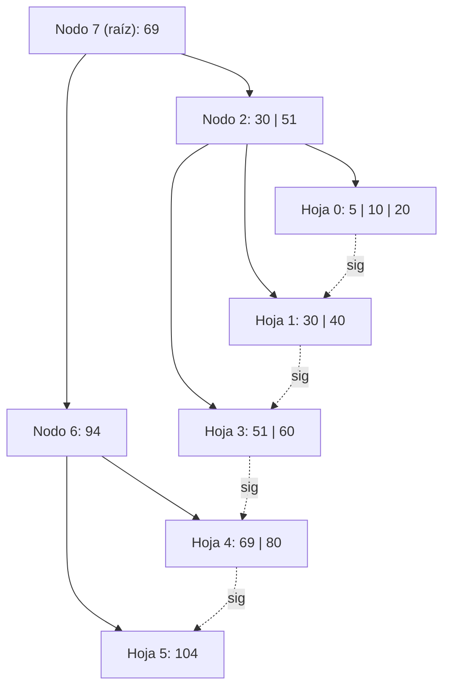
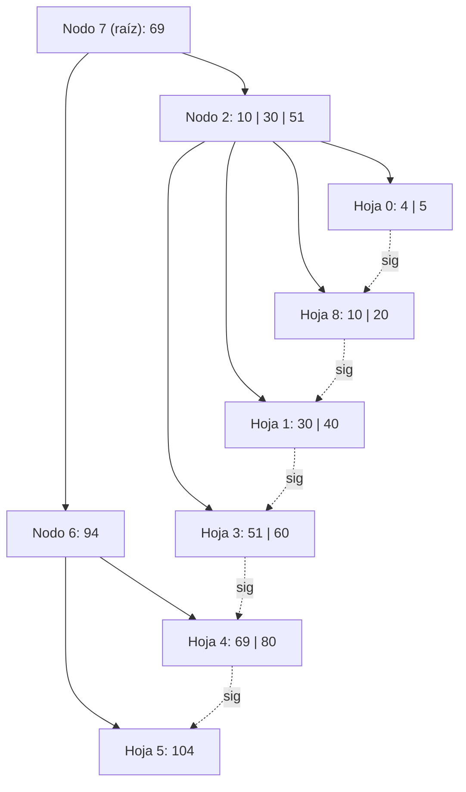
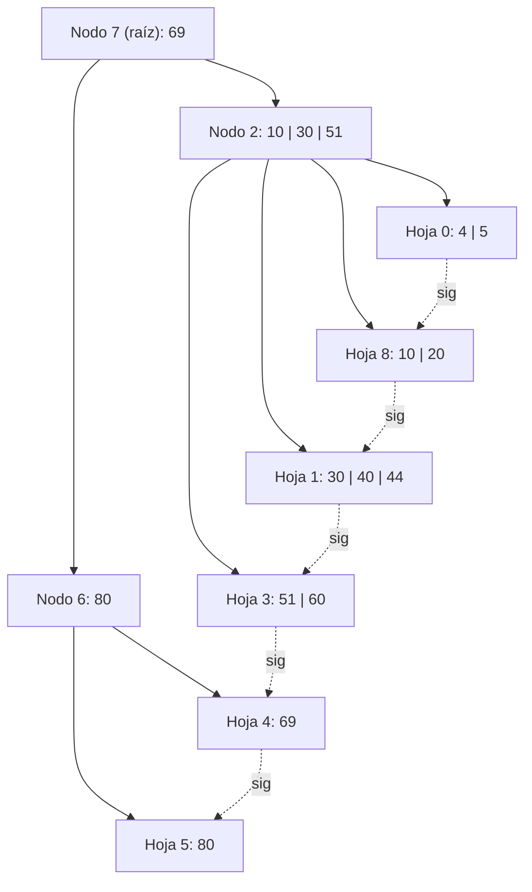

# Ejercicio 17 — Árbol B+ Orden 4, Política IZQUIERDA O DERECHA

## Estado inicial

Árbol B+ de **orden 4** (máx. 3 claves por nodo, mín. 1 clave en hojas, mín. 1 en internos no-raíz).  
Política de underflow: **IZQUIERDA O DERECHA** (primero redistribuir con hermano izq.; si no puede, redistribuir con hermano der.; si tampoco, fusionar con hermano izq.).

```
Nodo 7 (raíz): 1 i  2(69)6
Nodo 2:        2 i  0(30)1(51)3
Nodo 6:        1 i  4(94)5
Nodo 0:        3 h  (5)(10)(20) -> 1
Nodo 1:        2 h  (30)(40) -> 3
Nodo 3:        2 h  (51)(60) -> 4
Nodo 4:        2 h  (69)(80) -> 5
Nodo 5:        1 h  (104) -> -1
```



> **Nota sobre el separador 94:** El separador 94 en Nodo 6 separa Nodo 4 [69, 80] de Nodo 5 [104]. La clave 94 **no existe como dato en ninguna hoja** (fue la primera clave de Nodo 5 en un estado anterior del árbol, luego borrada). Esto es válido en árbol B+: los separadores son copias históricas que pueden no coincidir exactamente con la primera clave actual de la hoja derecha, siempre que se mantenga el orden.

---

## Operación 1: +4

**Búsqueda:** 4 < 69 → Nodo 2 → 4 < 30 → **Nodo 0**: [5, 10, 20]. Insertar 4.  
Nodo 0: [4, 5, 10, 20] = 4 → **OVERFLOW**.

**Split hoja:** [4, 5] | copiar **10** al padre | [10, 20].
- Nodo 0 (izq): [4, 5]
- **Nuevo Nodo 8** (der): [10, 20]
- Enlace: Nodo 0 → Nodo 8 → Nodo 1
- Separador **10** sube a Nodo 2: `0(10)8(30)1(51)3` → [10, 30, 51] = 3. OK.

**L/E:** L7, L2, L0, E0, E8, E2

### Estado después de +4:

```
Nodo 7 (raíz): 1 i  2(69)6
Nodo 2:        3 i  0(10)8(30)1(51)3
Nodo 6:        1 i  4(94)5
Nodo 0:        2 h  (4)(5) -> 8
Nodo 8:        2 h  (10)(20) -> 1
Nodo 1:        2 h  (30)(40) -> 3
Nodo 3:        2 h  (51)(60) -> 4
Nodo 4:        2 h  (69)(80) -> 5
Nodo 5:        1 h  (104) -> -1
```



---

## Operación 2: +44

**Búsqueda:** 44 < 69 → Nodo 2 → 44 ≥ 30, 44 < 51 → **Nodo 1**: [30, 40]. Insertar 44.  
Nodo 1: [30, 40, 44] = 3. OK (no overflow).

**L/E:** L7, L2, L1, E1

### Estado después de +44:

```
Nodo 7 (raíz): 1 i  2(69)6
Nodo 2:        3 i  0(10)8(30)1(51)3
Nodo 6:        1 i  4(94)5
Nodo 0:        2 h  (4)(5) -> 8
Nodo 8:        2 h  (10)(20) -> 1
Nodo 1:        3 h  (30)(40)(44) -> 3
Nodo 3:        2 h  (51)(60) -> 4
Nodo 4:        2 h  (69)(80) -> 5
Nodo 5:        1 h  (104) -> -1
```

---

## Operación 3: -94

**Búsqueda:** 94 ≥ 69 → Nodo 6 → 94 ≥ 94 → primer hijo del subárbol derecho del sep 94 = **Nodo 5**: [104]. **94 no está**.  
También: 94 < 94 no, buscar en hoja izquierda del sep 94 → Nodo 4: [69, 80]. **94 no está**.

**Conclusión:** La clave 94 es un **separador puro** en Nodo 6. No existe como dato en ninguna hoja.  
→ **La operación de baja no tiene efecto**. El árbol no se modifica.

**L/E:** L7, L6, L5 *(búsqueda, sin escrituras)*

### Estado después de -94 (sin cambios):

El árbol permanece igual al estado después de +44.

---

## Operación 4: -104

**Búsqueda:** 104 ≥ 69 → Nodo 6 → 104 ≥ 94 → **Nodo 5**: [104]. Eliminar 104.  
Nodo 5: [] = 0 → **UNDERFLOW**.

**Política IZQUIERDA O DERECHA:**  
- Hermano **izquierdo** de Nodo 5 en Nodo 6: sep **94**, apunta a **Nodo 4**: [69, 80] = 2 claves > mín. (1) → **puede ceder**.

**Redistribución (hoja B+):**  
- Se mueve la última clave de Nodo 4 (**80**) a Nodo 5.  
- Nodo 5: [80]. Nodo 4: [69].  
- El separador entre Nodo 4 y Nodo 5 en Nodo 6 se actualiza con la nueva primera clave de Nodo 5 = **80**.  
- Nodo 6: `4(80)5`.

**L/E:** L7, L6, L5, L4, E5, E4, E6

### Estado final después de -104:

```
Nodo 7 (raíz): 1 i  2(69)6
Nodo 2:        3 i  0(10)8(30)1(51)3
Nodo 6:        1 i  4(80)5
Nodo 0:        2 h  (4)(5) -> 8
Nodo 8:        2 h  (10)(20) -> 1
Nodo 1:        3 h  (30)(40)(44) -> 3
Nodo 3:        2 h  (51)(60) -> 4
Nodo 4:        1 h  (69) -> 5
Nodo 5:        1 h  (80) -> -1
```



---

## Resumen de operaciones

| # | Operación | Acción | L/E |
|---|-----------|--------|-----|
| +4 | OVERFLOW Nodo 0 → split → sep 10 sube a Nodo 2 | Nodo 8 creado | L7, L2, L0, E0, E8, E2 |
| +44 | Inserción simple en Nodo 1 | Sin cambios estructurales | L7, L2, L1, E1 |
| -94 | No existe como dato en hojas | Sin modificación | L7, L6, L5 |
| -104 | UNDERFLOW Nodo 5 → redistribución con Nodo 4 (izquierdo) | sep 94→80 | L7, L6, L5, L4, E5, E4, E6 |
