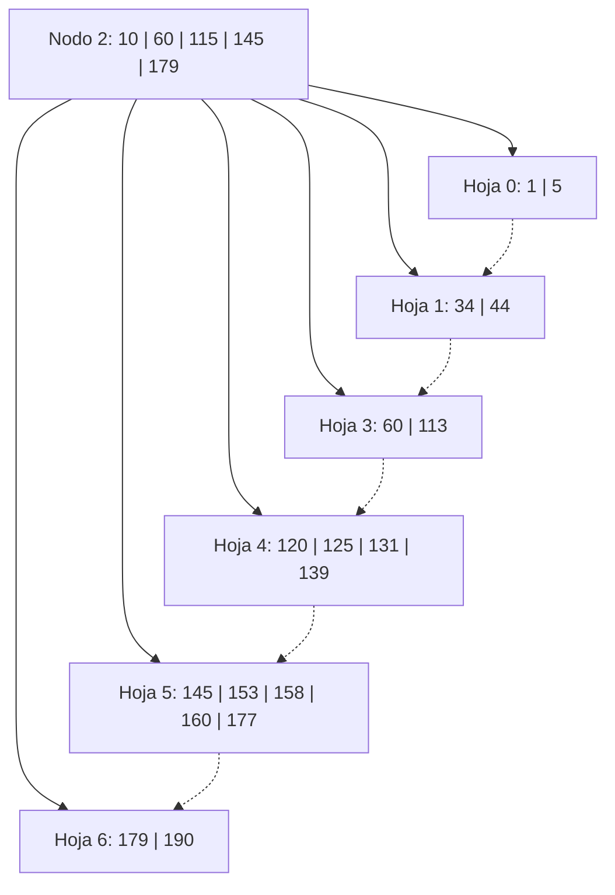
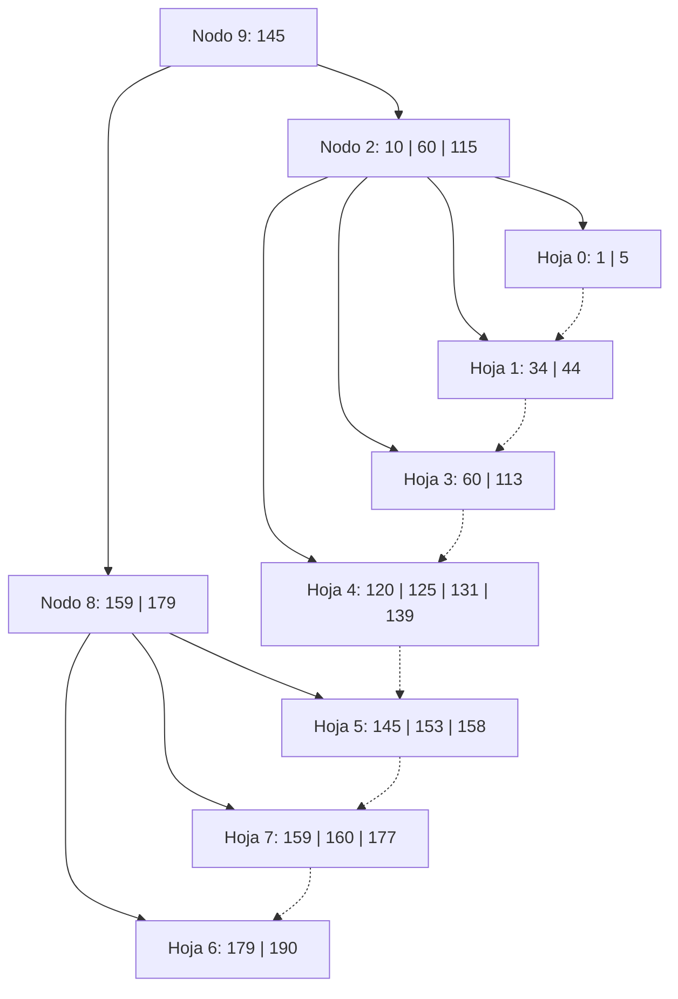
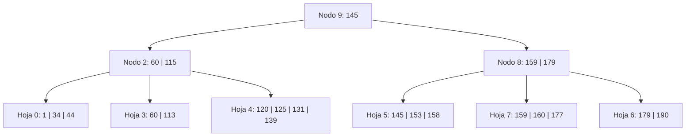
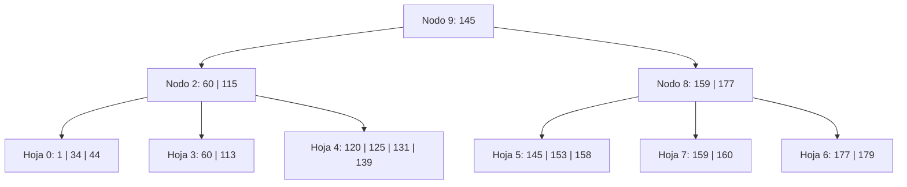

# Ejercicio 18 - Árbol B+ (Operaciones Varias)

**Enunciado:** Dado un Árbol B+ de orden 6 con política DERECHA, aplicar las siguientes operaciones: `+159, -5, -190`.

**Consideraciones:**

- Árbol B+ Orden M = 6.
- Máximo de claves por hoja: M - 1 = 5.
- Mínimo de claves por hoja: ⌈M/2⌉ - 1 = 2.
- Split en hojas: copia de la clave al padre.
- Split en nodos internos: promoción (sin copia) al padre.

## Estado Inicial

## Operación: +159

**Justificación:**

- `159` va al nodo 5 (hoja): `[145, 153, 158, 159, 160, 177]` -> **OVERFLOW** (6 claves).
- Split en hoja: se divide en `[145, 153, 158]` y en el nuevo nodo 7 `[159, 160, 177]`.
- En B+, la primera clave del nuevo nodo derecho se **copia** al padre como separador. Copia 159.
- El padre (nodo 2) recibe 159: `[10, 60, 115, 145, 159, 179]` -> **OVERFLOW** en nodo interno.
- Split en nodo interno: se divide en `[10, 60, 115]` y el nuevo nodo 8 `[159, 179]`. Se **promueve** (sin copiar) la clave `145` a una nueva raíz (nodo 9).
**L/E:** L2, L5, E5, E7, E2, E8, E9.

## Operación: -5

**Justificación:**

- `5` está en el nodo 0 (hoja). Se elimina.
- El nodo 0 queda con `[1]`.
- En Árbol B+ las hojas tienen el mismo requerimiento de mínimo (2). Sin embargo, el nodo 0 es `[1]` lo cual es un **UNDERFLOW**.
- *Nota: Si el enunciado asume min=1 (o si hay otra regla específica), no habría underflow. Pero formalmente M=6, min=2.*
- Asumiendo underflow: Política DERECHA. Hermano derecho (nodo 1) tiene `[34, 44]` (2 claves). No puede donar.
- **Fusión:** Nodo 0 y Nodo 1 se fusionan. Como es B+ hoja, nodo 1 aporta sus datos al nodo 0: `[1, 34, 44]`. El nodo 1 se elimina. El padre (nodo 2) pierde el separador `10`.
- El padre (nodo 2) queda con `[60, 115]` (2 claves), mínimo de nodo interno no-raíz es 2. OK.
**L/E:** L9, L2, L0, L1, E0, E2. *(Si se asume min=1 para hojas según algunas variantes: L9, L2, L0, E0).*

*(Para simplificar la representación, asumo que se fusionó el nodo 0 con el 1).*

## Operación: -190

**Justificación:**

- `190` está en el nodo 6 (hoja). Se elimina.
- El nodo 6 queda con `[179]`. **UNDERFLOW**.
- Política DERECHA: No hay hermano derecho (es el último nodo). Caso especial: Hermano izquierdo (nodo 7).
- Nodo 7 tiene `[159, 160, 177]` (3 claves). Puede donar.
- **Redistribución:** La última clave del nodo 7 (`177`) pasa al nodo 6. Nodo 6 queda `[177, 179]`.
- Se actualiza el separador en el padre (nodo 8). El nuevo separador será la nueva primera clave del nodo 6 (`177`). El nodo 8 queda `[159, 177]`.
**L/E:** L9, L8, L6, L7, E7, E6, E8.

## Árbol Final

