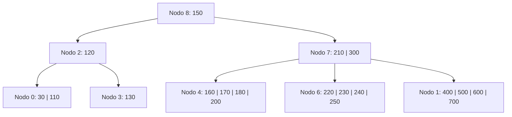
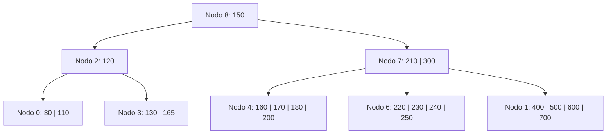
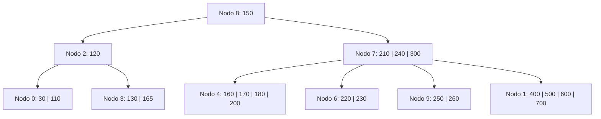
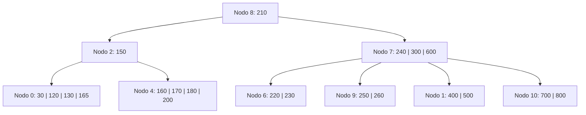

# Ejercicio 19 - Árbol B (Operaciones Varias)

**Enunciado:** Dado un Árbol B de orden 5 con política IZQUIERDA O DERECHA, aplicar las siguientes operaciones: `+165, +260, +800, -110`.

**Consideraciones:**

- Árbol B Orden M = 5.
- Máximo de claves por nodo: M - 1 = 4.
- Mínimo de claves por nodo (excepto raíz): ⌈M/2⌉ - 1 = 2.
- Split en orden impar: se promueve la clave en la posición M/2+0.5 = 3 (la del medio).

## Estado Inicial

## Operación: +165

**Justificación:**

- `165` va al nodo 3: `[130, 165]`.
- El nodo no rebasa el límite de 4 claves. OK.
**L/E:** L8, L2, L3, E3.

## Operación: +260

**Justificación:**

- `260` va al nodo 6: `[220, 230, 240, 250, 260]` -> **OVERFLOW**.
- Split: promueve la clave 240 al padre. Izq: `[220, 230]`, Der: nuevo nodo 9 con `[250, 260]`.
- El padre (nodo 7) recibe 240: `[210, 240, 300]`. OK.
**L/E:** L8, L7, L6, E6, E9, E7.

## Operación: +800

**Justificación:**

- `800` va al nodo 1: `[400, 500, 600, 700, 800]` -> **OVERFLOW**.
- Split: promueve la clave 600 al padre. Izq: `[400, 500]`, Der: nuevo nodo 10 con `[700, 800]`.
- El padre (nodo 7) recibe 600: `[210, 240, 300, 600]`. OK.
**L/E:** L8, L7, L1, E1, E10, E7.

## Operación: -110

**Justificación:**

- Se elimina `110` del nodo 0. Queda `[30]`. **UNDERFLOW** (min 2).
- Política Izquierda o Derecha: El nodo 0 no tiene hermano izquierdo. Usamos su hermano derecho, que es el nodo 3.
- Nodo 3 tiene `[130, 165]` (2 claves). No puede donar claves sin quedar él en underflow.
- **Fusión:** Se fusiona el nodo 0 con el hermano derecho (nodo 3) incluyendo el separador del padre (120).
- Nodo 0 + 120 + Nodo 3 = `[30, 120, 130, 165]` alojado en el nodo 0. El nodo 3 se elimina.
- El padre (nodo 2) pierde el separador 120 y el puntero al nodo 3. Queda vacío `[]`. **UNDERFLOW**.
- Padre del nodo 2 es la raíz (nodo 8). En árbol B, si un hijo de la raíz queda vacío por fusión, la raíz puede colapsar si tiene 1 sola clave (como es el caso, la raíz tiene `[150]`).
- Fusión del nodo interno (nodo 2 vacío) con el hermano derecho (nodo 7) y el separador de la raíz (150).
- Nodo 2 (`[]`) + 150 + Nodo 7 (`[210, 240, 300, 600]`) -> `[150, 210, 240, 300, 600]` -> **OVERFLOW** durante fusión.
- Como la suma causa overflow (5 claves), lo que se hace en realidad es una redistribución en el nivel de los nodos internos, no una fusión: Nodo 7 tiene `[210, 240, 300, 600]` (4 claves, puede donar).
- **Redistribución en interno:** Nodo 7 cede su primera clave al nodo 2 a través de la raíz. El 150 (raíz actual) baja al nodo 2, y el 210 (primera de nodo 7) sube a la raíz.
- Raíz (nodo 8) queda `[210]`. Nodo 2 queda `[150]`. Nodo 7 queda `[240, 300, 600]`.
**L/E:** L8, L2, L0, L3, E0, L7, E2, E7, E8.

## Árbol Final

