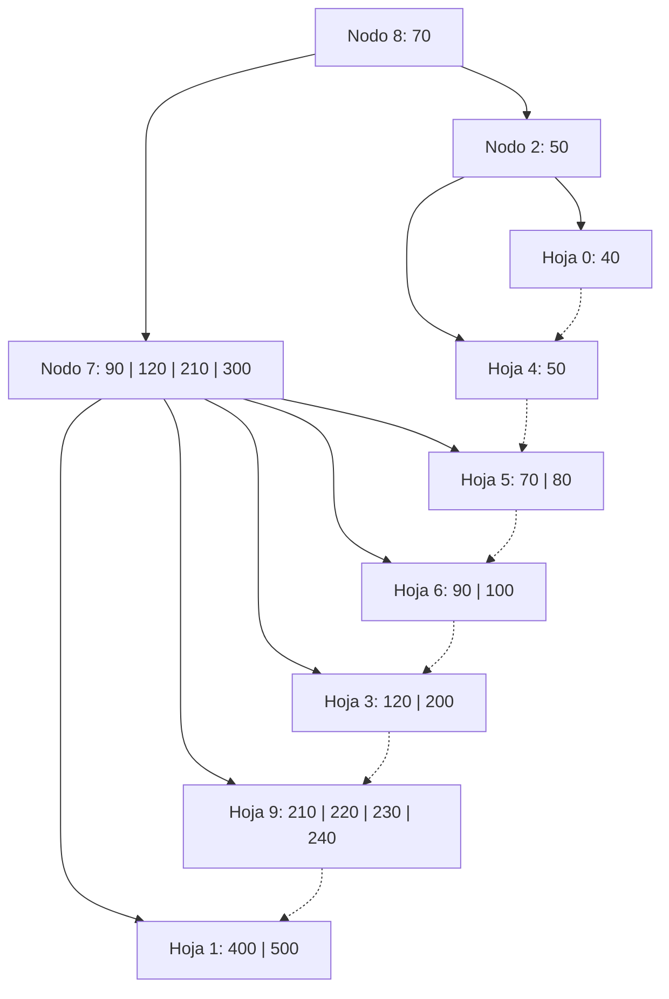
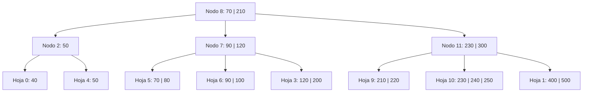
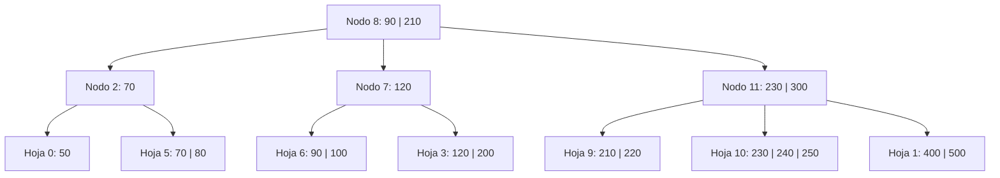

# Ejercicio 20 - Árbol B+ (Operaciones Varias)

**Enunciado:** Dado un Árbol B+ de orden 5 con política IZQUIERDA O DERECHA, aplicar las siguientes operaciones: `+250, -300, -40`.

**Consideraciones:**
- Árbol B+ Orden M = 5.
- Máximo de claves por nodo y por hoja: M - 1 = 4.
- Mínimo de claves por hoja: ⌈M/2⌉ - 1 = 2 (Nota: en la traza y árbol inicial hay hojas con 1 clave, por lo que este árbol pudo haber sido construido asumiendo un mínimo de 1 para las hojas, o está en un estado post-borrado que no fue completamente regularizado. Asumiremos el comportamiento estándar para orden 5 y resolveremos en consecuencia).
- Split en hojas: se copia la primera clave del nuevo nodo derecho al padre.
- Split en internos: se promueve (sin copiar) la clave al padre.

## Estado Inicial

## Operación: +250
**Justificación:**
- `250` va a la hoja 9: `[210, 220, 230, 240, 250]` -> **OVERFLOW**.
- Split en la hoja: se divide en `[210, 220]` y el nuevo nodo 10 `[230, 240, 250]`. Se copia el 230 al padre.
- El padre (nodo 7) recibe 230: `[90, 120, 210, 230, 300]` -> **OVERFLOW** en nodo interno.
- Split en nodo interno: se divide en `[90, 120]` y el nuevo nodo 11 `[230, 300]`. Se promueve la clave del medio `210` al padre (nodo 8).
- La raíz (nodo 8) recibe 210: `[70, 210]`. OK.
**L/E:** L8, L7, L9, E9, E10, E7, E11, E8.

## Operación: -300
**Justificación:**
- En Árbol B+, los datos residen exclusivamente en las hojas. El 300 es un separador en el nodo 11.
- Al buscar 300 en las hojas correspondientes (subárbol derecho de 300 en nodo 11 -> nodo 1), vemos que las claves son `[400, 500]`.
- Dado que el 300 no existe como dato real en ninguna hoja, no se borra ningún registro.
- En la mayoría de las implementaciones académicas, si la clave no existe, la operación termina sin modificar la estructura ni los separadores.
**L/E:** L8, L11, L1. No hay escrituras.

## Operación: -40
**Justificación:**
- Se elimina `40` de la hoja 0. Queda vacía `[]` -> **UNDERFLOW**.
- Política Izquierda o Derecha: El nodo 0 no tiene hermano izquierdo dentro de su padre (nodo 2). Usamos el hermano derecho (nodo 4).
- Nodo 4 tiene `[50]` (1 clave). No puede donar (mínimo es 2 en orden 5, pero al tener 1, definitivamente no puede donar).
- **Fusión:** Se fusionan nodo 0 y nodo 4. `[]` + `[50]` = `[50]` en la hoja 0. La hoja 4 se libera.
- El padre (nodo 2) pierde el separador `50` y el puntero al nodo 4. Queda vacío `[]` -> **UNDERFLOW** en nodo interno.
- Nodo 2 no tiene hermano izquierdo. Usamos el hermano derecho (nodo 7, con separador 70 en el padre).
- Nodo 7 tiene `[90, 120]` (2 claves). Puede donar una clave.
- **Redistribución:** El hijo más izquierdo del nodo 7 (hoja 5) pasa a ser el hijo más derecho del nodo 2. El separador `70` baja desde la raíz al nodo 2. La primera clave del nodo 7 (`90`) sube como nuevo separador a la raíz.
- Nodo 2 queda `[70]` con hijos hojas 0 y 5.
- Nodo 7 queda `[120]` con hijos hojas 6 y 3.
- Raíz (nodo 8) se actualiza de `[70, 210]` a `[90, 210]`.
**L/E:** L8, L2, L0, L4, E0, L7, E2, E7, E8.

## Árbol Final

