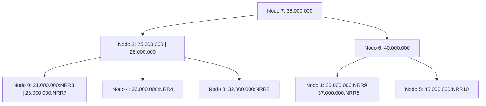

# Ejercicio 6 - Construcción de Árbol B

**Enunciado:** Construir un árbol B de orden 4 (máximo 3 claves, mínimo 2 hijos excepto la raíz) paso a paso con los 11 empleados dados.

**Consideraciones:**
- Orden M = 4.
- Máximo de claves por nodo: M - 1 = 3.
- Mínimo de claves por nodo (excepto raíz): ⌈M/2⌉ - 1 = 1.
- Los registros se insertan en el archivo de datos secuencialmente (NRR 0, 1, 2...).
- El árbol B indexa por DNI.
- Inserciones en orden de llegada: 35M, 40M, 32M, 28M, 26M, 37M, 25M, 23M, 21M, 36M, 45M.

## Paso a paso

**1. Insertar 35M (NRR=0)**
- Árbol vacío. Se crea el nodo 0 como raíz.
- L/E: E0 (escritura nuevo nodo raíz).
- Nodo 0: `[35M:0]`

**2. Insertar 40M (NRR=1)**
- Va al nodo 0.
- L/E: L0, E0.
- Nodo 0: `[35M:0, 40M:1]`

**3. Insertar 32M (NRR=2)**
- Va al nodo 0.
- L/E: L0, E0.
- Nodo 0: `[32M:2, 35M:0, 40M:1]` (Lleno, 3 claves).

**4. Insertar 28M (NRR=3)**
- Va al nodo 0: `[28M, 32M, 35M, 40M]` -> **OVERFLOW** (4 claves).
- Orden 4 -> split equitativo: izquierda 2, promueve 1, derecha 1 (o similar según criterio de la cátedra para pares, típicamente se promueve la clave en posición ⌈M/2⌉ = 2 o M/2+1 = 3).
- Promoviendo la clave del medio (35M): Nodo 0 queda `[28M:3, 32M:2]`. Nuevo nodo 1: `[40M:1]`. Nueva raíz nodo 2: `[35M:0]`.
- L/E: L0, E0, E1, E2.
- Árbol: Raíz 2:`[35M]` con hijos 0:`[28M, 32M]` y 1:`[40M]`.

**5. Insertar 26M (NRR=4)**
- 26M < 35M -> va a nodo 0.
- L/E: L2, L0, E0.
- Nodo 0: `[26M:4, 28M:3, 32M:2]` (Lleno).

**6. Insertar 37M (NRR=5)**
- 37M > 35M -> va a nodo 1.
- L/E: L2, L1, E1.
- Nodo 1: `[37M:5, 40M:1]`

**7. Insertar 25M (NRR=6)**
- 25M < 35M -> va a nodo 0: `[25M, 26M, 28M, 32M]` -> **OVERFLOW**.
- Split de nodo 0: promueve 28M.
- Nodo 0 queda: `[25M:6, 26M:4]`. Nuevo nodo 3: `[32M:2]`.
- 28M sube al padre (nodo 2), que ahora tiene `[28M, 35M]`.
- L/E: L2, L0, E0, E3, E2.
- Árbol: Raíz 2:`[28M, 35M]` con hijos 0:`[25M, 26M]`, 3:`[32M]`, 1:`[37M, 40M]`.

**8. Insertar 23M (NRR=7)**
- 23M < 28M -> va a nodo 0.
- L/E: L2, L0, E0.
- Nodo 0: `[23M:7, 25M:6, 26M:4]` (Lleno).

**9. Insertar 21M (NRR=8)**
- 21M < 28M -> va a nodo 0: `[21M, 23M, 25M, 26M]` -> **OVERFLOW**.
- Split de nodo 0: promueve 25M.
- Nodo 0 queda `[21M:8, 23M:7]`. Nuevo nodo 4: `[26M:4]`.
- 25M sube al nodo 2: `[25M, 28M, 35M]` (Lleno).
- L/E: L2, L0, E0, E4, E2.

**10. Insertar 36M (NRR=9)**
- 36M > 35M -> va a nodo 1.
- L/E: L2, L1, E1.
- Nodo 1: `[36M:9, 37M:5, 40M:1]` (Lleno).

**11. Insertar 45M (NRR=10)**
- 45M > 35M -> va a nodo 1: `[36M, 37M, 40M, 45M]` -> **OVERFLOW**.
- Split de nodo 1: promueve 40M.
- Nodo 1 queda `[36M:9, 37M:5]`. Nuevo nodo 5: `[45M:10]`.
- 40M sube al nodo 2: `[25M, 28M, 35M, 40M]` -> **OVERFLOW en raíz**.
- Split de nodo 2: promueve 35M.
- Nodo 2 queda `[25M, 28M]`. Nuevo nodo 6: `[40M]`.
- Nueva raíz nodo 7: `[35M]`.
- L/E: L2, L1, E1, E5, E2, E6, E7.

## Árbol Final

## Archivo de Datos Resultante

| NRR | DNI | Legajo | Nombre | Salario |
|---|---|---|---|---|
| 0 | 35.000.000 | ... | ... | ... |
| 1 | 40.000.000 | ... | ... | ... |
| 2 | 32.000.000 | ... | ... | ... |
| 3 | 28.000.000 | ... | ... | ... |
| 4 | 26.000.000 | ... | ... | ... |
| 5 | 37.000.000 | ... | ... | ... |
| 6 | 25.000.000 | ... | ... | ... |
| 7 | 23.000.000 | ... | ... | ... |
| 8 | 21.000.000 | ... | ... | ... |
| 9 | 36.000.000 | ... | ... | ... |
| 10| 45.000.000 | ... | ... | ... |
