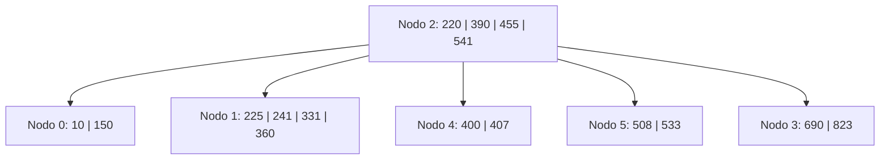
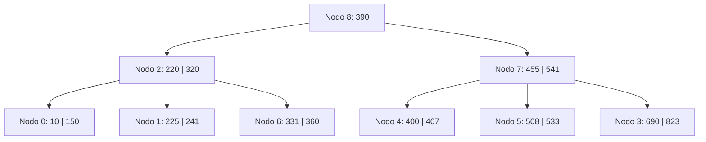
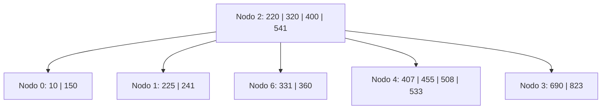
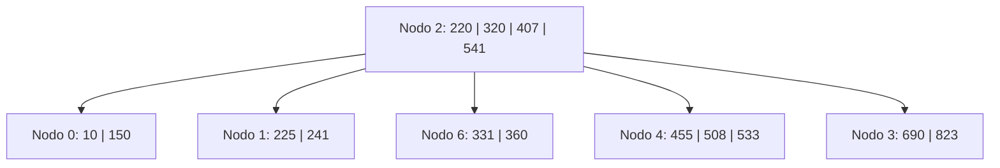
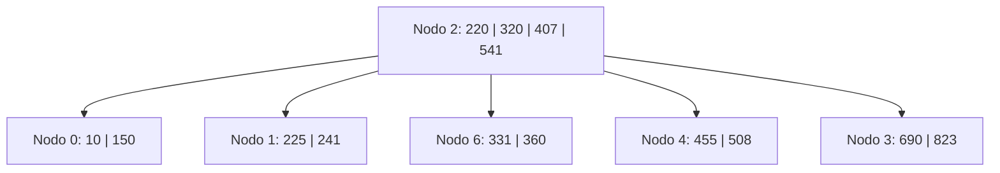

# Ejercicio 7 - Árbol B Orden 5 (Política Underflow: Izquierda)

## Estado Inicial

```
Nodo 2: 4 i 0(220)1(390)4(455)5(541)3
Nodo 0: 2 h (10)(150)
Nodo 1: 4 h (225)(241)(331)(360)
Nodo 4: 2 h (400)(407)
Nodo 5: 2 h (508)(533)
Nodo 3: 2 h (690)(823)
```

**Parámetros del orden 5:**

- Máximo de claves por nodo: 4
- Mínimo de claves por nodo (excepto raíz): 2 = ⌈5/2⌉ − 1
- Al hacer split de 5 claves: se promueve la clave de la posición 3 (el medio)



---

## Operación: +320

**Justificación:**

1. Se busca dónde insertar 320: raíz (nodo 2) → 320 > 220, 320 < 390 → bajar al hijo entre 220 y 390 = **nodo 1**.
2. Nodo 1 tiene [225, 241, 331, 360]. Insertar 320: [225, 241, **320**, 331, 360] = **5 claves → OVERFLOW**.
3. Orden 5 impar → promover la clave de posición 3 = **320**.
   - Nodo 1 queda: [225, 241]
   - Se crea **nodo 6**: [331, 360]
   - 320 sube al padre (nodo 2).
4. Nodo 2 recibe 320 entre nodo 1 y nodo 4: 0(220)1(320)6(390)4(455)5(541)3 → [220, 320, 390, 455, 541] = **5 claves → OVERFLOW**.
5. Orden 5 impar → promover posición 3 = **390**.
   - Nodo 2 queda: [220, 320] con hijos [0, 1, 6]
   - Se crea **nodo 7**: [455, 541] con hijos [4, 5, 3]
   - 390 sube, pero nodo 2 **era la raíz** → crear nueva raíz.
6. Se crea **nodo 8** (nueva raíz): [390] con hijos [2, 7].

**L/E:** `L2, L1, E1, E6, E2, E7, E8`

**Árbol resultante:**

```
Nodo 8: 1 i 2(390)7
Nodo 2: 2 i 0(220)1(320)6
Nodo 7: 2 i 4(455)5(541)3
Nodo 0: 2 h (10)(150)
Nodo 1: 2 h (225)(241)
Nodo 6: 2 h (331)(360)
Nodo 4: 2 h (400)(407)
Nodo 5: 2 h (508)(533)
Nodo 3: 2 h (690)(823)
```



---

## Operación: -390

**Justificación:**

1. Buscar 390: está en **nodo 8** (raíz), que es un nodo **interno**.
2. Para borrar de un nodo interno: reemplazar con el **sucesor** (mínimo del subárbol derecho).
   - Subárbol derecho de 390 en nodo 8 = nodo 7 → nodo 4 (hijo más izquierdo de nodo 7) → primer elemento = **400**.
3. Reemplazar 390 → **400** en nodo 8. Eliminar 400 de **nodo 4**.
4. Nodo 4: [400, 407] → quita 400 → [407] = **1 clave → UNDERFLOW** (mínimo = 2).
5. **Política IZQUIERDA.** Nodo 4 es el hijo más izquierdo de nodo 7 → **sin hermano izquierdo** → caso especial: usar hermano derecho.
6. Hermano derecho de nodo 4 = **nodo 5** (separador 455 en nodo 7). Nodo 5: [508, 533] = 2 claves = mínimo → **no puede donar**.
7. → **FUSIONAR** nodo 4 con nodo 5: [407] + **455** (separador del padre) + [508, 533] = [407, 455, 508, 533] → 4 claves → en **nodo 4**.
8. **Nodo 5 se libera**. Nodo 7 pierde la clave 455 y el puntero a nodo 5 → nodo 7: [541] con hijos [4, 3] = **1 clave → UNDERFLOW**.
9. Nodo 7 no es raíz. Padre = nodo 8 con [400], hijos [2, 7].
10. **Política IZQUIERDA.** Hermano izquierdo de nodo 7 = **nodo 2** (separador 400). Nodo 2: [220, 320] = 2 claves = mínimo → **no puede donar**.
11. → **FUSIONAR** nodo 2 con nodo 7: [220, 320] + **400** (separador del padre) + [541] con hijos [0, 1, 6, 4, 3] = [220, 320, 400, 541] → 4 claves → en **nodo 2**.
12. **Nodo 7 se libera**. Raíz (nodo 8) pierde clave 400 y puntero a nodo 7 → nodo 8 queda vacío → **raíz colapsa**.
13. La nueva raíz es **nodo 2**. **Nodo 8 se libera**.
14. Lista de libres (LIFO): [8, 7, 5] (8 fue el último en liberarse).

**L/E:** `L8, L7, L4, E8, E4, L5, E4, L2, E2`

> **Nota:** Se leen nodo 8 (raíz), nodo 7 (para encontrar sucesor), nodo 4 (para extraer sucesor y fusionar). Se actualizan: nodo 8 (con sucesor 400), nodo 4 (fusionado), luego se lee nodo 5 (para fusionar con nodo 4), se reescribe nodo 4 (resultado de fusión), se lee nodo 2 (para fusionar con nodo 7), se reescribe nodo 2 (nuevo árbol completo, nueva raíz).

**Árbol resultante:**

```
Nodo 2: 4 i 0(220)1(320)6(400)4(541)3
Nodo 0: 2 h (10)(150)
Nodo 1: 2 h (225)(241)
Nodo 6: 2 h (331)(360)
Nodo 4: 4 h (407)(455)(508)(533)
Nodo 3: 2 h (690)(823)
Nodos libres (LIFO): 8, 7, 5
```



---

## Operación: -400

**Justificación:**

1. Buscar 400: está en **nodo 2** (ahora la raíz), que es un nodo **interno**.
2. Para borrar de un nodo interno: reemplazar con el **sucesor** (mínimo del subárbol derecho de 400).
   - El hijo derecho de la clave 400 en nodo 2 es **nodo 4**. Su primer elemento es **407**.
3. Reemplazar 400 → **407** en nodo 2. Eliminar 407 de **nodo 4**.
4. Nodo 4: [407, 455, 508, 533] → quita 407 → [455, 508, 533] = **3 claves → OK** (mínimo = 2).
5. No hay underflow. Operación completa.

**L/E:** `L2, L4, E2, E4`

**Árbol resultante:**

```
Nodo 2: 4 i 0(220)1(320)6(407)4(541)3
Nodo 0: 2 h (10)(150)
Nodo 1: 2 h (225)(241)
Nodo 6: 2 h (331)(360)
Nodo 4: 3 h (455)(508)(533)
Nodo 3: 2 h (690)(823)
```



---

## Operación: -533

**Justificación:**

1. Buscar 533: raíz nodo 2 → 533 > 407, 533 < 541 → bajar al hijo entre 407 y 541 = **nodo 4**.
2. 533 está en **nodo 4** (hoja): [455, 508, 533]. Eliminar directamente.
3. Nodo 4: [455, 508] = **2 claves → OK** (mínimo = 2).
4. No hay underflow.

**L/E:** `L2, L4, E4`

**Árbol final:**

```
Nodo 2: 4 i 0(220)1(320)6(407)4(541)3
Nodo 0: 2 h (10)(150)
Nodo 1: 2 h (225)(241)
Nodo 6: 2 h (331)(360)
Nodo 4: 2 h (455)(508)
Nodo 3: 2 h (690)(823)
```


