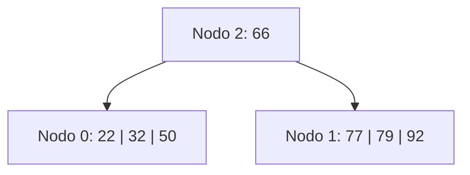
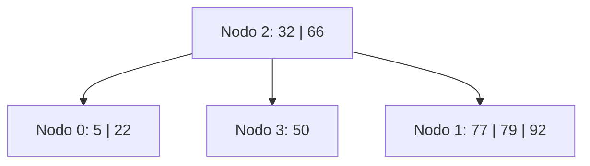
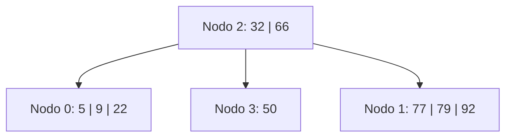
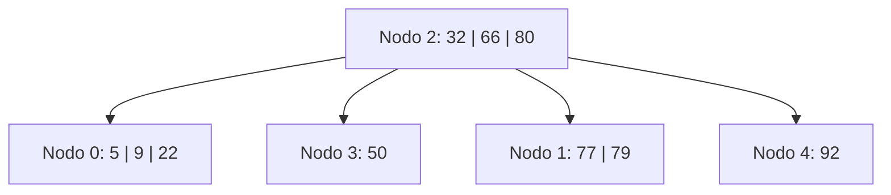
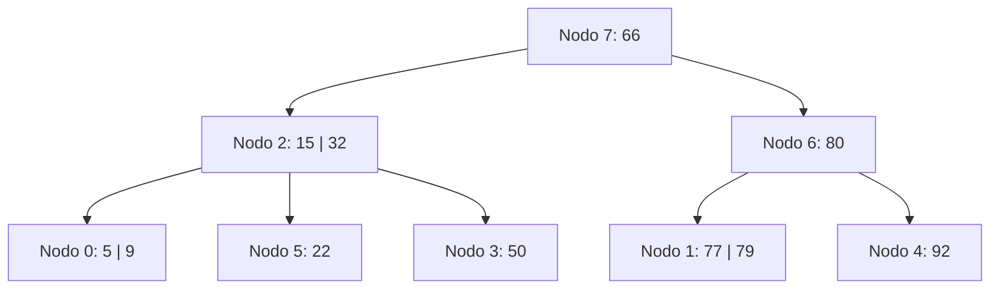
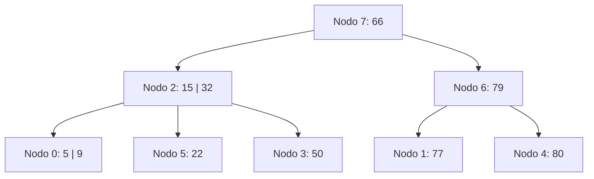
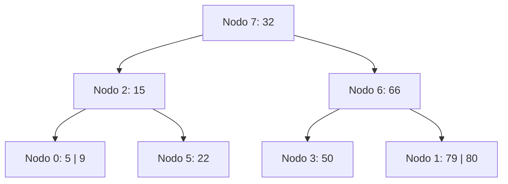

# Ejercicio 8 - Árbol B Orden 4 (Política Underflow: Derecha)

## Estado Inicial

```
Nodo 2: 1 i 0(66)1
Nodo 0: 3 h (22)(32)(50)
Nodo 1: 3 h (77)(79)(92)
```

**Parámetros del orden 4:**
- Máximo de claves por nodo: 3
- Mínimo de claves por nodo (excepto raíz): 1 = ⌈4/2⌉ − 1
- Al hacer split de 4 claves: [a, b, c, d] → izquierda [a, b], promover **c**, derecha [d]
  (La menor de las claves mayores = posición M/2+1 = posición 3)



---

## Operación: +5

**Justificación:**

1. Buscar dónde insertar 5: raíz (nodo 2) → 5 < 66 → bajar a **nodo 0**.
2. Nodo 0: [22, 32, 50]. Insertar 5 → [5, 22, 32, 50] = **4 claves → OVERFLOW**.
3. Orden 4 par → dividir: [5, 22] | promover **32** | [50].
   - Nodo 0 queda: [5, 22]
   - Se crea **nodo 3**: [50]
   - 32 sube al padre (nodo 2).
4. Nodo 2 recibe 32: 0(32)3(66)1 → [32, 66] = **2 claves → OK** (máximo = 3).

**L/E:** `L2, L0, E0, E3, E2`

**Árbol resultante:**

```
Nodo 2: 2 i 0(32)3(66)1
Nodo 0: 2 h (5)(22)
Nodo 3: 1 h (50)
Nodo 1: 3 h (77)(79)(92)
```



---

## Operación: +9

**Justificación:**

1. Buscar dónde insertar 9: raíz (nodo 2) → 9 < 32 → bajar a **nodo 0**.
2. Nodo 0: [5, 22]. Insertar 9 → [5, 9, 22] = **3 claves → OK** (máximo = 3).

**L/E:** `L2, L0, E0`

**Árbol resultante:**

```
Nodo 2: 2 i 0(32)3(66)1
Nodo 0: 3 h (5)(9)(22)
Nodo 3: 1 h (50)
Nodo 1: 3 h (77)(79)(92)
```



---

## Operación: +80

**Justificación:**

1. Buscar dónde insertar 80: raíz (nodo 2) → 80 > 66 → bajar a **nodo 1**.
2. Nodo 1: [77, 79, 92]. Insertar 80 → [77, 79, 80, 92] = **4 claves → OVERFLOW**.
3. Orden 4 par → dividir: [77, 79] | promover **80** | [92].
   - Nodo 1 queda: [77, 79]
   - Se crea **nodo 4**: [92]
   - 80 sube al padre (nodo 2).
4. Nodo 2 recibe 80: 0(32)3(66)1(80)4 → [32, 66, 80] = **3 claves → OK**.

**L/E:** `L2, L1, E1, E4, E2`

**Árbol resultante:**

```
Nodo 2: 3 i 0(32)3(66)1(80)4
Nodo 0: 3 h (5)(9)(22)
Nodo 3: 1 h (50)
Nodo 1: 2 h (77)(79)
Nodo 4: 1 h (92)
```



---

## Operación: +15

**Justificación:**

1. Buscar dónde insertar 15: raíz (nodo 2) → 15 < 32 → bajar a **nodo 0**.
2. Nodo 0: [5, 9, 22]. Insertar 15 → [5, 9, 15, 22] = **4 claves → OVERFLOW**.
3. Orden 4 par → dividir: [5, 9] | promover **15** | [22].
   - Nodo 0 queda: [5, 9]
   - Se crea **nodo 5**: [22]
   - 15 sube al padre (nodo 2).
4. Nodo 2 recibe 15: 0(15)5(32)3(66)1(80)4 → [15, 32, 66, 80] = **4 claves → OVERFLOW**.
5. Orden 4 par → dividir la raíz: [15, 32] | promover **66** | [80].
   - Nodo 2 queda: [15, 32] con hijos [0, 5, 3]
   - Se crea **nodo 6**: [80] con hijos [1, 4]
   - 66 sube → nodo 2 era raíz → se crea **nueva raíz**.
6. Se crea **nodo 7** (nueva raíz): [66] con hijos [2, 6].

**L/E:** `L2, L0, E0, E5, E2, E6, E7`

**Árbol resultante:**

```
Nodo 7: 1 i 2(66)6
Nodo 2: 2 i 0(15)5(32)3
Nodo 6: 1 i 1(80)4
Nodo 0: 2 h (5)(9)
Nodo 5: 1 h (22)
Nodo 3: 1 h (50)
Nodo 1: 2 h (77)(79)
Nodo 4: 1 h (92)
```



---

## Operación: -92

**Justificación:**

1. Buscar 92: raíz (nodo 7) → 92 > 66 → nodo 6 → 92 > 80 → **nodo 4**: [92]. Eliminar → [] = **0 claves → UNDERFLOW** (mínimo = 1).
2. **Política DERECHA.** Nodo 4 es el hijo más derecho de nodo 6 → **sin hermano derecho** → caso especial: usar hermano izquierdo.
3. Hermano izquierdo de nodo 4 = **nodo 1** (separador 80 en nodo 6). Nodo 1: [77, 79] = 2 claves > mínimo → **puede donar**.
4. → **REDISTRIBUIR** con el hermano izquierdo:
   - El separador (80) baja del padre (nodo 6) al nodo 4: nodo 4 → [80]
   - El máximo del hermano izquierdo (79) sube al padre como nuevo separador.
   - Nodo 1 pierde 79 → [77]
   - Nodo 6: separador queda como 79.

**L/E:** `L7, L6, L4, L1, E4, E1, E6`

**Árbol resultante:**

```
Nodo 7: 1 i 2(66)6
Nodo 2: 2 i 0(15)5(32)3
Nodo 6: 1 i 1(79)4
Nodo 0: 2 h (5)(9)
Nodo 5: 1 h (22)
Nodo 3: 1 h (50)
Nodo 1: 1 h (77)
Nodo 4: 1 h (80)
```



---

## Operación: -77

**Justificación:**

1. Buscar 77: raíz (nodo 7) → 77 > 66 → nodo 6 → 77 < 79 → **nodo 1**: [77]. Eliminar → [] = **0 claves → UNDERFLOW** (mínimo = 1).
2. **Política DERECHA.** Hermano derecho de nodo 1 = **nodo 4** (separador 79 en nodo 6). Nodo 4: [80] = 1 clave = mínimo → **no puede donar**.
3. → **FUSIONAR** nodo 1 con nodo 4 (a la derecha): [] + **79** (separador) + [80] = [79, 80] → en **nodo 1**. **Nodo 4 se libera**.
4. Nodo 6 pierde clave 79 y puntero a nodo 4 → nodo 6: [] con un solo hijo [nodo 1] = **0 claves → UNDERFLOW** (nodo 6 no es raíz).
5. Padre = nodo 7: [66] con hijos [2, 6]. **Política DERECHA.** Nodo 6 es el hijo **más derecho** de nodo 7 → **sin hermano derecho** → caso especial: usar hermano izquierdo.
6. Hermano izquierdo de nodo 6 = **nodo 2** (separador 66 en nodo 7). Nodo 2: [15, 32] = 2 claves > mínimo → **puede donar**.
7. → **REDISTRIBUIR** con el hermano izquierdo:
   - El separador (66) baja del padre (nodo 7) a nodo 6 como nueva clave.
   - El hijo más derecho de nodo 2 (nodo 3) pasa a ser el hijo izquierdo de nodo 6 (antes del separador que bajó).
   - El máximo de nodo 2 (32) sube al padre como nuevo separador.
   - Nodo 6: [66] con hijos [3, 1]
   - Nodo 2: pierde 32 y el hijo nodo 3 → [15] con hijos [0, 5]
   - Nodo 7: separador queda como 32.

**L/E:** `L7, L6, L1, L4, E1, L2, E2, E6, E7`

**Árbol final:**

```
Nodo 7: 1 i 2(32)6
Nodo 2: 1 i 0(15)5
Nodo 6: 1 i 3(66)1
Nodo 0: 2 h (5)(9)
Nodo 5: 1 h (22)
Nodo 3: 1 h (50)
Nodo 1: 2 h (79)(80)
Nodos libres (LIFO): 4
```


