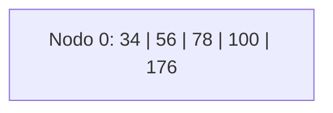
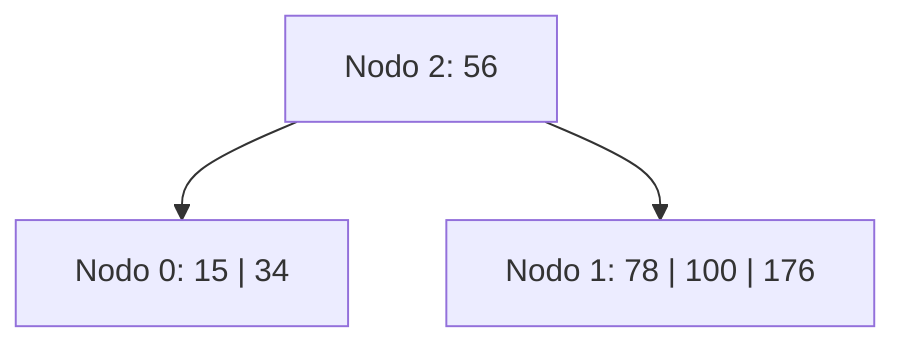
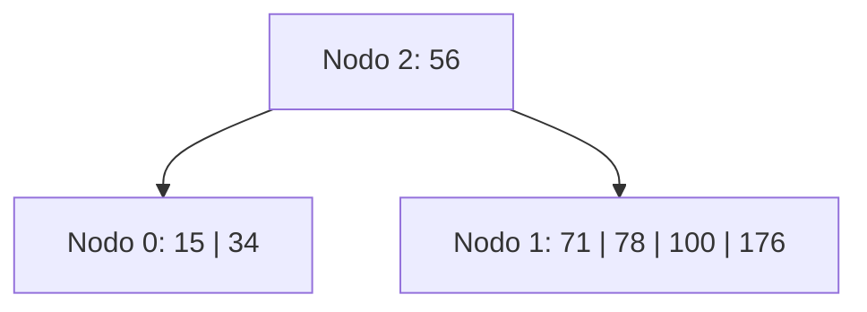
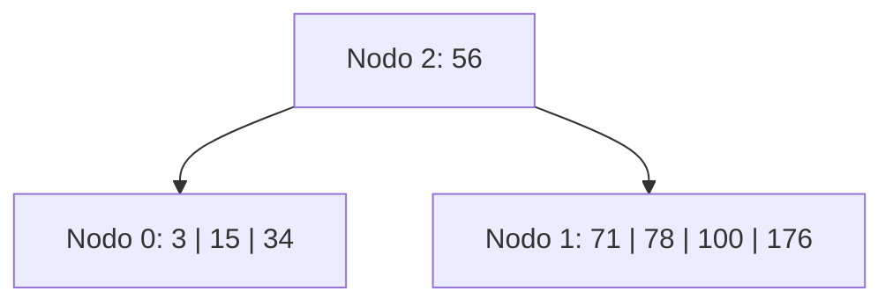
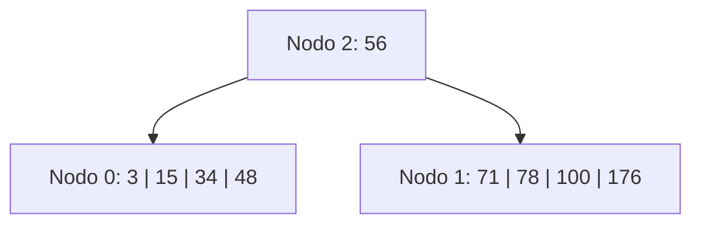
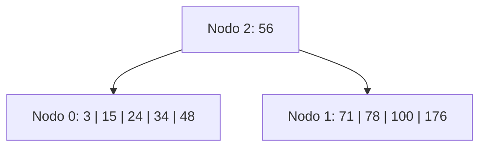
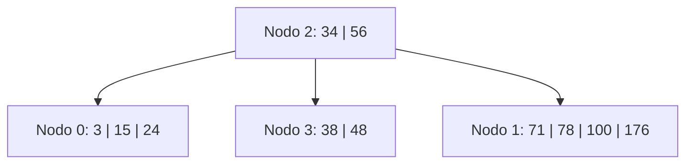
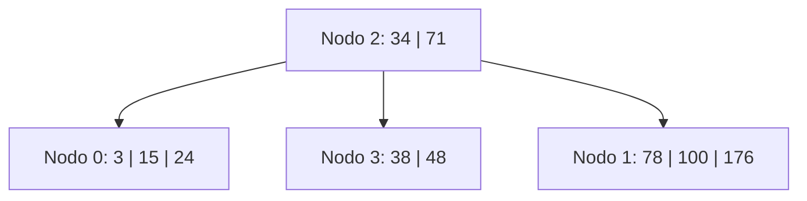
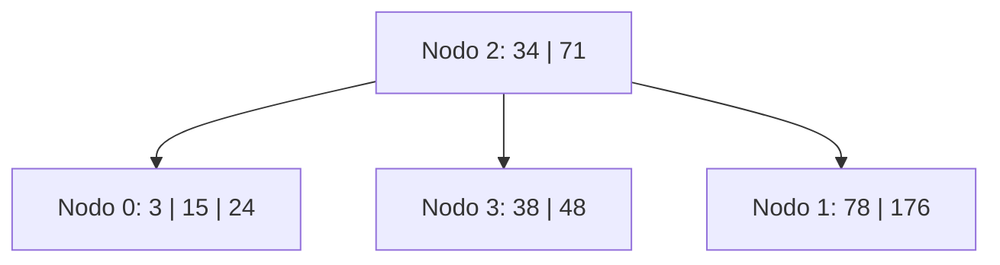

# Ejercicio 9 - Árbol B Orden 6 (Política Underflow: Derecha o Izquierda)

## Estado Inicial

```
Nodo 0: 5 h (34)(56)(78)(100)(176)
```

**Parámetros del orden 6:**
- Máximo de claves por nodo: 5
- Mínimo de claves por nodo (excepto raíz): 2 = ⌈6/2⌉ − 1
- Al hacer split de 6 claves: [a, b, c, d, e, f] → izquierda [a, b], promover **c**, derecha [d, e, f]
  (Para M=6 par: se promovela clave en posición M/2 = 3)
- **Política underflow:** primero se intenta redistribuir con hermano derecho; si no puede, con el hermano izquierdo; si tampoco puede, se fusiona con el hermano derecho.



---

## Operación: +15

**Justificación:**

1. El árbol solo tiene la raíz (nodo 0, hoja). Insertar 15 → [15, 34, 56, 78, 100, 176] = **6 claves → OVERFLOW**.
2. Orden 6 par → dividir: posición del medio = 3 → promover **56**.
   - Nodo 0 queda: [15, 34]
   - Se crea **nodo 1**: [78, 100, 176]
   - 56 sube → nodo 0 era raíz → se crea **nueva raíz**.
3. Se crea **nodo 2** (nueva raíz): [56] con hijos [0, 1].

**L/E:** `E0, E1, E2`

> *Nota: nodo 0 se reescribe con el contenido reducido, se crea nodo 1 con la mitad derecha, y se crea nodo 2 como nueva raíz.*

**Árbol resultante:**

```
Nodo 2: 1 i 0(56)1
Nodo 0: 2 h (15)(34)
Nodo 1: 3 h (78)(100)(176)
```



---

## Operación: +71

**Justificación:**

1. Buscar dónde insertar 71: raíz (nodo 2) → 71 > 56 → bajar a **nodo 1**.
2. Nodo 1: [78, 100, 176]. Insertar 71 → [71, 78, 100, 176] = **4 claves → OK** (máximo = 5).

**L/E:** `L2, L1, E1`

**Árbol resultante:**

```
Nodo 2: 1 i 0(56)1
Nodo 0: 2 h (15)(34)
Nodo 1: 4 h (71)(78)(100)(176)
```



---

## Operación: +3

**Justificación:**

1. Buscar dónde insertar 3: raíz (nodo 2) → 3 < 56 → bajar a **nodo 0**.
2. Nodo 0: [15, 34]. Insertar 3 → [3, 15, 34] = **3 claves → OK**.

**L/E:** `L2, L0, E0`

**Árbol resultante:**

```
Nodo 2: 1 i 0(56)1
Nodo 0: 3 h (3)(15)(34)
Nodo 1: 4 h (71)(78)(100)(176)
```



---

## Operación: +48

**Justificación:**

1. Buscar dónde insertar 48: raíz (nodo 2) → 48 < 56 → bajar a **nodo 0**.
2. Nodo 0: [3, 15, 34]. Insertar 48 → [3, 15, 34, 48] = **4 claves → OK**.

**L/E:** `L2, L0, E0`

**Árbol resultante:**

```
Nodo 2: 1 i 0(56)1
Nodo 0: 4 h (3)(15)(34)(48)
Nodo 1: 4 h (71)(78)(100)(176)
```



---

## Operación: +24

**Justificación:**

1. Buscar dónde insertar 24: raíz (nodo 2) → 24 < 56 → bajar a **nodo 0**.
2. Nodo 0: [3, 15, 34, 48]. Insertar 24 → [3, 15, 24, 34, 48] = **5 claves = máximo → OK** (no hay overflow).

**L/E:** `L2, L0, E0`

**Árbol resultante:**

```
Nodo 2: 1 i 0(56)1
Nodo 0: 5 h (3)(15)(24)(34)(48)
Nodo 1: 4 h (71)(78)(100)(176)
```



---

## Operación: +38

**Justificación:**

1. Buscar dónde insertar 38: raíz (nodo 2) → 38 < 56 → bajar a **nodo 0**.
2. Nodo 0: [3, 15, 24, 34, 48]. Insertar 38 → [3, 15, 24, 34, 38, 48] = **6 claves → OVERFLOW**.
3. Orden 6 par → dividir: posición 3 → promover **34**.
   - Nodo 0 queda: [3, 15, 24]
   - Se crea **nodo 3**: [38, 48]
   - 34 sube al padre (nodo 2).
4. Nodo 2 recibe 34: 0(34)3(56)1 → [34, 56] = **2 claves → OK**.

**L/E:** `L2, L0, E0, E3, E2`

**Árbol resultante:**

```
Nodo 2: 2 i 0(34)3(56)1
Nodo 0: 3 h (3)(15)(24)
Nodo 3: 2 h (38)(48)
Nodo 1: 4 h (71)(78)(100)(176)
```



---

## Operación: -56

**Justificación:**

1. Buscar 56: está en **nodo 2** (raíz), que es un nodo **interno**.
2. Para borrar de un nodo interno: reemplazar con el **sucesor** (mínimo del subárbol derecho de 56).
   - El hijo derecho de la clave 56 en nodo 2 es **nodo 1**. Su primer elemento es **71**.
3. Reemplazar 56 → **71** en nodo 2. Eliminar 71 de **nodo 1**.
4. Nodo 1: [71, 78, 100, 176] → quita 71 → [78, 100, 176] = **3 claves → OK** (mínimo = 2).
5. No hay underflow.

**L/E:** `L2, L1, E2, E1`

**Árbol resultante:**

```
Nodo 2: 2 i 0(34)3(71)1
Nodo 0: 3 h (3)(15)(24)
Nodo 3: 2 h (38)(48)
Nodo 1: 3 h (78)(100)(176)
```



---

## Operación: -100

**Justificación:**

1. Buscar 100: raíz (nodo 2) → 100 > 34, 100 > 71 → bajar a **nodo 1**: [78, 100, 176].
2. 100 está en **nodo 1** (hoja). Eliminar → [78, 176] = **2 claves → OK** (mínimo = 2).
3. No hay underflow.

**L/E:** `L2, L1, E1`

**Árbol final:**

```
Nodo 2: 2 i 0(34)3(71)1
Nodo 0: 3 h (3)(15)(24)
Nodo 3: 2 h (38)(48)
Nodo 1: 2 h (78)(176)
```


