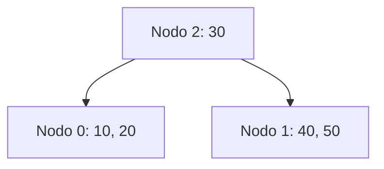
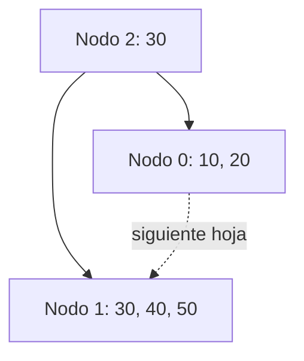
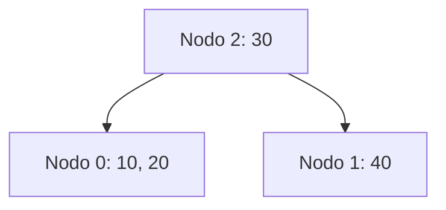
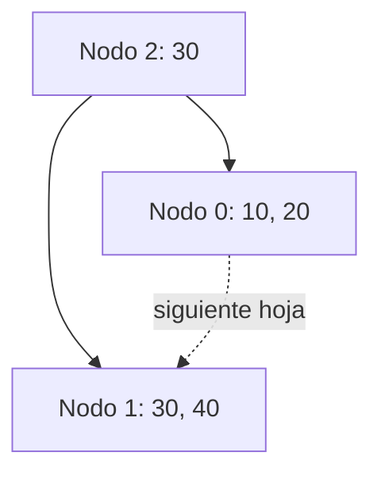

<!-- markdownlint-disable MD013 MD040 -->
# Introducción a las Bases de Datos

## Fundamentos de Organización de Datos

## Práctica 4

## Políticas para la resolución de underflow

**Política izquierda:** se intenta redistribuir con el hermano adyacente izquierdo, si no es posible, se fusiona con hermano adyacente izquierdo.

**Política derecha:** se intenta redistribuir con el hermano adyacente derecho, si no es posible, se fusiona con hermano adyacente derecho.

**Política izquierda o derecha:** se intenta redistribuir con el hermano adyacente izquierdo, si no es posible, se intenta con el hermano adyacente derecho, si tampoco es posible, se fusiona con hermano adyacente izquierdo.

**Política derecha o izquierda:** se intenta redistribuir con el hermano adyacente derecho, si no es posible, se intenta con el hermano adyacente izquierdo, si tampoco es posible, se fusiona con hermano adyacente derecho.

**Casos especiales:** en cualquier política si se tratase de un nodo hoja de un extremo del árbol debe intentarse redistribuir con el hermano adyacente que el mismo posea.

### Aclaración

- En caso de underflow lo primero que se intenta SIEMPRE es redistribuir y el hermano adyacente se encuentra en condiciones de ceder elementos si al hacerlo no se produce underflow en él.
- En caso de overflow SIEMPRE se genera un nuevo nodo. Las claves se distribuyen equitativamente entre el nodo desbordado y el nuevo.

En el caso de órdenes impares se debe promocionar la clave o la copia (en árbol B+) que se encuentra en la posición del medio.

---

### Ejemplo árbol B, orden 5



### Ejemplo árbol B+, orden 5



En el caso de órdenes pares se elige la menor de las claves mayores o su copia (en árbol B+) para promocionar.

### Ejemplo árbol B, orden 4



### Ejemplo árbol B+, orden 4



---

## Parte 1: Archivos de datos, índices y árboles B

**1.** Considere que desea almacenar en un archivo la información correspondiente a los alumnos de la Facultad de Informática de la UNLP. De los mismos deberá guardarse nombre y apellido, DNI, legajo y año de ingreso. Suponga que dicho archivo se organiza como un árbol B de orden M.

a. Defina en Pascal las estructuras de datos necesarias para organizar el archivo de alumnos como un árbol B de orden M.

b. Suponga que la estructura de datos que representa una persona (registro de persona) ocupa 64 bytes, que cada nodo del árbol B tiene un tamaño de 512 bytes y que los números enteros ocupan 4 bytes, ¿cuántos registros de persona entrarían en un nodo del árbol B? ¿Cuál sería el orden del árbol B en este caso (el valor de M)? Para resolver este inciso, puede utilizar la fórmula N = (M-1) *A + M* B + C, donde N es el tamaño del nodo (en bytes), A es el tamaño de un registro (en bytes), B es el tamaño de cada enlace a un hijo y C es el tamaño que ocupa el campo referido a la cantidad de claves. El objetivo es reemplazar estas variables con los valores dados y obtener el valor de M (M debe ser un número entero, ignorar la parte decimal).

c. ¿Qué impacto tiene sobre el valor de M organizar el archivo con toda la información de los alumnos como un árbol B?

d. ¿Qué dato seleccionaría como clave de identificación para organizar los elementos (alumnos) en el árbol B? ¿Hay más de una opción?

e. Describa el proceso de búsqueda de un alumno por el criterio de ordenamiento especificado en el punto previo. ¿Cuántas lecturas de nodos se necesitan para encontrar un alumno por su clave de identificación en el peor y en el mejor de los casos? ¿Cuáles serían estos casos?

f. ¿Qué ocurre si desea buscar un alumno por un criterio diferente? ¿Cuántas lecturas serían necesarias en el peor de los casos?

**2.** Una mejora respecto a la solución propuesta en el ejercicio 1 sería mantener por un lado el archivo que contiene la información de los alumnos de la Facultad de Informática (archivo de datos no ordenado) y por otro lado mantener un índice al archivo de datos que se estructura como un árbol B que ofrece acceso indizado por DNI de los alumnos.

a. Defina en Pascal las estructuras de datos correspondientes para el archivo de alumnos y su índice.

b. Suponga que cada nodo del árbol B cuenta con un tamaño de 512 bytes. ¿Cuál sería el orden del árbol B (valor de M) que se emplea como índice? Asuma que los números enteros ocupan 4 bytes. Para este inciso puede emplear una fórmula similar al punto 1b, pero considere además que en cada nodo se deben almacenar los M-1 enlaces a los registros correspondientes en el archivo de datos.

c. ¿Qué implica que el orden del árbol B sea mayor que en el caso del ejercicio 1?

d. Describa con sus palabras el proceso para buscar el alumno con el DNI 12345678 usando el índice definido en este punto.

e. ¿Qué ocurre si desea buscar un alumno por su número de legajo? ¿Tiene sentido usar el índice que organiza el acceso al archivo de alumnos por DNI? ¿Cómo haría para brindar acceso indizado al archivo de alumnos por número de legajo?

f. Suponga que desea buscar los alumnos que tienen DNI en el rango entre 40000000 y 45000000. ¿Qué problemas tiene este tipo de búsquedas con apoyo de un árbol B que solo provee acceso indizado por DNI al archivo de alumnos?

**3.** Los árboles B+ representan una mejora sobre los árboles B dado que conservan la propiedad de acceso indexado a los registros del archivo de datos por alguna clave, pero permiten además un recorrido secuencial rápido. Analice qué ventajas y desventajas tiene mantener en las hojas los datos.

Resuelva los siguientes incisos:

a. ¿Cómo se organizan los elementos (claves) de un árbol B+? ¿Qué elementos se encuentran en los nodos internos y qué elementos se encuentran en los nodos hojas?

b. ¿Qué característica distintiva presentan los nodos hojas de un árbol B+? ¿Por qué?

c. Defina en Pascal las estructuras de datos correspondientes para el archivo de alumnos y su índice (árbol B+). Por simplicidad, suponga que todos los nodos del árbol B+ (nodos internos y nodos hojas) tienen el mismo tamaño.

d. Describa, con sus palabras, el proceso de búsqueda de un alumno con un DNI específico haciendo uso de la estructura auxiliar (índice) que se organiza como un árbol B+. ¿Qué diferencia encuentra respecto a la búsqueda en un índice estructurado como un árbol B?

e. Explique con sus palabras el proceso de búsqueda de los alumnos que tienen DNI en el rango entre 40000000 y 45000000, apoyando la búsqueda en un índice organizado como un árbol B+. ¿Qué ventajas encuentra respecto a este tipo de búsquedas en un árbol B?

f. Defina los pro y contras de tener en las hojas los datos para acceder secuencialmente a ellos.

**4.** Dado el siguiente algoritmo de búsqueda en un árbol B:

```pascal
procedure buscar(NRR, clave, NRR_encontrado, pos_encontrada, resultado)
var clave_encontrada: boolean;
begin
  if (nodo = null)
    resultado := false; {clave no encontrada}
  else
    posicionarYLeerNodo(A, nodo, NRR);
    claveEncontrada(A, nodo, clave, pos, clave_encontrada);
    if (clave_encontrada) then begin
      NRR_encontrado := NRR; { NRR actual }
      pos_encontrada := pos; { posicion dentro del array }
      resultado := true;
    end
    else
      buscar(nodo.hijos[pos], clave, NRR_encontrado, pos_encontrada, resultado)
end;
```

Asuma que el archivo se encuentra abierto y que, para la primera llamada, el parámetro NRR contiene la posición de la raíz del árbol. Responda detalladamente:

a. PosicionarYLeerNodo(): Indique qué hace y la forma en que deben ser enviados los parámetros (valor o referencia). Implemente este módulo en Pascal.

b. claveEncontrada(): Indique qué hace y la forma en que deben ser enviados los parámetros (valor o referencia). ¿Cómo lo implementaría?

c. ¿Existe algún error en este código? En caso afirmativo, modifique lo que considere necesario.

d. ¿Qué cambios son necesarios en el procedimiento de búsqueda implementado sobre un árbol B para que funcione en un árbol B+?

**5.** Defina los siguientes conceptos:

- Overflow
- Underflow
- Redistribución
- Fusión o concatenación

En los dos últimos casos, ¿cuándo se aplica cada uno?

**6.** Suponga que se tiene un archivo que contiene información de los empleados de una empresa. De cada empleado se mantiene la siguiente información: DNI, legajo, nombre completo y salario. Considere que se mantiene además un índice, organizado como árbol B de orden 4, que provee acceso indizado a los empleados por su DNI. Grafique como queda el archivo de empleados (archivo de datos) y el archivo índice (árbol B) tras la inserción de los siguientes registros:

| DNI | Legajo | Nombre y apellido | Salario |
| --- | --- | --- | --- |
| 35.000.000 | 100 | Juan Perez | $250000 |
| 40.000.000 | 101 | Lucio Redivo | $400000 |
| 32.000.000 | 102 | Nicolás Lapro | $720000 |
| 28.000.000 | 103 | Luis Scola | $2000000 |
| 26.000.000 | 104 | Andres Nocioni | $1500000 |
| 37.000.000 | 105 | Facundo Campazzo | $1200000 |
| 25.000.000 | 106 | Emanuel Ginobili | $5000000 |
| 23.000.000 | 107 | Pepe Sanchez | $1000000 |
| 21.000.000 | 108 | Alejandro Montecchia | $800000 |
| 36.000.000 | 109 | Marcos Delia | $300000 |
| 45.000.000 | 110 | Leandro Bolmaro | $600000 |

Notas:

- Grafique los estados de ambos archivos (datos e índice) cuando ocurren cambios relevantes en el índice como la creación de un nuevo nodo.
- Además de graficar los archivos con sus respectivas estructuras internas, resulta útil que grafique la vista del archivo índice como un árbol B.

---

## Parte 2: Operaciones en árboles B y B+

Para los siguientes ejercicios debe:

- Indicar los nodos leídos y escritos en cada operación.
- Todas las operaciones deben estar claramente justificadas, enunciando las mismas indefectiblemente tal cual se presenta en la materia.
- Los números de nodo deben asignarse en forma coherente con el crecimiento del archivo. La reutilización de nodos libres se debe efectuar con política LIFO (último en entrar, primero en salir).
- Para los siguientes ejercicios sólo interesa graficar los estados del árbol B que representa el índice (no es necesario dibujar la estructura interna de los archivos como si se solicitó en el ejercicio 6).

**7.** Dado el siguiente árbol B de orden 5, con política de resolución de underflow a izquierda, realice las siguientes operaciones: +320, -390, -400, -533. Por cada operación:

a. Dibuje el árbol resultante.
b. Justifique las decisiones tomadas durante la operación.
c. Indique las lecturas/escrituras de nodos en el orden en que ocurren.

```
2: 0 (220) 1 (390) 4 (455) 5 (541) 3
0: (10)(150)
1: (225)(241)(331)(360)
4: (400)(407)
5: (508)(533)
3: (690)(823)
```

**8.** Dado el siguiente árbol B de orden 4, con política de resolución de underflow a derecha, realice las siguientes operaciones: +5, +9, +80, +15, -92, -77. Por cada operación:

a. Dibuje el árbol resultante.
b. Justifique las decisiones tomadas durante la operación.
c. Indique las lecturas/escrituras de nodos en el orden en que ocurren.

```
2: 0 (66) 1
0: (22)(32)(50)
1: (77)(79)(92)
```

**9.** Dado el siguiente árbol B de orden 6, mostrar cómo quedaría el mismo luego de realizar las siguientes operaciones: +15, +71, +3, +48, +24, +38, -56, -100.

Política de resolución de underflows: derecha o izquierda.

```
0: (34)(56)(78)(100)(176)
```

**10.** Dado el siguiente árbol B de orden 5, mostrar cómo quedaría el mismo luego de realizar las siguientes operaciones: +450, -485, -511, -614.

Política de resolución de underflows: derecha.

```
2: 0 (315) 1 (485) 4 (547) 5 (639) 3
0: (148)(223)
1: (333)(390)(442)(454)
4: (508)(511)
5: (614)(633)
3: (789)(915)
```

**11.** Dada las siguientes operaciones, mostrar la construcción paso a paso de un árbol B de orden 4: +50, +70, +40, +15, +90, +120, +115, +45, +30, +100, +112, +77, -45, -40, -50, -90, -100.

Política de resolución de underflows: izquierda o derecha.

**12.** Dadas las siguientes operaciones, mostrar la construcción paso a paso de un árbol B de orden 5:

Política de resolución de underflows: izquierda.

+80, +50, +70, +120, +23, +52, +59, +65, +30, +40, +45, +31, +34, +38, +60, +63, +64, -23, -30, -31, -40, -45, -38.

**13.** Dado el siguiente árbol B de orden 6, mostrar cómo quedaría el mismo luego de realizar las siguientes operaciones: +300, +577, -586, -570, -380, -460.

Política de resolución de underflows: izquierda o derecha.

```
2: 0 (216) 1 (460) 4 (570) 5 (689) 3 (777) 6
0: (100)(159)(171)
1: (222)(256)(358)(380)(423)
4: (505)(522)
5: (586)(599)(615)(623)(680)
3: (703)(725)
6: (789)(915)(1000)
```

**14.** Dado el siguiente árbol B+ de orden 4, con política de resolución de underflow a derecha, realice las siguientes operaciones: +80, -400, -50, -11, -77. Por cada operación:

a. Dibuje el árbol resultante.
b. Justifique las decisiones tomadas durante la operación.
c. Indique las lecturas/escrituras de nodos en el orden en que ocurren.

```
4: 0 (340) 1 (400) 2 (500) 3
0: (11)(50)(77) -> 1
1: (340)(350)(360) -> 2
2: (402)(410)(420) -> 3
3: (520)(530) -> -1
```

**15.** Dado el siguiente árbol B+ de orden 4, mostrar como quedaría el mismo luego de realizar las siguientes operaciones: +120, +110, +52, +70, +15, -45, -52, +22, +19, -66, -22, -19, -23, -89.

Política de resolución de underflows: derecha.

```
2: 0 (66) 1
0: (23)(45) -> 1
1: (66)(67)(89)
```

**16.** Dada las siguientes operaciones, mostrar la construcción paso a paso de un árbol B+ de orden 6: +52, +23, +10, +99, +63, +74, +19, +85, +14, +73, +5, +7, +41, +100, +130, +44, -63, -73, +15, +16, -74, -52.

Política de resolución de underflows: izquierda.

**17.** Dado un árbol B+ de orden 4 y con política izquierda o derecha, para cada operación dada:

a. Dibuje el árbol resultante.
b. Explique brevemente las decisiones tomadas.
c. Escriba las lecturas y escrituras.

Operaciones: +4, +44, -94, -104

```
nodo 7: 1 i 2(69)6
nodo 2: 2 i 0(30)1(51)3
nodo 6: 1 i 4(94)5
nodo 0: 3 h(5)(10)(20) -> 1
nodo 1: 2 h(30)(40) -> 3
nodo 3: 2 h(51)(60) -> 4
nodo 4: 2 h(69)(80) -> 5
nodo 5: 1 h(104) -> -1
```

**18.** Dado el árbol B+ que se detalla más abajo, con orden 6, es decir, capacidad de 5 claves como máximo. Muestre los estados sucesivos al realizar la siguiente secuencia de operaciones: +159, -5 y -190, además indicar nodos leídos y escritos en el orden de ocurrencia. Política de resolución underflow derecha.

```
Nodo 2: 5, i, 0(10)1(60)3(115)4(145)5(179)6
Nodo 0: 2, h, (1)(5) -> 1
Nodo 1: 2, h, (34)(44) -> 3
Nodo 3: 2, h, (60)(113) -> 4
Nodo 4: 4, h, (120)(125)(131)(139) -> 5
Nodo 5: 5, h, (145)(153)(158)(160)(177) -> 6
Nodo 6: 2, h, (179)(190) -> -1
```

**19.** Dado un árbol B de orden 5 y con política izquierda o derecha, para cada operación dada:

a. Dibuje el árbol resultante
b. Explique detalladamente las decisiones tomadas
c. Escriba las lecturas y escrituras

Operaciones: +165, +260, +800, -110

```
Árbol: Nodo 8: 1 i 2 (150) 7
Nodo 2: 1 i 0 (120) 3
Nodo 7: 2 i 4 (210) 6 (300) 1
Nodo 0: 2 h (30)(110)
Nodo 3: 1 h (130)
Nodo 4: 4 h (160)(170)(180)(200)
Nodo 6: 4 h (220)(230)(240)(250)
Nodo 1: 4 h (400)(500)(600)(700)
```

**20.** Dado un árbol B+ de orden 5 y con política izquierda o derecha, para cada operación dada:

a. Dibuje el árbol resultante
b. Explique detalladamente las decisiones tomadas
c. Escriba las lecturas y escrituras

Operaciones: +250, -300, -40

```
Árbol: nodo 8: 1 i 2(70)7
nodo 2: 1 i 0(50)4
nodo 7: 4 i 5(90)6(120)3(210)9(300)1
nodo 0: 1 h(40) -> 4
nodo 4: 1 h(50) -> 5
nodo 5: 2 h(70)(80) -> 6
nodo 6: 2 h(90)(100) -> 3
nodo 3: 2 h(120)(200) -> 9
nodo 9: 4 h(210)(220)(230)(240) -> 1
nodo 1: 2 h(400)(500) -> -1
```

---

## Parte 3: Preguntas para afianzar conocimientos

Analice y responda las siguientes preguntas sobre árboles B.

**1.** Se tiene un árbol B de orden 5 inicialmente vacío. Se insertan en este orden las claves: 12, 7, 25, 30, 3, 15, 18, 20.

¿Cuál de las siguientes afirmaciones es correcta después de todas las inserciones?

A) La raíz tiene 3 claves y 4 hijos.
B) La raíz tiene 2 claves y 3 hijos.
C) La raíz tiene 4 claves y 5 hijos.
D) La raíz tiene 1 clave y 2 hijos.
E) Ninguna de las anteriores

**2.** ¿Cuáles de las siguientes operaciones pueden provocar una redistribución de claves entre nodos hermanos en un árbol B?

A) Inserción con desborde.
B) Borrado.
C) Búsqueda.
D) División de la raíz.
E) Inserción sin desborde.

**3.** Se tiene un árbol B de orden 5 con las claves iniciales: 10, 20, 30, 40, 50. Se inserta la clave 25.

¿Qué sucede cuando se inserta la clave 25?

A) La raíz se divide en dos nodos hijos.
B) La raíz mantiene todas las claves sin división.
C) Se crea un nuevo nivel con dos hijos.
D) La clave 25 se inserta en un nodo hoja sin cambios en la raíz.

**4.** Dado el siguiente árbol B+ de orden 4 con política izquierda o derecha, indique el árbol resultante para la baja de la clave 94.

```
7: 2 (65) 6
2: 0 (30) 1 (51) 3
6: 4 (94) 5
0: 3 (5)(10) -> 1
1: (30) -> 3
3: (51)(60) -> 4
4: (69)(80) -> 5
5: (104) -> -1
```

A)

```
7: 2 (65) 6
2: 0 (30) 1 (51) 3
6: 4 (94) 5
0: 3 (5)(10) -> 1
1: (30) -> 3
3: (51)(60) -> 4
4: (69)(80) -> 5
5: (104) -> -1
```

B)

```
7: 2 (65) 6
2: 0 (30) 1 (51) 3
6: 4 (80) 5
0: 3 (5)(10) -> 1
1: (30) -> 3
3: (51)(60) -> 4
4: (69)(80) -> 5
5: (104) -> -1
```

C)

```
7: 2 (65) 6
2: 0 (30) 1 (51) 3
6: 4 (80) 5
0: 3 (5)(10) -> 1
1: (30) -> 3
3: (51)(60) -> 4
4: (69) -> 5
5: (104) -> -1
```

D)

```
7: 2 (65) 6
2: 0 (30) 1 (51) 3
6: 4 (104) 5
0: 3 (5)(10) -> 1
1: (30) -> 3
3: (51)(60) -> 4
4: (80) -> 5
5: (104) -> -1
```

**5.** Dado el siguiente árbol B+ de orden 4 con política izquierda, indicar las L/E para la baja de la clave 80.

```
7: 2 (65) 6
2: 0 (30) 1 (51) 3
6: 4 (94) 5
0: 3 (5)(10) -> 1
1: (30) -> 3
3: (51)(60) -> 4
4: (80) -> 5
5: (104) -> -1
```

A) L7,L6,L4,L3,E3,E4,E6,E7
B) L7,L6,L4,L5,E4,E5,L2,E2,E6,E7
C) L7,L6,L4,E4,L2,E2,E6,E7
D) L7,L6,L4,L5,E4,L2,E2,E6,E7
