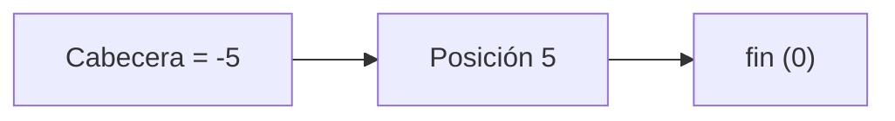
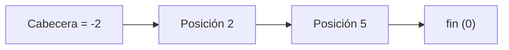
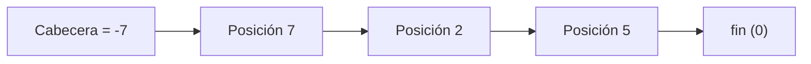

# Fundamentos de Organización de Datos — Archivos: Bajas

> Conversión de la presentación `6_-_Archivos_-_Bajas.pptx` a Markdown. El contenido textual se conserva tal cual figura en las diapositivas originales. Los dos ejemplos numéricos (diapositivas 10 y 11) se mostraban mediante animaciones superpuestas; aquí se reconstruyen como una secuencia de tablas y diagramas Mermaid, uno por cada estado intermedio del archivo.

---

## Diapositiva 1 — Portada

Fundamentos de Organización de Datos
Archivos — Bajas

---

## Diapositiva 2 — Algorítmica clásica sobre archivos

**¿Qué es una baja?**

Se denomina proceso de baja a aquel proceso que permite quitar información de un archivo.

---

## Diapositiva 3 — Modos de baja

El proceso de baja puede llevarse a cabo de dos modos diferentes:

- **Baja física**: Consiste en borrar efectivamente la información del archivo, recuperando el espacio físico.
- **Baja lógica**: Consiste en borrar la información del archivo, pero sin recuperar el espacio físico respectivo.

---

## Diapositiva 4 — Baja Física

Se realiza baja física sobre un archivo cuando un elemento es efectivamente quitado del archivo, decrementando en uno la cantidad de elementos.

- **VENTAJA**: En todo momento, se administra un archivo de datos que ocupa el lugar mínimo necesario.
- **DESVENTAJA**: Performance de los algoritmos que implementan esta solución.

---

## Diapositiva 5 — Técnicas de Baja Física

- Generar un nuevo archivo con los elementos válidos (sin copiar los que se desea eliminar).
- Utilizar el mismo archivo de datos, generando los reacomodamientos que sean necesarios. (Solo para archivos sin ordenar)

---

## Diapositiva 6 — Ejemplo: algoritmo (Baja física, parte 1)

```pascal
begin {se sabe que existe Carlos Garcia}
    assign (archivo, 'arch_empleados');
    assign (archivo_nuevo, 'arch_nuevo');
    reset (archivo);
    rewrite (archivo_nuevo);
    leer (archivo, reg);
    {se copian los registros previos a Carlos Garcia}
    while (reg.nombre <> 'Carlos Garcia') do begin
        write (archivo_nuevo, reg);
        leer (archivo, reg);
    end;
```

---

## Diapositiva 7 — Ejemplo: algoritmo (Baja física, parte 2)

```pascal
    {se descarta a Carlos Garcia}
    leer(archivo, reg);
    {se copian los registros restantes}
    while (reg.nombre <> valoralto) do begin
        write(archivo_nuevo, reg);
        leer(archivo, reg);
    end;
close(archivo_nuevo);
    close(archivo);
{renombrar el archivo original para dejarlo como respaldo}
  rename(archivo,'arch_empleados_old');
{renombrar el archivo temporal con el nombre del original}
  rename(archivo_nuevo, 'arch_empleados');
end.
```

---

## Diapositiva 8 — Ejemplo: Baja lógica

```pascal
Begin {se sabe que existe Carlos Garcia}
    assign(archivo, 'arch_empleados');
    reset(archivo);
    leer(archivo, reg);
    {Se avanza hasta Carlos Garcia}
    while (reg.nombre <> 'Carlos Garcia') do
        leer(archivo, reg);
    {Se genera una marca de borrado}
    reg.nombre := '***';
    {Se borra lógicamente a Carlos Garcia}
    seek(archivo, filepos(archivo)-1 );
    write(archivo, reg);
    close(archivo);
end.
```

---

## Diapositiva 9 — Técnicas

- **Recuperación de espacio**: Se utiliza el proceso de baja física periódicamente para realizar un proceso de compactación del archivo. Quita los registros marcados como eliminados, utilizando cualquiera de los algoritmos vistos para baja física.
- **Reasignación de espacio**: Recupera el espacio utilizando los lugares indicados como eliminados para el ingreso de nuevos elementos al archivo (altas).

---

## Diapositiva 10 — Ejemplo Reasignación de espacio: Marca de eliminado

Archivo de enteros (NRR 0 a 8). Se eliminan, en orden, las claves: **116, 304, 824**.

**Estado inicial**

| NRR | 0 | 1 | 2 | 3 | 4 | 5 | 6 | 7 | 8 |
|---|---|---|---|---|---|---|---|---|---|
| Valor | 156 | 304 | 228 | 98 | 116 | 504 | 824 | 597 | 15 |

**Paso 1 — Eliminar 116 (NRR 4)**: se reemplaza el valor por una marca de eliminado (`***`).

| NRR | 0 | 1 | 2 | 3 | 4 | 5 | 6 | 7 | 8 |
|---|---|---|---|---|---|---|---|---|---|
| Valor | 156 | 304 | 228 | 98 | `***` | 504 | 824 | 597 | 15 |

**Paso 2 — Eliminar 304 (NRR 1)**

| NRR | 0 | 1 | 2 | 3 | 4 | 5 | 6 | 7 | 8 |
|---|---|---|---|---|---|---|---|---|---|
| Valor | 156 | `***` | 228 | 98 | `***` | 504 | 824 | 597 | 15 |

**Paso 3 — Eliminar 824 (NRR 6)**

| NRR | 0 | 1 | 2 | 3 | 4 | 5 | 6 | 7 | 8 |
|---|---|---|---|---|---|---|---|---|---|
| Valor | 156 | `***` | 228 | 98 | `***` | 504 | `***` | 597 | 15 |

**¿Desventajas de esta técnica?** (pregunta planteada en la diapositiva original, sin respuesta desarrollada en el contenido fuente).

---

## Diapositiva 11 — Ejemplo Reasignación de espacio: Lista invertida

Misma idea, pero en lugar de solo marcar el registro como eliminado, los espacios libres se encadenan entre sí mediante punteros negativos, formando una **lista de libres**. La posición 0 es un **registro cabecera** que apunta al primer espacio libre. Se eliminan, en el mismo orden, las claves: **116, 304, 824**.

**Estado inicial**

| Posición | 0 (Cabecera) | 1 | 2 | 3 | 4 | 5 | 6 | 7 | 8 | 9 |
|---|---|---|---|---|---|---|---|---|---|---|
| Valor | 0 | 156 | 304 | 228 | 98 | 116 | 504 | 824 | 597 | 15 |


**Paso 1 — Eliminar 116 (posición 5)**: la cabecera pasa a apuntar a la posición 5; la posición 5 guarda el valor anterior de la cabecera (0, que actúa como terminador de la lista).

| Posición | 0 (Cabecera) | 1 | 2 | 3 | 4 | 5 | 6 | 7 | 8 | 9 |
|---|---|---|---|---|---|---|---|---|---|---|
| Valor | -5 | 156 | 304 | 228 | 98 | 0 | 504 | 824 | 597 | 15 |



**Paso 2 — Eliminar 304 (posición 2)**: la cabecera pasa a -2; la posición 2 guarda el valor anterior de la cabecera (-5), encadenándose con el espacio libre anterior.

| Posición | 0 (Cabecera) | 1 | 2 | 3 | 4 | 5 | 6 | 7 | 8 | 9 |
|---|---|---|---|---|---|---|---|---|---|---|
| Valor | -2 | 156 | -5 | 228 | 98 | 0 | 504 | 824 | 597 | 15 |



**Paso 3 — Eliminar 824 (posición 7)**: la cabecera pasa a -7; la posición 7 guarda el valor anterior de la cabecera (-2).

| Posición | 0 (Cabecera) | 1 | 2 | 3 | 4 | 5 | 6 | 7 | 8 | 9 |
|---|---|---|---|---|---|---|---|---|---|---|
| Valor | -7 | 156 | -5 | 228 | 98 | 0 | 504 | -2 | 597 | 15 |



La lista de espacios libres queda, en orden, encadenada como: **Cabecera → Posición 7 → Posición 2 → Posición 5 → fin**. Esta cadena indica el orden en que esos espacios estarán disponibles para ser reutilizados en futuras altas.

