# Fundamentos de Organización de Datos — Árboles B

> Conversión de la presentación `7_-_Árboles_B.pptx` a Markdown. El contenido textual se conserva tal cual figura en las diapositivas originales. Los diagramas de árboles que en el archivo original se construían mediante animaciones superpuestas (varias cajas de texto apiladas en la misma posición de una misma diapositiva) fueron reconstruidos aquí como una secuencia de diagramas Mermaid independientes, uno por cada estado intermedio, aplicando fielmente el algoritmo de inserción/eliminación en árboles B de orden 4 descrito en la propia presentación y contrastando cada resultado contra los estados finales mostrados de forma inequívoca en las diapositivas correspondientes.

---

## Diapositiva 1 — Portada

Fundamentos de Organización de Datos
Árboles B

---

## Diapositiva 2 — Árboles B y B+

Los árboles B son árboles multicamino con una construcción especial en forma ascendente que permite mantenerlos balanceados a bajo costo.

---

## Diapositiva 3 — Propiedades de un Árbol B de orden M

- Cada nodo del árbol puede contener como máximo M descendientes directos (hijos).
- La raíz no posee descendientes directos o tiene al menos dos.
- Un nodo interno con X hijos contiene X-1 elementos.
- Todos los nodos (salvo la raíz) tienen como mínimo [M/2] – 1 elementos y como máximo M-1 elementos.
- Todos los nodos terminales se encuentran al mismo nivel.
- Cada nodo tiene sus elementos ordenados por clave. Además, todos los elementos en el subárbol izquierdo de un elemento son menores o iguales que dicho elemento, mientras que todos los elementos en el subárbol derecho son mayores que ese elemento.

---

## Diapositiva 4 — Ejemplo de Árbol B de orden 4

Diagrama estático de ejemplo (no animado) que ilustra la forma general de un árbol B de orden 4 con tres niveles.

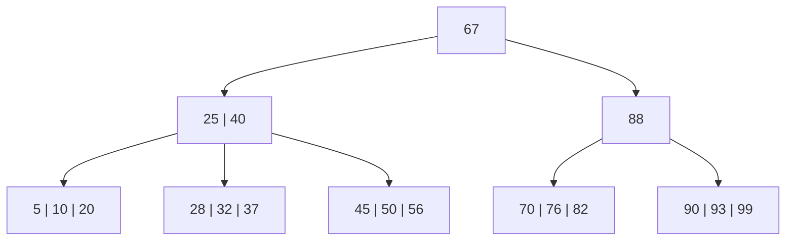

---

## Diapositiva 5 — ¿Para qué usamos los árboles B?

Alternativas:

- Organizar el archivo de datos como un árbol B.
- Organizar el archivo índice un árbol B.

---

## Diapositiva 6 — Archivo de datos como árbol B

```pascal
const M = … ; {orden del árbol}
type
TDato = record
  codigo: longint;
  nombre: string[50];
end;
    TNodo = record
        cant_datos: integer;
        datos: array[1..M-1] of TDato;
        hijos: array[1..M] of integer;
    end;
    arbolB = file of TNodo;
var
        archivoDatos: arbolB;
```

---

## Diapositiva 7 — Alternativa 1: archivo de datos como árbol B (ejemplo)

Árbol de ejemplo (orden 4) con las claves 67-Pedro, 25-María, 40-Luis y 96-Franco:

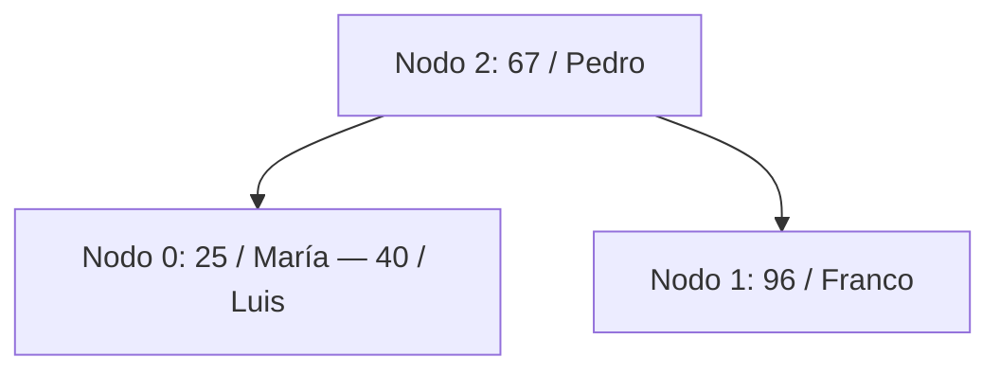

Representación física del archivo (un registro por nodo del árbol):

| NRR | cant_claves (cd) | datos (clave/nombre) | hijos |
|---|---|---|---|
| 0 | 2 | 1: 25/María — 2: 40/Luis | 1: -1, 2: -1, 3: — |
| 1 | 1 | 1: 96/Franco | 1: -1, 2: -1 |
| 2 | 1 | 1: 67/Pedro | 1: 0, 2: 1 |

**¿Problemas de esta alternativa?** (pregunta planteada en la diapositiva original, sin respuesta desarrollada en el contenido fuente: implica que el archivo de datos completo —incluyendo campos largos como nombres— se reorganiza físicamente cada vez que el árbol se balancea).

---

## Diapositiva 8 — Archivo índice como árbol B

```pascal
const M = … ; {orden del árbol}
type
TDato = record
  codigo: longint;
  nombre: string[50];
end;
    TNodo = record
        cant_claves: integer;
        claves: array[1..M-1] of longint;
        enlaces: array [1..M-1] of integer;
        hijos: array[1..M] of integer;
    end;
    TArchivoDatos  = file of TDato;
    arbolB = file of TNodo;
var
        archivoDatos: TArchivoDatos;
        archivoIndice: arbolB;
```

---

## Diapositiva 9 — Alternativa 2: archivo índice como árbol B (ejemplo)

A diferencia de la alternativa anterior, aquí el árbol B solo almacena **claves y enlaces** hacia un archivo de datos separado (no ordenado), evitando así reorganizar los registros completos.

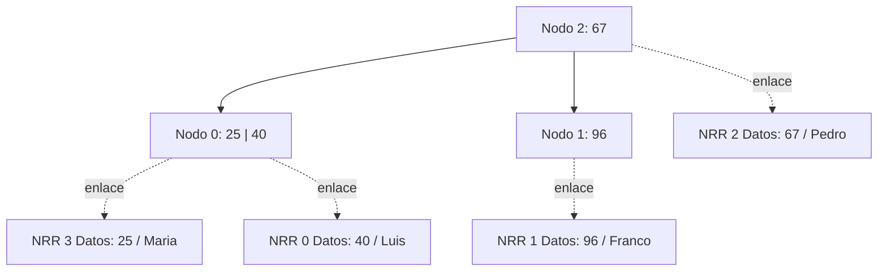

Archivo de datos (no ordenado):

| NRR | Código | Nombre |
|---|---|---|
| 0 | 40 | Luis |
| 1 | 96 | Franco |
| 2 | 25 | Maria |
| 3 | 67 | Pedro |

Archivo índice (árbol B):

| NRR | cant_claves (cc) | claves | enlaces | hijos |
|---|---|---|---|---|
| 0 | 2 | 1: 25, 2: 40 | 1: 2, 2: 0 | 1: -1, 2: -1, 3: — |
| 1 | 1 | 1: 96 | 1: 4 | 1: -1, 2: -1 |
| 2 | 1 | 1: 67 | 1: 3 | 1: 0, 2: 1 |

---

## Diapositiva 10 — Ejemplo: Árbol B de orden 4 (construcción, parte 1)

Árbol inicial vacío. Se insertan las claves **+40, +25, +96**.

**Paso 1 — Insertar 40**

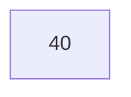

**Paso 2 — Insertar 25**


**Paso 3 — Insertar 96**: el nodo llega a su capacidad máxima (3 claves) sin overflow.


(La clave +67 queda pendiente para la diapositiva siguiente.)

---

## Diapositiva 11 — Overflow (regla general)

- Se crea un nuevo nodo.
- La primera mitad de las claves se mantiene en el nodo con overflow.
- La segunda mitad de las claves se traslada al nuevo nodo.
- La menor de las claves de la segunda mitad se promociona al nodo padre.

---

## Diapositiva 12 — Construcción, parte 2 (+67)

**Paso 4 — Insertar 67**: el nodo raíz `[25, 40, 96]` recibe 67 y queda `[25, 40, 67, 96]` → **overflow**. Se crea un nuevo nodo: la primera mitad `[25, 40]` queda en el nodo original (Nodo 0), la segunda mitad es `[67, 96]`, de la cual la menor clave (67) se promociona al padre y el resto `[96]` pasa al nuevo nodo (Nodo 1). Como el nodo que desbordó era la raíz, se crea una **nueva raíz** (Nodo 2) y aumenta la altura del árbol.

> ¡Notar la numeración de los nodos! — aclaración presente en la diapositiva original sobre cómo se asignan los identificadores de nodo (NRR) al crear nuevos nodos.

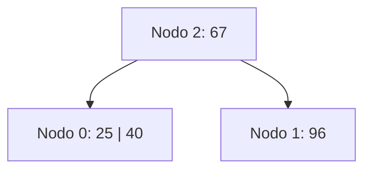

Archivo resultante:

| NRR | cant_claves (cc) | claves | hijos |
|---|---|---|---|
| 0 | 2 | 25, 40 | -1, -1, -1 |
| 1 | 1 | 96 | -1, -1 |
| 2 | 1 | 67 | 0, 1 |

---

## Diapositiva 13 — Construcción, parte 3 (+88, +105, +75)

Se parte del árbol de la diapositiva 12.

**Paso 5 — Insertar 88**: entra en el Nodo 1 (subárbol derecho de 67).

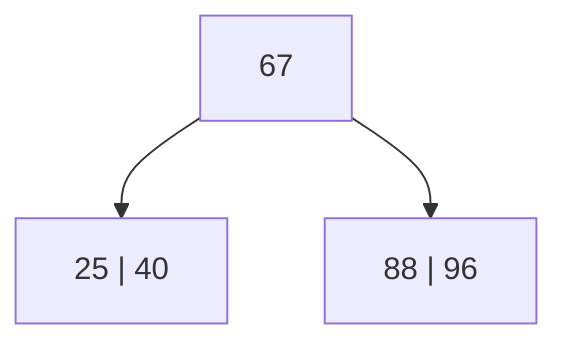

**Paso 6 — Insertar 105**: entra también en el Nodo 1.

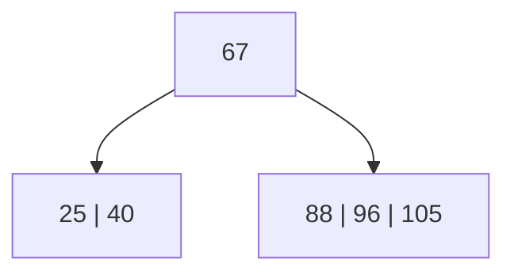

**Paso 7 — Insertar 75**: el Nodo 1 `[88, 96, 105]` recibe 75 y queda `[75, 88, 96, 105]` → **overflow en el nodo 1**. División del mismo y promoción de la clave 96 al padre.

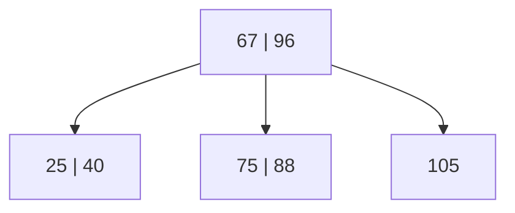

---

## Diapositiva 14 — Construcción, parte 4 (+91, +80)

Se parte del árbol de la diapositiva 13.

**Paso 8 — Insertar 91**: entra en el Nodo 1 `[75, 88]` → `[75, 88, 91]`.

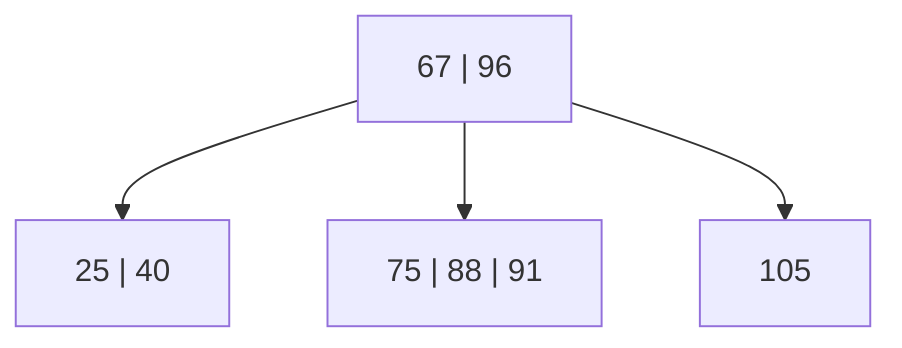

**Paso 9 — Insertar 80**: el Nodo 1 `[75, 88, 91]` recibe 80 y queda `[75, 80, 88, 91]` → **overflow en el nodo 1**. División del mismo y promoción de la clave 88.

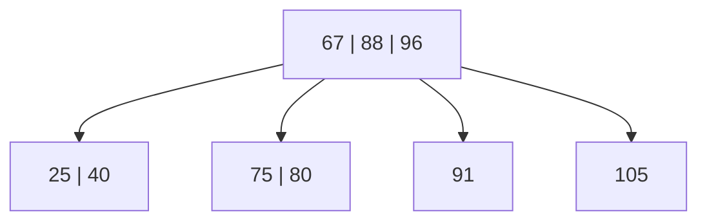

---

## Diapositiva 15 — Análisis de lecturas/escrituras y siguientes altas

Pregunta planteada: **¿L/E necesarias para el alta de la clave 80?**

Respuesta: **L2, L1, E1, E4, E2** (cada nodo se lee a lo sumo 1 vez).

Se indica que a continuación se completa el árbol con las altas de: **+86, +120, +230, +95, +55**.

---

## Diapositiva 16 — Construcción, parte 5 (+86, +120, +230, +95, +55, +70)

Se parte del árbol de la diapositiva 14/15.

**Paso 10 — Insertar 86**: entra en el Nodo 1 `[75, 80]` → `[75, 80, 86]`.

**Paso 11 — Insertar 120**: entra en el Nodo 3 `[105]` → `[105, 120]`.

**Paso 12 — Insertar 230**: entra en el Nodo 3 `[105, 120]` → `[105, 120, 230]`.

**Paso 13 — Insertar 95**: entra en el Nodo 4 `[91]` → `[91, 95]`.

**Paso 14 — Insertar 55**: entra en el Nodo 0 `[25, 40]` → `[25, 40, 55]`.

Ninguna de estas cinco altas produce overflow. Estado resultante:

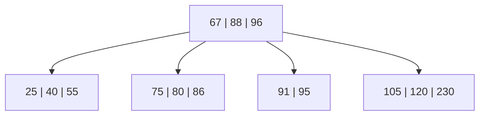

**Paso 15 — Alta de +70**: el Nodo 1 `[75, 80, 86]` recibe 70 y queda `[70, 75, 80, 86]` → **overflow en el nodo 1**. División del mismo y promoción de la clave 80. La raíz `[67, 88, 96]` recibe la clave 80 y queda `[67, 80, 88, 96]` → **también entra en overflow**: se propaga la división a la raíz, que se divide y aumenta la altura del árbol (**nueva raíz**).

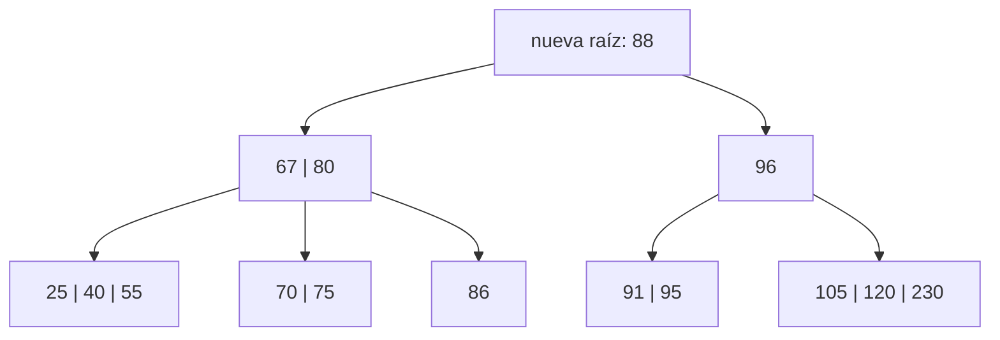

---

## Diapositiva 17 — Árbol completo y comienzo de las bajas

Estado final tras todas las inserciones (idéntico al resultado de la diapositiva 16, paso 15), con la numeración de nodos de la presentación: Nodo 7 (raíz) = 88; Nodo 2 = 67, 80; Nodo 6 = 96; Nodo 0 = 25, 40, 55; Nodo 1 = 70, 75; Nodo 5 = 86; Nodo 4 = 91, 95; Nodo 3 = 105, 120, 230.

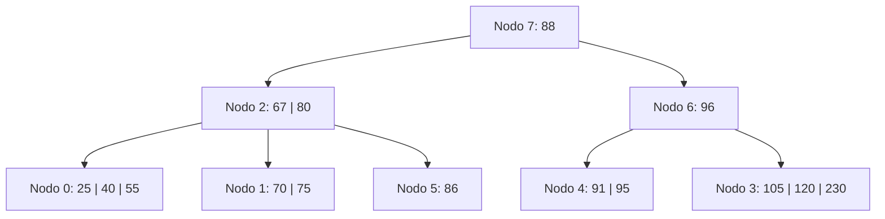

A partir de aquí comienza la sección de **Bajas**, anunciando la eliminación de la clave **-75**.

---

## Diapositiva 18 — Bajas (anuncio)

Se retoma el árbol de la diapositiva 17 y se anuncia el comienzo de la sección **Bajas**, con la primera eliminación a tratar: **-75**.

---

## Diapositiva 19 — Reglas generales para las bajas

- Si la clave a eliminar no está en una hoja, se debe reemplazar con la menor clave del subárbol derecho.
- Si el nodo hoja contiene por lo menos el mínimo número de claves, luego de la eliminación, no se requiere ninguna acción adicional.
- En caso contrario, se debe tratar el underflow.

---

## Diapositiva 20 — Bajas: Underflow

4. Primero se intenta redistribuir con un hermano adyacente. La redistribución es un proceso mediante el cual se trata de dejar cada nodo lo más equitativamente cargado posible.

5. Si la redistribución no es posible, entonces se debe fusionar con el hermano adyacente.

---

## Diapositiva 21 — Políticas para la resolución de underflow

- **Política izquierda**: se intenta redistribuir con el hermano adyacente izquierdo, si no es posible, se fusiona con hermano adyacente izquierdo.
- **Política derecha**: se intenta redistribuir con el hermano adyacente derecho, si no es posible, se fusiona con hermano adyacente derecho.
- **Política izquierda o derecha**: se intenta redistribuir con el hermano adyacente izquierdo, si no es posible, se intenta con el hermano adyacente derecho, si tampoco es posible, se fusiona con hermano adyacente izquierdo.
- **Política derecha o izquierda**: se intenta redistribuir con el hermano adyacente derecho, si no es posible, se intenta con el hermano adyacente izquierdo, si tampoco es posible, se fusiona con hermano adyacente derecho.

---

## Diapositiva 22 — Casos especiales

Casos especiales: en cualquier política si se tratase de un nodo hoja de un extremo del árbol debe intentarse redistribuir con el hermano adyacente que el mismo posea.

Aclaración: en caso de underflow lo primero que se intenta **SIEMPRE** es redistribuir, si el hermano adyacente se encuentra en condiciones de hacer la redistribución y no se produce underflow en él.

---

## Diapositiva 23 — Bajas: -75, -88

Se parte del árbol final de la diapositiva 17.

**Paso 1 — Eliminar 75**: la clave 75 está en una hoja (Nodo 1). Se elimina directamente: `[70, 75]` → `[70]`. Como el mínimo de claves por nodo es 1, **no se genera underflow**.

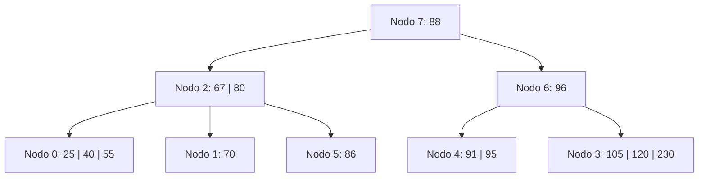

**Paso 2 — Eliminar 88**: la clave 88 está en la **raíz** (nodo interno), no en una hoja. Se reemplaza por la menor clave del subárbol derecho: la menor clave de Nodo 4 `[91, 95]` es 91. La raíz pasa a tener la clave 91, y el Nodo 4 queda `[95]`. No se genera underflow en la hoja.

L/E necesarias: **L7, L6, L4, E4, E7**.

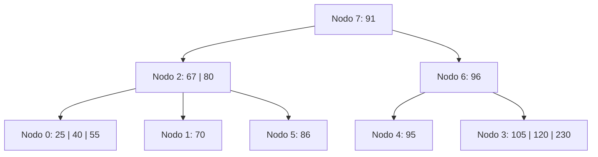

---

## Diapositiva 24 — Bajas: -70 (ejemplo política derecha o izquierda)

Se parte del árbol obtenido al final de la diapositiva 23.

**Paso 3 — Eliminar 70**: el Nodo 1 `[70]` (que tenía el mínimo de 1 clave) queda **vacío** → **underflow**.

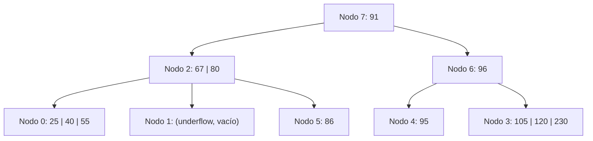

---

## Diapositiva 25 — Explicación: Baja de la clave 70 (política derecha o izquierda)

La eliminación de la clave 70 en el nodo 1 produce underflow.

Se intenta redistribuir con el hermano derecho (Nodo 5 = `[86]`). No es posible, ya que el nodo contiene la cantidad mínima de claves.

Se intenta redistribuir con el hermano izquierdo (Nodo 0 = `[25, 40, 55]`). La operación es posible y se rebalancea la carga entre los nodos 1 y 0.

---

## Diapositiva 26 — Bajas: -70, -105, -86 (resolución y siguientes)

**Resultado del paso 3 (redistribución tras eliminar 70)**: se rota a través del padre: la clave separadora 67 del Nodo 2 baja al Nodo 1, y la mayor clave del Nodo 0 (55) sube al Nodo 2. El Nodo 0 queda `[25, 40]` y el Nodo 1 pasa a contener `[67]`.

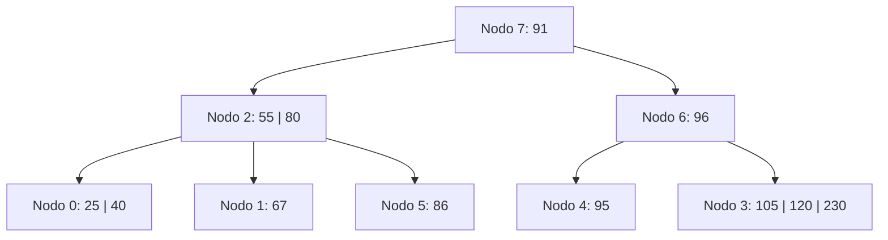

**Paso 4 — Eliminar 105**: la clave 105 está en el Nodo 3 `[105, 120, 230]` → `[120, 230]`. No se genera underflow (quedan 2 claves, por encima del mínimo de 1).

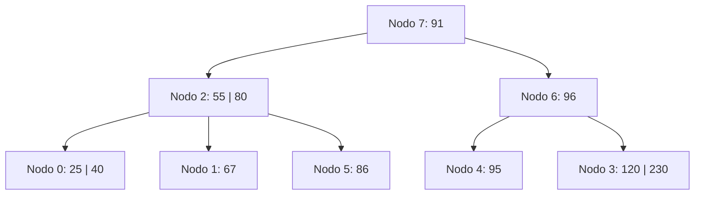

**Paso 5 — Eliminar 86**: el Nodo 5 `[86]` queda **vacío** → underflow.

```mermaid
flowchart TD
    N7["Nodo 7: 91"]
    N2["Nodo 2: 55 | 80"]
    N6["Nodo 6: 96"]
    N0["Nodo 0: 25 | 40"]
    N1["Nodo 1: 67"]
    N5["Nodo 5: (underflow, vacío)"]
    N4["Nodo 4: 95"]
    N3["Nodo 3: 120 | 230"]
    N7 --> N2
    N7 --> N6
    N2 --> N0
    N2 --> N1
    N2 --> N5
    N6 --> N4
    N6 --> N3
```

**-86, no se puede balancear con adyacente** (el Nodo 1 `[67]` tiene el mínimo de 1 clave), **entonces se fusiona el nodo en underflow con su adyacente**: se desarrolla en la diapositiva siguiente.

---

## Diapositiva 27 — Bajas: -86 (fusión), -230, -95

**Resultado del paso 5 (fusión tras eliminar 86)**: se fusionan el Nodo 5 (vacío) con el Nodo 1 `[67]`, bajando la clave separadora 80 del Nodo 2. El nodo fusionado (Nodo 1) queda `[67, 80]`; se libera el Nodo 5; el Nodo 2 pierde la clave 80 y queda `[55]`.

```mermaid
flowchart TD
    N7["Nodo 7: 91"]
    N2["Nodo 2: 55"]
    N6["Nodo 6: 96"]
    N0["Nodo 0: 25 | 40"]
    N1["Nodo 1: 67 | 80"]
    N4["Nodo 4: 95"]
    N3["Nodo 3: 120 | 230"]
    N7 --> N2
    N7 --> N6
    N2 --> N0
    N2 --> N1
    N6 --> N4
    N6 --> N3
```

**Paso 6 — Eliminar 230**: el Nodo 3 `[120, 230]` → `[120]`. No se genera underflow (queda en el mínimo de 1 clave, pero no por debajo).

```mermaid
flowchart TD
    N7["Nodo 7: 91"]
    N2["Nodo 2: 55"]
    N6["Nodo 6: 96"]
    N0["Nodo 0: 25 | 40"]
    N1["Nodo 1: 67 | 80"]
    N4["Nodo 4: 95"]
    N3["Nodo 3: 120"]
    N7 --> N2
    N7 --> N6
    N2 --> N0
    N2 --> N1
    N6 --> N4
    N6 --> N3
```

**Paso 7 — Eliminar 95**: el Nodo 4 `[95]` queda **vacío** → underflow. Se desarrolla en la diapositiva siguiente.

```mermaid
flowchart TD
    N7["Nodo 7: 91"]
    N2["Nodo 2: 55"]
    N6["Nodo 6: 96"]
    N0["Nodo 0: 25 | 40"]
    N1["Nodo 1: 67 | 80"]
    N4["Nodo 4: (underflow, vacío)"]
    N3["Nodo 3: 120"]
    N7 --> N2
    N7 --> N6
    N2 --> N0
    N2 --> N1
    N6 --> N4
    N6 --> N3
```

---

## Diapositiva 28 — Bajas: -95 (fusión y reducción de altura)

**-95, no se puede balancear con adyacente** (el Nodo 3 `[120]` tiene el mínimo de 1 clave), **entonces se fusiona el nodo 4 y el nodo 3**: se desciende la clave separadora 96 del Nodo 6 al nodo fusionado, que queda `[96, 120]`; se libera el Nodo 3.

**Se propaga el underflow al nodo 6**, que queda sin claves. **Como el nodo 6 no puede balancear con adyacente (nodo 2)** —el Nodo 2 `[55]` también tiene el mínimo de 1 clave— **se fusionan y disminuye en 1 la altura del árbol**: se desciende la clave 91 de la raíz (Nodo 7), que queda vacía y se libera; el nodo fusionado pasa a ser la **nueva raíz**, con claves `[55, 91]`.

```mermaid
flowchart TD
    Root["nueva raíz: 55 | 91"]
    N0["25 | 40"]
    N1["67 | 80"]
    N6["96 | 120"]
    Root --> N0
    Root --> N1
    Root --> N6
```

---

## Diapositiva 29 — Ejemplo: Redistribución en nodo interno

Ejemplo independiente que ilustra una **redistribución entre nodos internos** (no entre hojas), a raíz de la eliminación de la clave **-134**.

**Árbol inicial** (orden 4): raíz con clave 116; hijo izquierdo (nodo interno) con claves 35 y 83, cuyos tres hijos hoja son `[13, 22]`, `[39, 40]` y `[89, 96, 101]`; hijo derecho (nodo interno) con clave 160, cuyos dos hijos hoja son `[134]` y `[199]`.

```mermaid
flowchart TD
    Root["116"]
    I1["35 | 83"]
    I2["160"]
    L0["13 | 22"]
    L1["39 | 40"]
    L5["89 | 96 | 101"]
    L4["134"]
    L3["199"]
    Root --> I1
    Root --> I2
    I1 --> L0
    I1 --> L1
    I1 --> L5
    I2 --> L4
    I2 --> L3
```

**Eliminar -134**: la hoja `[134]` queda vacía → underflow. No es posible redistribuir con su hermana `[199]` (tiene el mínimo de 1 clave), por lo que se **fusionan** ambas hojas a través de la clave separadora del nodo interno derecho (160): la hoja fusionada queda `[160, 199]`, y el nodo interno derecho pierde su única clave, quedando vacío → **underflow en un nodo interno**.

Se intenta redistribuir este nodo interno con su hermano izquierdo `[35, 83]`, que sí tiene claves de sobra para ceder: se rota a través de la raíz. La clave de la raíz (116) desciende al nodo interno derecho; la mayor clave del nodo interno izquierdo (83) asciende a la raíz; y el hijo más a la derecha del nodo interno izquierdo (la hoja `[89, 96, 101]`) se traslada para pasar a ser hijo del nodo interno derecho.

**Árbol resultante:**

```mermaid
flowchart TD
    Root["83"]
    I1["35"]
    I2["116"]
    L0["13 | 22"]
    L1["39 | 40"]
    L5["89 | 96 | 101"]
    L34["160 | 199"]
    Root --> I1
    Root --> I2
    I1 --> L0
    I1 --> L1
    I2 --> L5
    I2 --> L34
```

