# Fundamentos de Organización de Datos — Árboles B+

> Conversión de la presentación `8_-_Árboles_B_.pptx` a Markdown. El contenido textual se conserva tal cual figura en las diapositivas originales. Los diagramas de árboles, que en el archivo original se mostraban mediante animaciones superpuestas (varias imágenes apiladas en una misma diapositiva), fueron reconstruidos aquí como una secuencia de diagramas Mermaid independientes, uno por cada estado intermedio del árbol, siguiendo fielmente el algoritmo de inserción/eliminación en árboles B+ de orden 4 descrito en la propia presentación.

---

## Diapositiva 1 — Portada

Fundamentos de Organización de Datos
Árboles B+

---

## Diapositiva 2 — Árboles B+

Constituyen una mejora sobre los árboles B, pues conservan la propiedad de acceso indizado rápido y permiten además un recorrido secuencial rápido.

- **Conjunto índice**: Proporciona acceso indizado a los registros. Todas las claves se encuentran en las hojas, duplicándose en la raíz y nodos interiores aquellas que resulten necesarias para definir los caminos de búsqueda.
- **Conjunto secuencia**: Contiene todos los registros del archivo. Las hojas se vinculan para facilitar el recorrido secuencial rápido. Cuando se lee en orden lógico, lista todos los registros por el orden de la clave.

---

## Diapositiva 3 — Búsqueda B+

La operación de búsqueda en árboles B+ es similar a la operación de búsqueda en árboles B. El proceso es simple, ya que todas las claves se encuentran en las hojas, deberá continuarse con la búsqueda hasta el último nivel del árbol.

---

## Diapositiva 4 — Inserción B+

**Dificultad**: Inserción en nodo lleno (overflow).

El nodo afectado se divide en 2, distribuyéndose las claves lo más equitativamente posible. Una copia de la clave del medio o de la menor de las claves mayores (casos de overflow con cantidad pares de elementos) se promociona al nodo padre. El nodo con overflow se divide a la mitad.

La copia de la clave sólo se realiza en un overflow ocurrido a nivel de hoja.

Caso contrario -> igual tratamiento que en árboles B.

---

## Diapositiva 5 — Bajas en B+

La operación de eliminación en árboles B+ es más simple que en árboles B. Esto ocurre porque las claves a eliminar siempre se encuentran en las páginas hojas. En general deben distinguirse los siguientes casos, dado un árbol B+ de orden M:

Si al eliminar una clave, la cantidad de claves que queda es mayor o igual que [M/2]-1, entonces termina la operación. Las claves de los nodos raíz o internos no se modifican por más que sean una copia de la clave eliminada en las hojas.

---

## Diapositiva 6 — Bajas en B+ (Underflow)

**Underflow**

Si al eliminar una clave, la cantidad de llaves es menor a [M/2]-1, entonces debe realizarse una redistribución de claves, tanto en el índice como en las páginas hojas.

Si la redistribución no es posible, entonces debe realizarse una fusión entre los nodos.

---

## Diapositiva 7 — Políticas para la resolución de underflow

- **Política izquierda**: se intenta redistribuir con el hermano adyacente izquierdo, si no es posible, se fusiona con hermano adyacente izquierdo.
- **Política derecha**: se intenta redistribuir con el hermano adyacente derecho, si no es posible, se fusiona con hermano adyacente derecho.
- **Política izquierda o derecha**: se intenta redistribuir con el hermano adyacente izquierdo, si no es posible, se intenta con el hermano adyacente derecho, si tampoco es posible, se fusiona con hermano adyacente izquierdo.
- **Política derecha o izquierda**: se intenta redistribuir con el hermano adyacente derecho, si no es posible, se intenta con el hermano adyacente izquierdo, si tampoco es posible, se fusiona con hermano adyacente derecho.

---

## Diapositiva 8 — Ejemplo con árbol de orden 4

Claves a insertar (primer lote): **+50, +75, +23**

Como el árbol está vacío, las tres claves se insertan en un único nodo (que es a la vez raíz y hoja), sin que se produzca overflow (orden 4 → máximo 3 claves por nodo).

---

## Diapositiva 9 — Construcción paso a paso (+8, +121, +15, +2)

Continúa la inserción de claves sobre el árbol de la diapositiva anterior. Se muestra cada estado intermedio.

**Paso 1 — Insertar +8**: el nodo `[23, 50, 75]` recibe la clave 8 y queda en `[8, 23, 50, 75]`, lo que produce **overflow** (4 claves > 3 permitidas). Se crea un nuevo nodo, se reparten las claves por mitades y la menor clave de la segunda mitad (50) se promociona —con copia— al nuevo nodo padre (conjunto índice).

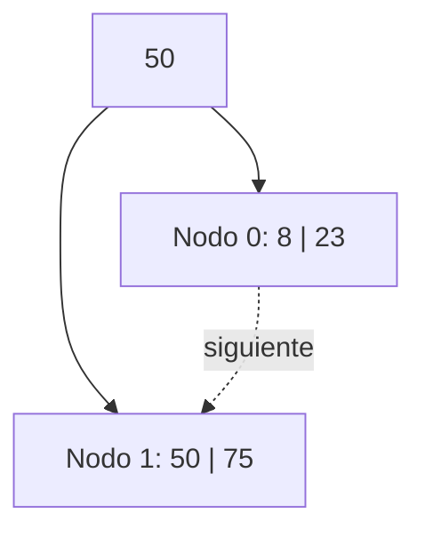

**Paso 2 — Insertar +121**: 121 entra en la hoja derecha sin overflow.

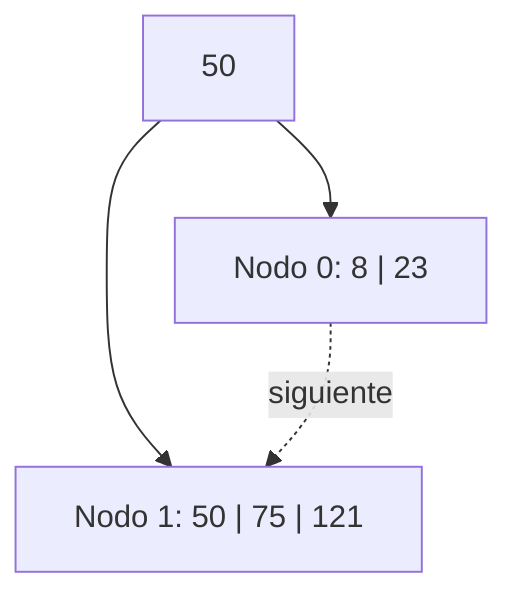

**Paso 3 — Insertar +15**: 15 entra en la hoja izquierda sin overflow. (La clave +2 queda pendiente para la diapositiva siguiente.)

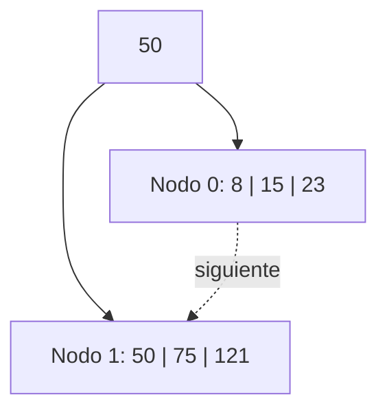

---

## Diapositiva 10 — Continuación (+2, +13, +88)

**Paso 4 — Insertar +2**: el nodo 0 `[8, 15, 23]` recibe 2 y queda `[2, 8, 15, 23]` → overflow. Se crea el Nodo 3, se reparten las claves y se promociona (con copia) la clave 15 al índice.

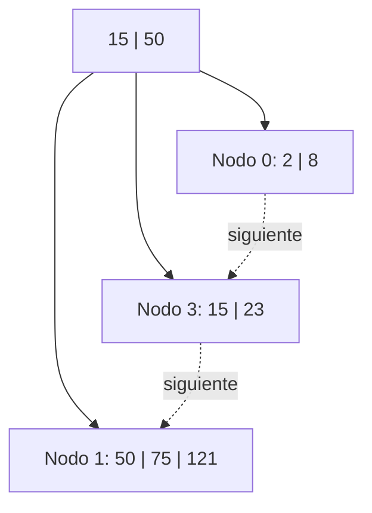

**Paso 5 — Insertar +13**: 13 entra en el Nodo 0 `[2, 8]` → `[2, 8, 13]`, sin overflow. (La clave +88 queda pendiente para la diapositiva siguiente.)

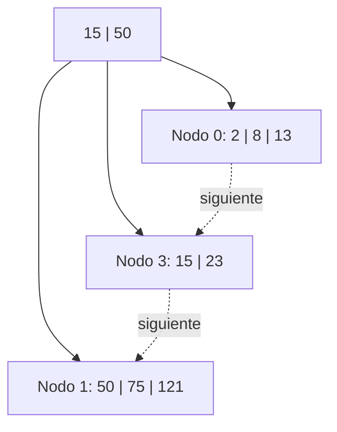

---

## Diapositiva 11 — Continuación (+88, +90, +100)

**Paso 6 — Insertar +88**: el Nodo 1 `[50, 75, 121]` recibe 88 y queda `[50, 75, 88, 121]` → overflow. Se crea el Nodo 4, y se promociona (con copia) la clave 88 al índice, que pasa a tener 3 claves.

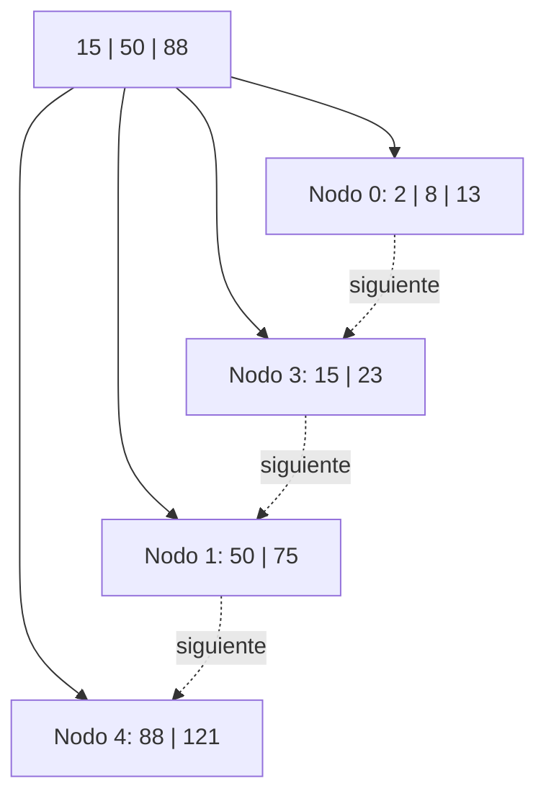

**Paso 7 — Insertar +90**: 90 entra en el Nodo 4 `[88, 121]` → `[88, 90, 121]`, sin overflow.

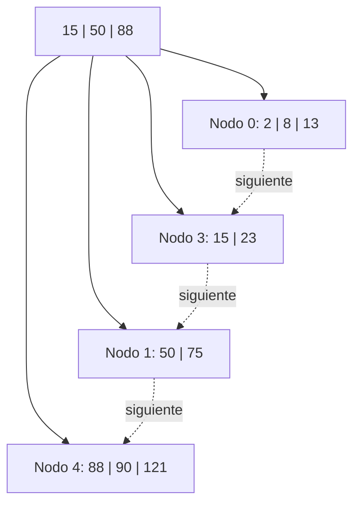

**Paso 8 — Insertar +100**: el Nodo 4 `[88, 90, 121]` recibe 100 y queda `[88, 90, 100, 121]` → overflow. Se crea el Nodo 5 y se promociona la clave 100 al nodo índice, que ya tenía 3 claves (`15, 50, 88`) y por lo tanto **también entra en overflow**: se propaga la división hasta la raíz, se incrementa la altura del árbol y se crea una **nueva raíz**.

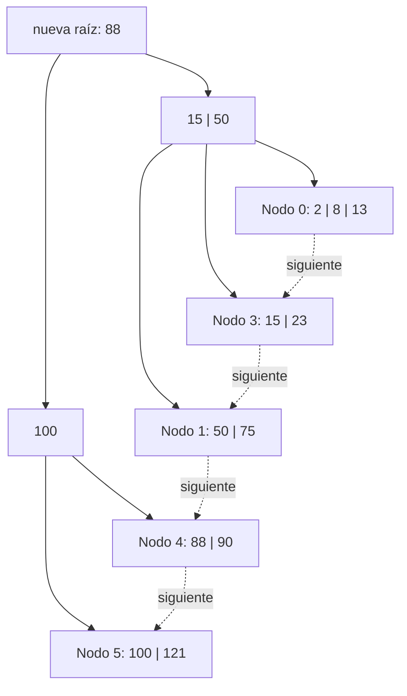

---

## Diapositiva 12 — Bajas: -8, -100, -121, -88

Se parte del árbol obtenido al final de la diapositiva 11.

**Paso 9 — Eliminar -8**: se quita del Nodo 0, que queda `[13]`... en realidad queda `[2, 13]` (2 claves), sin underflow (mínimo [M/2]-1 = 1).

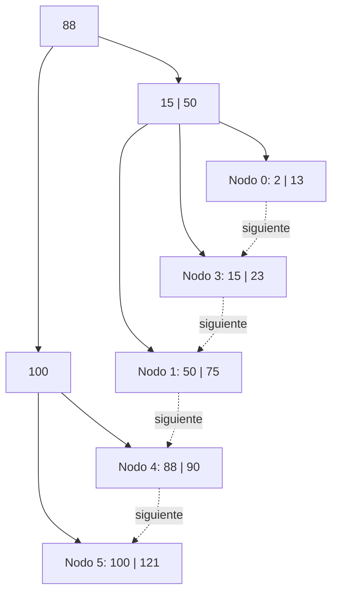

**Paso 10 — Eliminar -100**: se quita del Nodo 5, que queda `[121]` (1 clave, sin underflow). La copia de la clave 100 en el índice **no se modifica** (regla de la diapositiva 5: las claves de nodos internos no cambian aunque sean copia de una clave eliminada en las hojas).

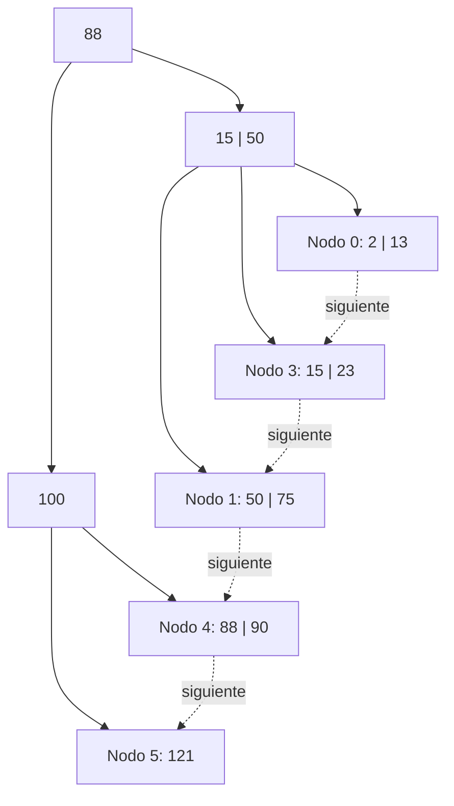

**Paso 11 — Eliminar -121**: el Nodo 5 queda vacío (0 claves) → **underflow**. Se intenta redistribuir con el hermano izquierdo Nodo 4 `[88, 90]`: es posible, por lo que se rebalancea moviendo la clave 90 al Nodo 5 y actualizando la copia en el índice de 100 a 90.

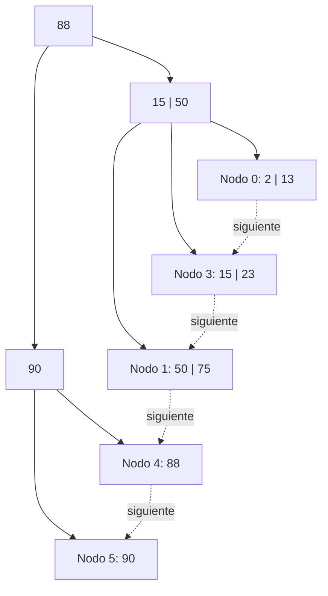

**Paso 12 — Eliminar -88**: el Nodo 4 queda vacío → underflow en nodo 4. **No es posible redistribuir** (el hermano Nodo 5 tiene solo 1 clave, el mínimo). Se **fusionan los nodos 4 y 5**, liberando el Nodo 5. El nodo índice `I2` pierde su única clave → underflow → **se propaga**. Se resuelve mediante **redistribución entre los nodos 2 (=I1), 7 (raíz) y 6 (=I2)**: la clave 50 sube de I1 a la raíz, y la clave 88 (antigua raíz) baja a I2.

> Nota: la presentación original numera estos nodos internamente como Nodo 2, Nodo 6 y Nodo 7; aquí se conservan los mismos rótulos `I1`/`I2`/`Root` usados en los pasos previos para mantener la coherencia visual del diagrama.

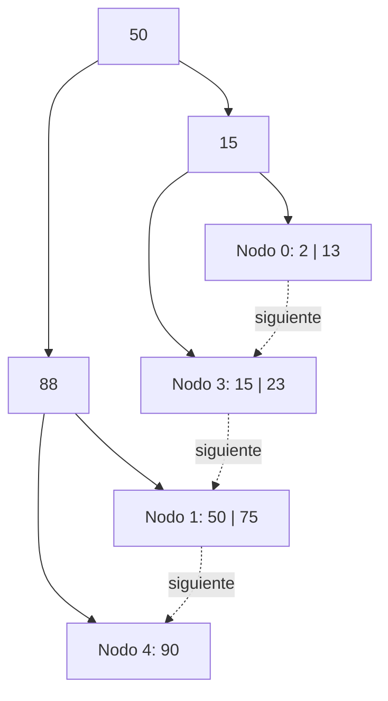

---

## Diapositiva 13 — Bajas: -90, -50

Se parte del árbol final de la diapositiva 12.

**Paso 13 — Eliminar -90**: el Nodo 4 queda vacío → underflow. Se redistribuye con el hermano izquierdo Nodo 1 `[50, 75]`: se mueve la clave 75 al Nodo 4 y se actualiza la copia en el índice de 88 a 75.

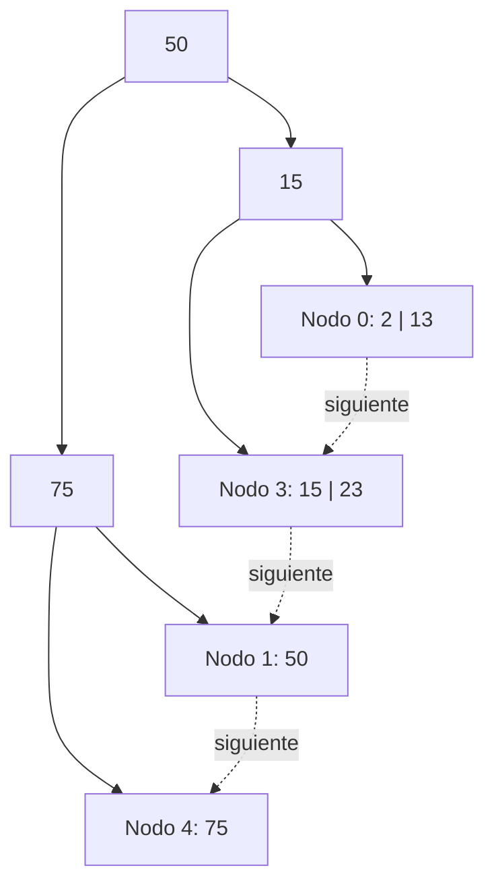

**Paso 14 — Eliminar -50**: el Nodo 1 queda vacío → underflow. **No es posible redistribuir** con el Nodo 4 (tiene solo 1 clave, el mínimo). Se **fusionan los nodos 1 y 4** (queda `[75]`), liberando el Nodo 4. El nodo índice I2 pierde su única clave → underflow → se propaga. **No es posible redistribuir** con I1 (también tiene 1 clave mínima), por lo que se **fusionan los nodos 2 (I1) y 6 (I2)** a través de la raíz, liberando el Nodo 6 (I2) y **decrementando la altura del árbol** al liberarse la raíz (Nodo 7).

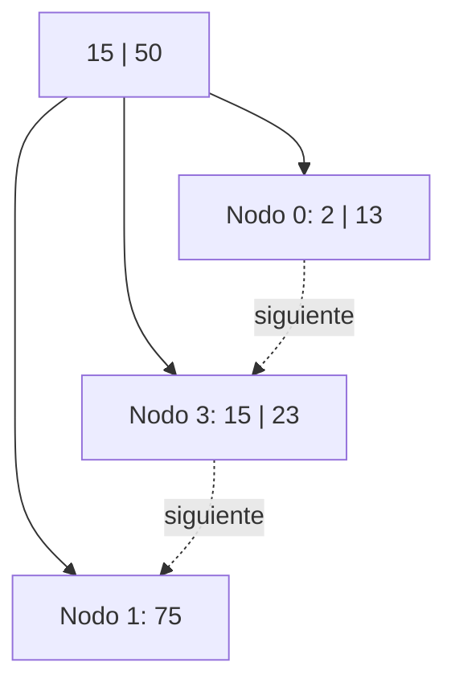

