# Fundamentos de Organización de Datos — Árboles B

---

## ¿Qué son los árboles B y B+?

Los árboles B son árboles multicamino con una construcción especial respecto del resto de los árboles: a diferencia de otras estructuras, **se construyen "al revés"**, es decir, de forma ascendente (desde las hojas hacia la raíz, creciendo hacia arriba en lugar de hacia abajo). Gracias a esa forma de construcción, se mantienen fácilmente balanceados, a un costo relativamente bajo.

---

## Propiedades de un Árbol B de orden M

- Cada nodo del árbol puede contener como máximo **M descendientes directos** (hijos) y, en consecuencia, como máximo **M-1 elementos**.
- La raíz no tiene descendientes directos, o tiene al menos dos.
- Si un nodo tiene **X** descendientes directos, entonces contiene **X-1** elementos.
- Todos los nodos, a excepción de la raíz, tienen un número mínimo de elementos igual a **⌈M/2⌉ - 1**, y como máximo **M-1** elementos.
- Todos los nodos terminales (hojas) se encuentran al mismo nivel. Si algún nodo hoja no está al mismo nivel que el resto, el árbol no está balanceado y no cumple las propiedades fundamentales de un árbol B.
- Dentro de cada nodo los elementos están siempre ordenados (numérica o alfabéticamente, según el tipo de clave). Además, a la izquierda de una clave quedan todos los elementos menores y a la derecha todos los mayores, tanto entre nodos como dentro de un mismo nodo.

---

## Tipo de dato para representar un árbol B

Al programar un árbol B se declara, en principio, el **orden** del árbol como una constante. Luego se declara el **registro** que representa al nodo, compuesto por el arreglo de claves y el arreglo de hijos (punteros, representados como enteros que indican la posición relativa en el archivo). Finalmente, el árbol en sí termina siendo un **archivo de nodos**.

```pascal
const M = … ; {orden del árbol}
type
    TDato = record
      codigo: longint;
      nombre: string[50];
    end;
    TNodo = record
        cant_datos: integer;
        datos: array[1..M-1] of TDato;
        hijos: array[1..M] of integer;
    end;
    arbolB = file of TNodo;
var
        archivoDatos: arbolB;
```

---

## Representación gráfica de un árbol B

Un árbol B de orden 4 con raíz `67`, hijo izquierdo con claves `25 | 40` e hijo derecho con claves `88 | 96 | 105` se vería así:

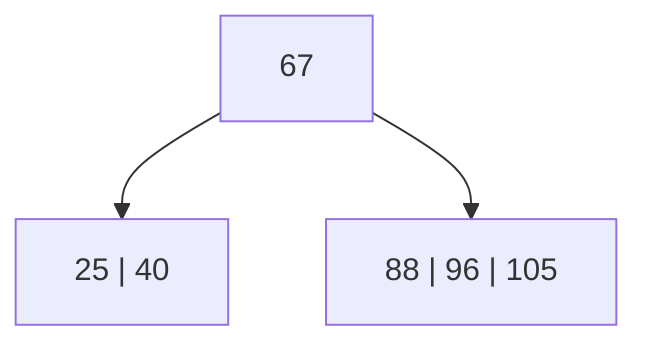

Notar que a la izquierda de la clave 67 (la raíz) quedan todos los elementos menores (25 y 40), y dentro del nodo también están ordenados entre sí (primero 25, luego 40). A la derecha quedan los mayores, también ordenados dentro del nodo.

---

## ¿Para qué usamos los árboles B?

Hay dos alternativas posibles para usar un árbol B como estructura de organización:

- Organizar el **archivo de datos** como un árbol B.
- Organizar un **archivo índice** como árbol B, separado del archivo de datos.

### Alternativa 1: archivo de datos como árbol B

```pascal
const M = … ; {orden del árbol}
type
TDato = record
  codigo: longint;
  nombre: string[50];
end;
    TNodo = record
        cant_datos: integer;
        datos: array[1..M-1] of TDato;
        hijos: array[1..M] of integer;
    end;
    arbolB = file of TNodo;
var
        archivoDatos: arbolB;
```

Ejemplo con las claves `67-Pedro`, `25-María`, `40-Luis` y `96-Franco`:

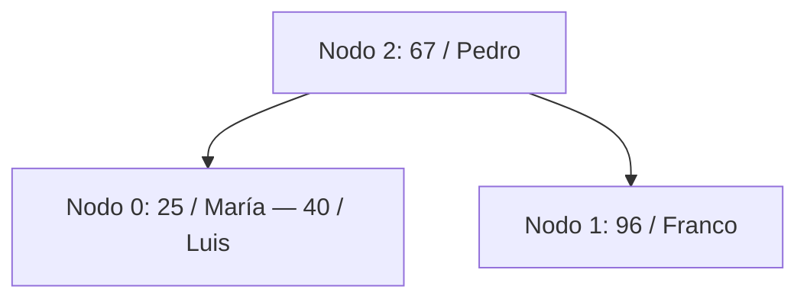

Representación física del archivo (un registro por nodo del árbol):

| NRR | cant_claves (cd) | datos (clave/nombre) | hijos |
|---|---|---|---|
| 0 | 2 | 1: 25/María — 2: 40/Luis | 1: -1, 2: -1, 3: — |
| 1 | 1 | 1: 96/Franco | 1: -1, 2: -1 |
| 2 | 1 | 1: 67/Pedro | 1: 0, 2: 1 |

El problema de esta alternativa es que el archivo de datos completo —incluidos campos largos, como nombres— se reorganiza físicamente cada vez que el árbol se balancea (en cada alta o baja que produzca overflow o underflow), lo cual resulta costoso si los registros son grandes.

### Alternativa 2: archivo índice como árbol B

```pascal
const M = … ; {orden del árbol}
type
TDato = record
  codigo: longint;
  nombre: string[50];
end;
    TNodo = record
        cant_claves: integer;
        claves: array[1..M-1] of longint;
        enlaces: array [1..M-1] of integer;
        hijos: array[1..M] of integer;
    end;
    TArchivoDatos  = file of TDato;
    arbolB = file of TNodo;
var
        archivoDatos: TArchivoDatos;
        archivoIndice: arbolB;
```

A diferencia de la alternativa anterior, aquí el árbol B solo almacena **claves y enlaces** hacia un archivo de datos separado (no ordenado), evitando así reorganizar los registros completos cuando el árbol se balancea.

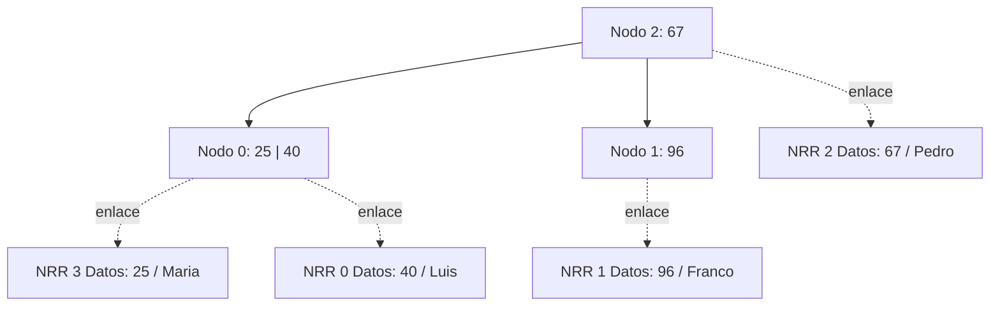

Archivo de datos (no ordenado):

| NRR | Código | Nombre |
|---|---|---|
| 0 | 40 | Luis |
| 1 | 96 | Franco |
| 2 | 25 | Maria |
| 3 | 67 | Pedro |

Archivo índice (árbol B):

| NRR | cant_claves (cc) | claves | enlaces | hijos |
|---|---|---|---|---|
| 0 | 2 | 1: 25, 2: 40 | 1: 2, 2: 0 | 1: -1, 2: -1, 3: — |
| 1 | 1 | 1: 96 | 1: 4 | 1: -1, 2: -1 |
| 2 | 1 | 1: 67 | 1: 3 | 1: 0, 2: 1 |

---

## Altas (inserciones): la regla del overflow

Siempre que se trabaja con un árbol B (o B+), al insertar una clave puede ocurrir una **colisión**: la clave entra ordenada pero el nodo ya no tiene capacidad. A eso se le llama **overflow**, y la forma de resolverlo es siempre la misma, sin importar si se trabaja con árboles B o B+:

1. Se crea un **nuevo nodo**. (Ojo: no siempre hay que crear un nodo desde cero — si existe algún nodo que quedó libre por una baja anterior, se reutiliza ese número de nodo en lugar de crear uno nuevo.)
2. La **primera mitad** de las claves se mantiene en el nodo que tenía overflow.
3. La **segunda mitad** de las claves se traslada al nuevo nodo (o al nodo reutilizado).
4. La **menor de las claves de la segunda mitad** ("la menor de las mayores") se promociona al nodo padre.

Si el nodo que tuvo overflow era la raíz, no existe padre al cual promocionar la clave, así que se crea una **nueva raíz** y, en consecuencia, **aumenta la altura del árbol**. Mientras no se vuelva a llenar algún nodo, el árbol se mantiene en esa altura.

### Una regla fundamental: no renumerar nodos

Cuando se resuelve un overflow, **lo único que debe cambiar entre el estado anterior y el posterior** son: el nodo que tenía el problema, el nodo nuevo (o reutilizado) que se creó, y eventualmente la nueva raíz. **El resto del árbol debe permanecer exactamente igual**, incluyendo la numeración de todos los demás nodos. Si entre un paso y el siguiente cambia algo más —se renumeran nodos, se mueven claves de lugar que no correspondía mover—, hay un error en la resolución.

---

## Construcción paso a paso de un árbol B de orden 4

Se parte de un árbol vacío y se van insertando claves. Con orden 4, cada nodo admite como máximo 3 claves y mínimo 1 (salvo la raíz).

**Insertar 40** → entra sin problemas en el nodo inicial (Nodo 0).

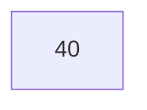

**Insertar 25** → se inserta ordenado.

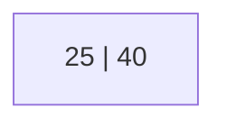

**Insertar 96** → el nodo llega a su capacidad máxima (3 claves) sin overflow.

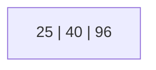

**Insertar 67** → el nodo `[25, 40, 96]` no tiene lugar para una cuarta clave: se produce **overflow** en el Nodo 0. Se crea un nuevo nodo (Nodo 1): la primera mitad `[25, 40]` queda en el Nodo 0, la segunda mitad es `[67, 96]`, de la cual la menor (67) se promociona al padre y el resto `[96]` pasa al Nodo 1. Como el nodo que desbordó era la raíz, se crea una **nueva raíz** (Nodo 2) y aumenta la altura del árbol.

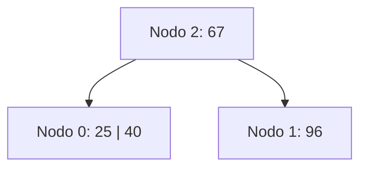

Archivo resultante:

| NRR | cant_claves (cc) | claves | hijos |
|---|---|---|---|
| 0 | 2 | 25, 40 | -1, -1, -1 |
| 1 | 1 | 96 | -1, -1 |
| 2 | 1 | 67 | 0, 1 |

**Insertar 88** → entra sin problemas en el Nodo 1 (mayor que 67).

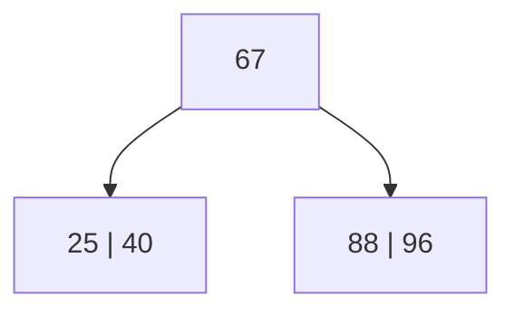

**Insertar 105** → entra también en el Nodo 1.


**Insertar 75** → el Nodo 1 `[88, 96, 105]` recibe 75 y queda `[75, 88, 96, 105]` → **overflow**. Se crea un nuevo nodo (Nodo 3): `[75, 88]` quedan en el Nodo 1, `[105]` pasa al Nodo 3, y la menor de las mayores (96) se promociona al padre.

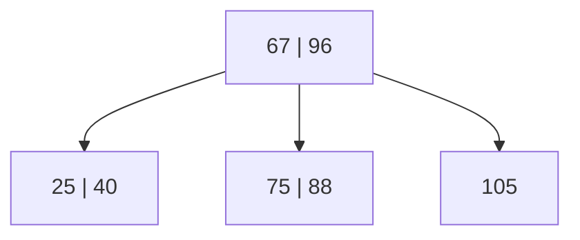

**Insertar 91** → entra sin problemas en el Nodo 1 `[75, 88]` → `[75, 88, 91]`.

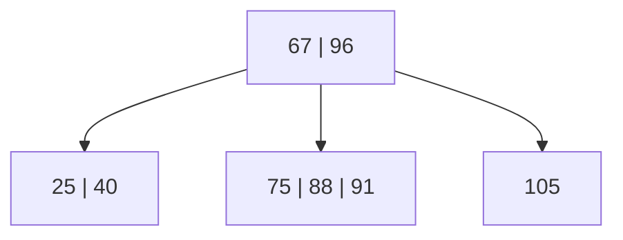

**Insertar 80** → el Nodo 1 `[75, 88, 91]` recibe 80 y queda `[75, 80, 88, 91]` → **overflow**. Se crea el Nodo 4: `[75, 80]` quedan en el Nodo 1, `[91]` pasa al Nodo 4, y se promociona el 88.

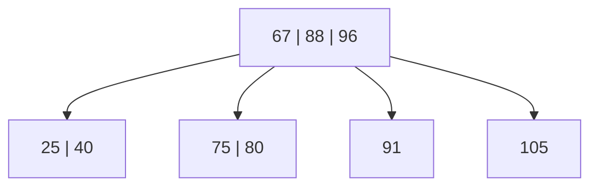

### Lecturas y escrituras: cómo se trabaja realmente con el archivo

Más allá de los dibujos, lo importante en la algorítmica es qué **lecturas (L)** y **escrituras (E)** hay que hacer en el archivo para resolver cada operación. Siempre que se empieza a trabajar con el árbol —ya sea para una búsqueda, una alta o una baja— **la primera lectura es la de la raíz**.

Por ejemplo, para dar de alta la clave 80 sobre el árbol anterior:

- Se lee el Nodo 2 (la raíz).
- 80 es mayor que 67, así que se lee el Nodo 1.
- Se produce overflow: hay que crear el Nodo 4 y reescribir el Nodo 1, el Nodo 4 y el Nodo 2 (la raíz, que recibe la clave promovida).

L/E necesarias: **L2, L1, E1, E4, E2**.

Las escrituras se pueden hacer en cualquier recorrido (in-order, pre-order o post-order), pero **una vez elegido un orden de escritura hay que mantenerlo siempre**: si la primera vez se escribió hijo izquierdo, hijo derecho y luego padre, todas las resoluciones del árbol deben escribirse en ese mismo orden (en este caso, in-order: hijo izquierdo → hijo derecho → padre). Es un algoritmo, no solo un dibujo, así que la consistencia en el recorrido de escritura es indispensable.

### Completando el árbol

Las siguientes inserciones —**86, 120, 230, 95, 55**— entran todas sin generar overflow:

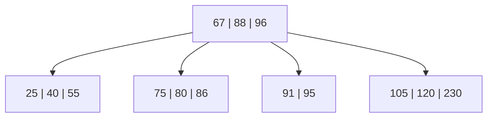

**Insertar 70** → el Nodo 1 `[75, 80, 86]` recibe 70 y queda `[70, 75, 80, 86]` → **overflow**. Se crea el Nodo 5: `[70, 75]` quedan en el Nodo 1, `[86]` pasa al Nodo 5, y se promociona el 80. Pero al subir el 80, la raíz `[67, 88, 96]` queda `[67, 80, 88, 96]` → **overflow también en la raíz**: el overflow se propaga. Se divide nuevamente: `[67, 80]` y `[88, 96]` quedan repartidos, sube la menor de las mayores (88) y se crea una **nueva raíz**, aumentando otra vez la altura del árbol.

> Cuando un overflow se propaga y produce un incremento doble de la altura, conviene resolver el paso en dos partes (primero el nodo hijo, después el padre) para no perderse, aunque el procedimiento es exactamente el mismo en ambos casos: dividir la carga y promocionar la menor de las mayores.

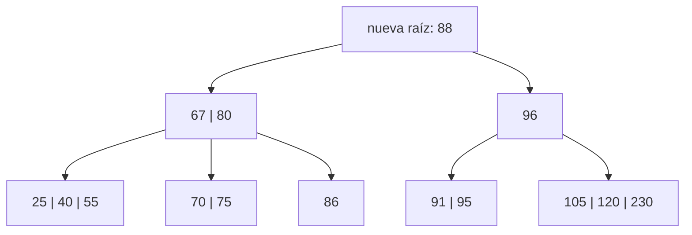

Este es el árbol que queda numerado para la sección de bajas: Nodo 7 (raíz) = 88; Nodo 2 = 67, 80; Nodo 6 = 96; Nodo 0 = 25, 40, 55; Nodo 1 = 70, 75; Nodo 5 = 86; Nodo 4 = 91, 95; Nodo 3 = 105, 120, 230.

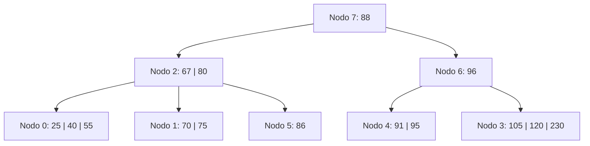

---

## Bajas (eliminaciones): reglas generales

Las bajas en un árbol B **siempre se concretan en un nodo hoja**. Hay dos casos posibles:

1. **La clave a eliminar ya está en una hoja**: se elimina directamente.
2. **La clave a eliminar está en un nodo interno** (incluida la raíz): no se puede eliminar ahí mismo, así que se reemplaza por la **menor clave de su subárbol derecho** (la "menor de las mayores", recorriendo el subárbol derecho hacia la izquierda hasta llegar a la hoja). Esa clave sustituta sube a ocupar el lugar de la eliminada, y la baja efectiva ("física") se realiza sobre la hoja de la que se tomó la clave sustituta.

Una vez realizada la baja en la hoja:

- Si al nodo le quedan al menos tantas claves como el mínimo permitido, se escribe el nodo y la operación termina.
- Si el nodo queda con **menos del mínimo de elementos**, se produce **underflow** y hay que resolverlo.

---

## Underflow: redistribución y fusión

Cuando un nodo queda en underflow, siempre se intenta resolver de la misma manera, en este orden de prioridad:

1. **Redistribuir** con un hermano adyacente: se juntan las claves del nodo en underflow, las del hermano, y la clave separadora del padre, y se vuelven a repartir tratando de dejar ambos nodos lo más equilibrados posible.
2. Si la redistribución **no es posible** (porque el hermano adyacente también está en el mínimo y, al juntar y repartir, alguno de los dos volvería a quedar en underflow), entonces se **fusiona**: se juntan las claves del nodo, las del hermano y la clave separadora del padre en un único nodo, y se libera el otro.

La fusión, al quitarle una clave al nodo padre, puede a su vez dejarlo en underflow — en ese caso, el underflow se resuelve en el padre de la misma manera (redistribución si es posible, fusión si no), y así sucesivamente puede propagarse hasta la raíz. Si la fusión llega a involucrar a la raíz y esta queda vacía, se libera y el nodo fusionado pasa a ser la nueva raíz, con lo cual **disminuye la altura del árbol** (de manera simétrica a como el overflow la incrementaba).

### Políticas para la resolución de underflow

- **Política izquierda**: se intenta redistribuir con el hermano adyacente izquierdo; si no es posible, se fusiona con el hermano adyacente izquierdo.
- **Política derecha**: se intenta redistribuir con el hermano adyacente derecho; si no es posible, se fusiona con el hermano adyacente derecho.
- **Política izquierda o derecha**: se intenta redistribuir primero con el izquierdo; si no es posible, se intenta con el derecho; si tampoco es posible, se fusiona con el hermano adyacente izquierdo.
- **Política derecha o izquierda**: se intenta redistribuir primero con el derecho; si no es posible, se intenta con el izquierdo; si tampoco es posible, se fusiona con el hermano adyacente derecho.

### Casos especiales

Si el nodo en underflow está en un extremo del árbol y no tiene el hermano que la política indicaría como primera opción (por ejemplo, política derecha en el nodo más a la derecha de su nivel, o política izquierda en el más a la izquierda), entonces se trabaja directamente con el único hermano adyacente disponible.

### Una aclaración importante: "hermanos" no es lo mismo que "nodos del mismo nivel"

Dos nodos son **hermanos adyacentes** únicamente cuando comparten exactamente el **mismo padre inmediato**. Es un error común confundir esto: dos nodos pueden estar en el mismo nivel del árbol y compartir un antecesor común (un "abuelo"), pero si ese antecesor no es el padre directo de ambos, **no son hermanos** y no se puede redistribuir o fusionar entre ellos. Si un nodo tiene underflow, solo se puede trabajar con los hermanos que comparten su mismo padre inmediato — si solo tiene un hermano disponible, se trabaja con ese, independientemente de la política configurada.

---

## Ejemplos de bajas paso a paso

Se parte del árbol final de la construcción (Nodo 7 = 88 como raíz).

**Eliminar 75** → la clave está en una hoja (Nodo 1). Se elimina directamente: `[70, 75]` → `[70]`. Como el mínimo es 1 clave por nodo, **no hay underflow**.

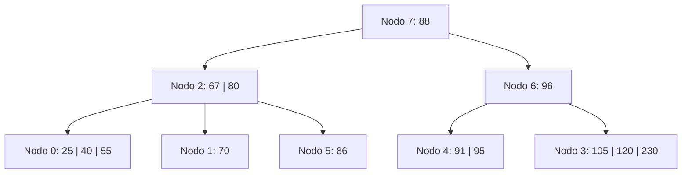

**Eliminar 88** → la clave está en la **raíz** (nodo interno). Se reemplaza por la menor clave de su subárbol derecho: en el Nodo 4 `[91, 95]`, la menor es 91. La raíz pasa a tener la clave 91, y el Nodo 4 queda `[95]`. No hay underflow.

L/E necesarias: **L7, L6, L4, E4, E7**.

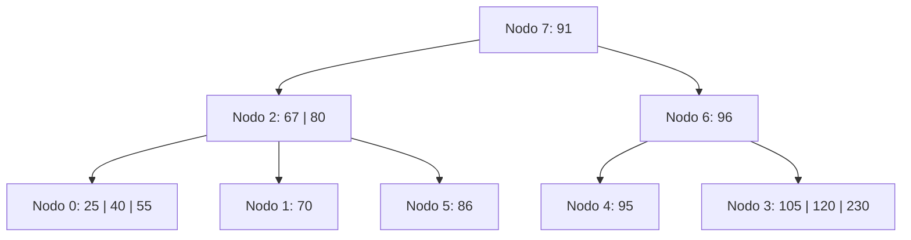

**Eliminar 70** (con política derecha o izquierda) → el Nodo 1 `[70]` queda **vacío** → underflow. Se intenta redistribuir primero con el hermano derecho, el Nodo 5 `[86]`: no es posible, porque tiene el mínimo de claves. Se intenta entonces con el hermano izquierdo, el Nodo 0 `[25, 40, 55]`: sí es posible. Se rota a través del padre: la clave separadora del Nodo 2 (67) baja al Nodo 1, y la mayor clave del Nodo 0 (55) sube al Nodo 2. El Nodo 0 queda `[25, 40]` y el Nodo 1 pasa a contener `[67]`.

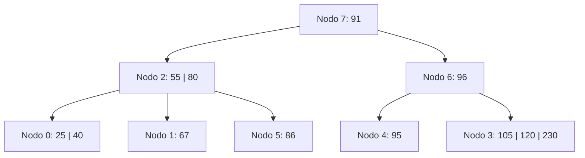

**Eliminar 105** → Nodo 3 `[105, 120, 230]` → `[120, 230]`. No hay underflow (quedan 2 claves, por encima del mínimo de 1).

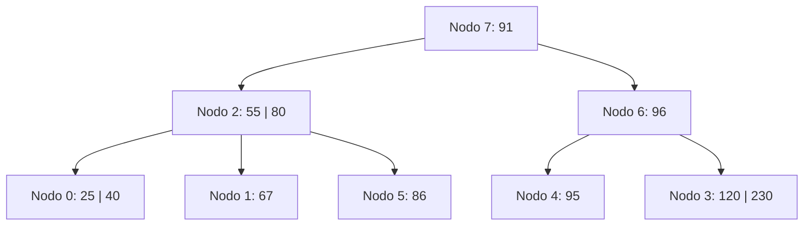

**Eliminar 86** → el Nodo 5 `[86]` queda **vacío** → underflow. No se puede balancear con el hermano adyacente (el Nodo 1 `[67]` también está en el mínimo de 1 clave), así que se **fusiona** el Nodo 5 con el Nodo 1: baja la clave separadora del Nodo 2 (80). El nodo fusionado (Nodo 1) queda `[67, 80]`; se libera el Nodo 5; el Nodo 2 pierde la clave 80 y queda `[55]`.

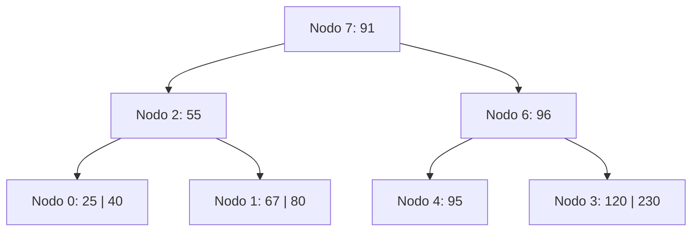

**Eliminar 230** → Nodo 3 `[120, 230]` → `[120]`. No hay underflow (queda exactamente en el mínimo de 1, sin caer por debajo).

```mermaid
flowchart TD
    N7["Nodo 7: 91"]
    N2["Nodo 2: 55"]
    N6["Nodo 6: 96"]
    N0["Nodo 0: 25 | 40"]
    N1["Nodo 1: 67 | 80"]
    N4["Nodo 4: 95"]
    N3["Nodo 3: 120"]
    N7 --> N2
    N7 --> N6
    N2 --> N0
    N2 --> N1
    N6 --> N4
    N6 --> N3
```

**Eliminar 95** → el Nodo 4 `[95]` queda **vacío** → underflow. No se puede balancear con el adyacente (el Nodo 3 `[120]` está en el mínimo), así que se **fusionan** el Nodo 4 y el Nodo 3: baja la clave separadora del Nodo 6 (96). El nodo fusionado queda `[96, 120]`; se libera el Nodo 3.

Esa fusión deja al **Nodo 6 sin claves**: el underflow se **propaga al padre**. El Nodo 6 tampoco puede balancear con su adyacente (el Nodo 2 `[55]` también está en el mínimo), así que se **fusionan**, bajando la clave de la raíz (91). La raíz queda vacía y se libera; el nodo fusionado pasa a ser la **nueva raíz**, con lo cual **disminuye en 1 la altura del árbol** — exactamente de forma simétrica a como el overflow la había aumentado.

```mermaid
flowchart TD
    Root["nueva raíz: 55 | 91"]
    N0["25 | 40"]
    N1["67 | 80"]
    N6["96 | 120"]
    Root --> N0
    Root --> N1
    Root --> N6
```

Este último ejemplo combina los dos fenómenos típicos del underflow encadenado: una primera fusión a nivel de hoja que se propaga como underflow al nodo padre, y una segunda fusión que termina reduciendo la altura del árbol.

---

## Ejemplo: redistribución en un nodo interno

Hasta acá se vieron casos de underflow resuelto con redistribución en hojas, y casos de underflow resuelto con fusión (tanto en hojas como propagado a nodos internos). Falta el caso de **underflow en un nodo interno que sí puede resolverse por redistribución**.

**Árbol inicial** (orden 4): raíz con clave 116; hijo izquierdo (nodo interno) con claves 35 y 83, cuyos tres hijos hoja son `[13, 22]`, `[39, 40]` y `[89, 96, 101]`; hijo derecho (nodo interno) con clave 160, cuyos dos hijos hoja son `[134]` y `[199]`.

```mermaid
flowchart TD
    Root["116"]
    I1["35 | 83"]
    I2["160"]
    L0["13 | 22"]
    L1["39 | 40"]
    L5["89 | 96 | 101"]
    L4["134"]
    L3["199"]
    Root --> I1
    Root --> I2
    I1 --> L0
    I1 --> L1
    I1 --> L5
    I2 --> L4
    I2 --> L3
```

**Eliminar 134** → la hoja `[134]` queda vacía → underflow. No es posible redistribuir con su única hermana `[199]` (también está en el mínimo de 1 clave), así que se **fusionan** ambas hojas a través de la clave separadora del nodo interno derecho (160): la hoja fusionada queda `[160, 199]`, y el nodo interno derecho pierde su única clave, quedando vacío → **underflow, pero ahora en un nodo interno**.

Para resolver el underflow del nodo interno se intenta primero redistribuir con su hermano izquierdo `[35, 83]`, que sí tiene claves de sobra para ceder. Se rota a través de la raíz: la clave de la raíz (116) desciende al nodo interno derecho; la mayor clave del nodo interno izquierdo (83) asciende a la raíz; y el hijo más a la derecha del nodo interno izquierdo (la hoja `[89, 96, 101]`) se traslada para pasar a ser hijo del nodo interno derecho.

**Árbol resultante:**

```mermaid
flowchart TD
    Root["83"]
    I1["35"]
    I2["116"]
    L0["13 | 22"]
    L1["39 | 40"]
    L5["89 | 96 | 101"]
    L34["160 | 199"]
    Root --> I1
    Root --> I2
    I1 --> L0
    I1 --> L1
    I2 --> L5
    I2 --> L34
```

Este caso demuestra que el procedimiento general de underflow (intentar redistribuir, y solo fusionar si no es posible) se aplica exactamente igual sea cual sea el nivel del árbol en el que ocurra: hoja o nodo interno.

---

## Resumen / reglas de oro

- **No renumerar nodos**: salvo el nodo nuevo creado (o el reutilizado) y, eventualmente, una nueva raíz, el resto del árbol debe permanecer idéntico entre un paso y el siguiente.
- **Overflow**: siempre se resuelve igual — se crea (o reutiliza) un nodo, se divide la carga en dos mitades y se promociona al padre la menor de las claves de la segunda mitad. Si el nodo desbordado era la raíz, aumenta la altura del árbol.
- **Underflow**: siempre se resuelve igual — primero se intenta redistribuir según la política vigente (izquierda, derecha, izquierda-o-derecha, derecha-o-izquierda); si no es posible, se fusiona con el hermano adyacente correspondiente. Si la fusión vacía al padre y este era la raíz, disminuye la altura del árbol.
- **Hermano adyacente** significa, estrictamente, compartir el mismo padre inmediato — no alcanza con estar en el mismo nivel del árbol.
- Las bajas siempre se concretan en una hoja: si la clave a eliminar está en un nodo interno, se reemplaza por la menor clave de su subárbol derecho y la eliminación física ocurre en esa hoja.
- Las escrituras del archivo pueden hacerse en cualquier recorrido (in-order, pre-order, post-order), pero una vez elegido un orden hay que mantenerlo siempre de forma consistente.

Siguiendo estas reglas alcanza para resolver correctamente cualquier secuencia de altas y bajas sobre un árbol B, incluidos los casos de overflow y underflow dobles (propagados).
