# Fundamentos de Organización de Datos — Árboles B+

---

## ¿Qué son los árboles B+?

Los árboles B+ son una **mejora sobre los árboles B**: conservan la propiedad de acceso indizado rápido (la búsqueda dependiendo de si el valor buscado es mayor o menor avanza por izquierda o por derecha, igual que en B) y además permiten un **recorrido secuencial rápido** de todos los datos ordenados.

Conviene recordar que, en la práctica, los árboles B, B+ y B* no son más que la representación de los **índices de una base de datos** (claves primarias u otros campos de búsqueda). Cuando se necesita obtener una tabla ordenada por algún criterio (por ejemplo, ordenar por DNI), con un árbol B común habría que hacer un recorrido in-order completo del árbol para reconstruir el orden. Con un árbol B+ esto es mucho más simple: alcanza con ubicarse en la clave más a la izquierda del árbol (la menor del subárbol izquierdo, en la hoja) y desde ahí recorrer secuencialmente, porque **todas las hojas están enlazadas entre sí**. Esa es la razón de ser del árbol B+, y tiene dos componentes:

- **Conjunto índice**: proporciona el acceso indizado a los registros. Todas las claves se encuentran en las hojas; se **duplican** en la raíz y en los nodos interiores aquellas claves necesarias para definir los caminos de búsqueda.
- **Conjunto secuencia**: contiene todos los registros del archivo. Las hojas se vinculan entre sí mediante un enlace para facilitar el recorrido secuencial rápido. Al leer en ese orden lógico, se obtienen todos los registros ordenados por clave.

Una idea clave para no perder de vista: **nada de lo que está en los niveles intermedios o en la raíz de un árbol B+ es un dato válido**. Son simplemente señaladores (o "flags") de búsqueda que indican el camino a seguir; los únicos datos verdaderos están en las hojas.

---

## Búsqueda en B+

La búsqueda en un árbol B+ es casi idéntica a la búsqueda en un árbol B, con una diferencia importante: como los datos válidos están únicamente en las hojas, la búsqueda **siempre empieza en la raíz pero debe llegar hasta el último nivel (las hojas)** para determinar si el elemento está o no está presente — nunca puede "encontrarse" en un nodo intermedio, porque ahí solo hay señaladores.

---

## Inserción en B+

La inserción en un árbol B+ es, en su mecánica general, **igual a la del árbol B**: se busca la hoja donde corresponde insertar la clave.

- Si no hay overflow, se inserta y termina la operación.
- Si hay overflow, se procede igual que en árbol B: se crea (o reutiliza) un nuevo nodo, se divide la carga lo más equitativamente posible, y se promociona al padre una clave que sirva de señalador de búsqueda.

### La regla de la copia

La diferencia central respecto del árbol B está en **qué se promociona al padre**:

- Si el overflow se produce **con una cantidad impar de elementos** (por ejemplo, 5), existe una clave del medio: esa clave del medio se **copia** hacia el padre, y el nodo queda dividido en dos partes (en el ejemplo, 2 elementos a la izquierda y 3 a la derecha contando la del medio repetida).
- Si el overflow se produce **con una cantidad par de elementos** (por ejemplo, 4), no hay clave del medio exacta: se **copia** la menor de las claves mayores (la más a la izquierda del nuevo nodo/subárbol derecho), y el nodo queda dividido en dos mitades iguales.

**Punto fundamental: la copia de la clave solo se realiza cuando el overflow ocurre a nivel de hoja.** Si ese overflow se propaga hacia arriba (porque el nodo padre o la raíz ya estaban al máximo), la resolución en los **niveles internos se hace exactamente igual que en árbol B**: no se copia nada, simplemente se divide la carga del nodo interno y se promociona la clave correspondiente (sin duplicarla). Copiar también a nivel de nodos internos es un error: produciría una clave "extra" sin el hijo correspondiente, dejando el árbol mal formado.

---

## Bajas en B+

La eliminación en árboles B+ es **más simple** que en árboles B, justamente porque las claves a eliminar siempre se encuentran en las hojas — no existe el caso de "clave en nodo interno" que obligaba, en árbol B, a reemplazarla por la menor del subárbol derecho. Si el dato a eliminar existe en el árbol, va a estar sí o sí en una hoja:

- Se desciende hasta la hoja correspondiente.
- Si no se encuentra ahí el elemento, se informa que no existe y no se realiza la baja.
- Si se encuentra, se realiza la baja.

Dado un árbol B+ de orden M: si al eliminar la clave la cantidad de claves que queda en la hoja es **mayor o igual** a ⌈M/2⌉-1, la operación termina ahí. **Las claves de los nodos raíz o internos no se modifican**, aun cuando sean copia de la clave recién eliminada en la hoja — el señalador sigue sirviendo a los fines de la búsqueda mientras continúe indicando correctamente el camino, y solo se elimina si deja de ser útil para ese propósito (por ejemplo, como consecuencia de una fusión posterior).

### Underflow en B+

Si al eliminar una clave la cantidad de claves del nodo queda **por debajo** del mínimo (⌈M/2⌉-1), se produce **underflow**, y debe resolverse exactamente con la misma lógica que en árbol B:

1. Se intenta primero una **redistribución** (balanceo de cargas) con el o los hermanos adyacentes que indique la política vigente.
2. Si la redistribución no es posible porque el o los hermanos también están en el mínimo, se realiza una **fusión** entre los nodos.

**Cuidado especial al redistribuir en B+**: como en los nodos internos las claves son solo señaladores (no datos válidos), al balancear cargas **no hay que "bajar" la clave del padre como si fuera un dato**; hay que tomar la clave correspondiente del nodo hoja con el que se redistribuye y, recién entonces, actualizar (o reemplazar) el señalador del padre con el valor que corresponda como nuevo límite de búsqueda. Si por error se baja el señalador del padre como si fuera un dato válido de la hoja, se está "inventando" una clave que en realidad nunca existió como tal en los datos.

### Políticas para la resolución de underflow

Son las mismas políticas que en árbol B, y se aplican igual tanto en hojas como en nodos internos:

- **Política izquierda**: se intenta redistribuir con el hermano adyacente izquierdo; si no es posible, se fusiona con el hermano adyacente izquierdo.
- **Política derecha**: se intenta redistribuir con el hermano adyacente derecho; si no es posible, se fusiona con el hermano adyacente derecho.
- **Política izquierda o derecha**: se intenta redistribuir primero con el izquierdo; si no es posible, se intenta con el derecho; si tampoco es posible, se fusiona con el hermano adyacente izquierdo.
- **Política derecha o izquierda**: se intenta redistribuir primero con el derecho; si no es posible, se intenta con el izquierdo; si tampoco es posible, se fusiona con el hermano adyacente derecho.

Y, al igual que en B, si el nodo en underflow está en un extremo del árbol y no tiene el hermano que la política indicaría en primer lugar, se trabaja directamente con el único hermano adyacente disponible, sin importar la política configurada.

> **No olvidar nunca los enlaces entre hojas.** Mantener la secuencialidad entre nodos hoja (el "conjunto secuencia") es una de las propiedades definitorias del árbol B+. Si al hacer una alta, una baja, una división o una fusión se pierde algún enlace entre hojas, el árbol deja de ser un árbol B+ válido — es un error conceptual grave, no un simple detalle de implementación.

---

## Ejemplo de construcción de un árbol B+ de orden 4

Con orden 4, cada nodo admite como máximo 3 claves.

**Insertar 50, 75, 23**: como el árbol está vacío, las tres claves entran ordenadas en un único nodo (que es a la vez raíz y hoja), sin overflow.

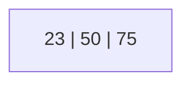

**Insertar 8**: el nodo `[23, 50, 75]` recibe 8 y queda `[8, 23, 50, 75]` → **overflow** (4 claves, máximo permitido 3). Se crea un nuevo nodo: `[8, 23]` quedan en el Nodo 0, `[50, 75]` pasan al Nodo 1, y se promociona **una copia** de la menor clave de la segunda mitad (50) al nuevo nodo padre, que pasa a formar parte del conjunto índice. Como hay 4 claves (cantidad par), se copia la menor de las mayores, no hay clave de "medio" exacta.

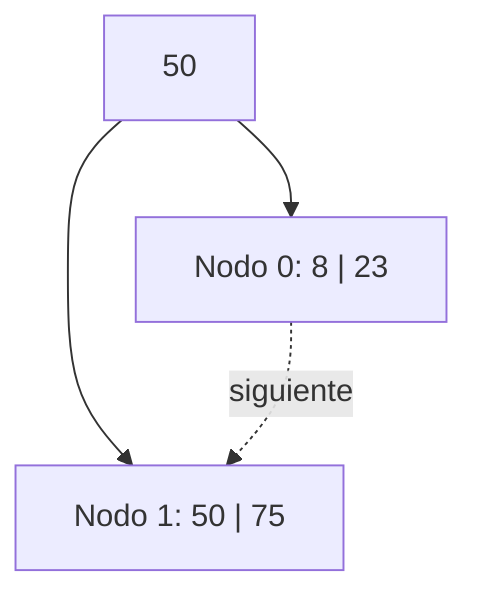

**Insertar 121**: entra en la hoja derecha (Nodo 1) sin overflow.

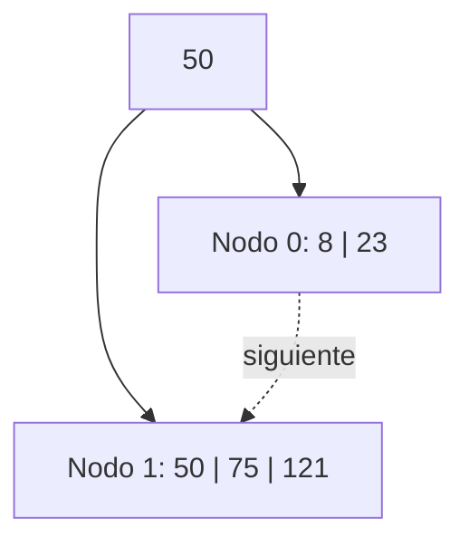

**Insertar 15**: entra en la hoja izquierda (Nodo 0) sin overflow.

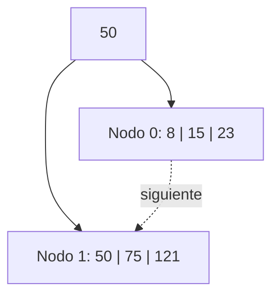

**Insertar 2**: el Nodo 0 `[8, 15, 23]` recibe 2 y queda `[2, 8, 15, 23]` → **overflow**. Se crea el Nodo 3: `[2, 8]` quedan en el Nodo 0, `[15, 23]` pasan al Nodo 3, y se copia la clave 15 hacia el índice.

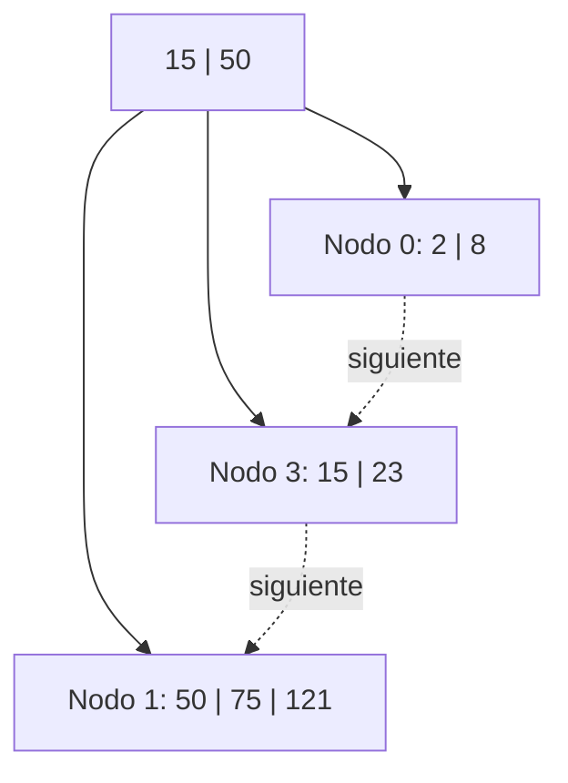

**Insertar 13**: entra en el Nodo 0 `[2, 8]` → `[2, 8, 13]`, sin overflow.

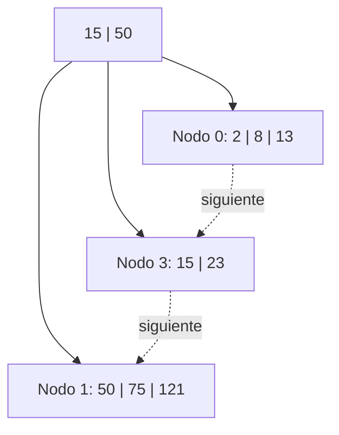

**Insertar 88**: el Nodo 1 `[50, 75, 121]` recibe 88 y queda `[50, 75, 88, 121]` → **overflow**. Se crea el Nodo 4: `[50, 75]` quedan en el Nodo 1, `[88, 121]` pasan al Nodo 4, y se copia el 88 hacia el índice, que pasa a tener 3 claves (`15, 50, 88`).

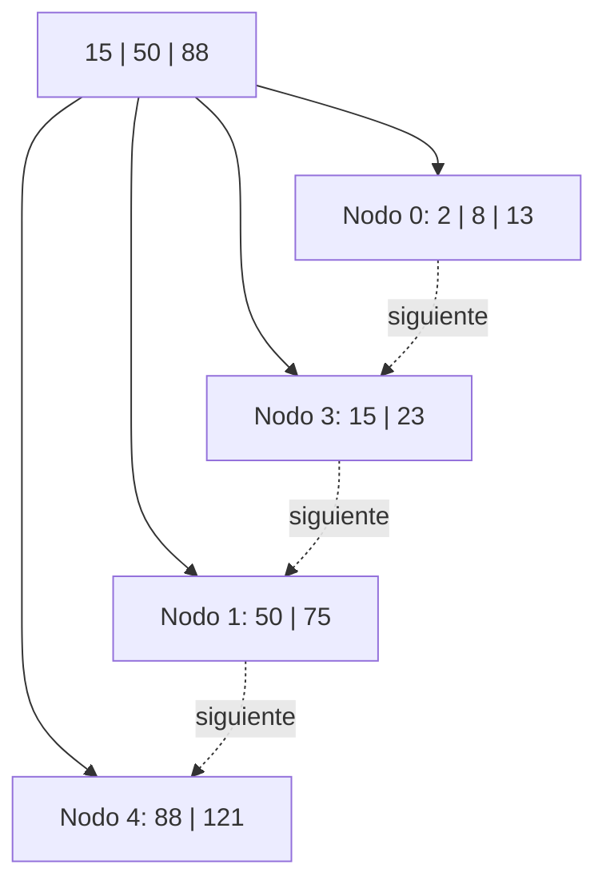

**Insertar 90**: entra en el Nodo 4 `[88, 121]` → `[88, 90, 121]`, sin overflow.

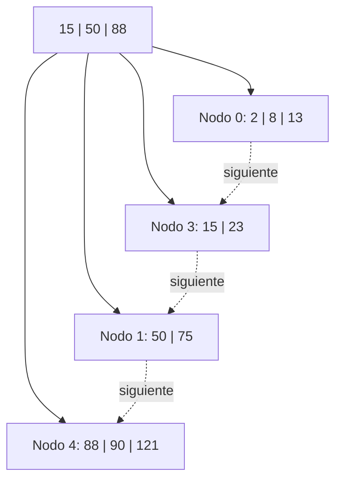

**Insertar 100**: el Nodo 4 `[88, 90, 121]` recibe 100 y queda `[88, 90, 100, 121]` → **overflow**. Se crea el Nodo 5: `[88, 90]` quedan en el Nodo 4, `[100, 121]` pasan al Nodo 5, y se intenta copiar el 100 hacia el nodo índice (raíz), que ya tenía 3 claves (`15, 50, 88`) → **también entra en overflow**. Como este segundo overflow ocurre a **nivel interno**, ya **no se copia nada**: se trata igual que en árbol B, dividiendo la carga del nodo índice. De las cuatro claves `15, 50, 88, 100`, las dos primeras (`15, 50`) quedan en un nodo, la tercera (`88`) se promociona —sin copiar, esta vez sí sube definitivamente— a una nueva raíz, y la cuarta (`100`) queda en el otro nodo. Se crea una **nueva raíz** y aumenta la altura del árbol.

> Notar el patrón: la clave que asciende al dividir un nodo interno es siempre la que queda "tercera" contando de izquierda a derecha entre las claves que se estaban repartiendo — el mismo criterio de "promocionar la menor de las mayores" que en árbol B, solo que aquí ya no se duplica.

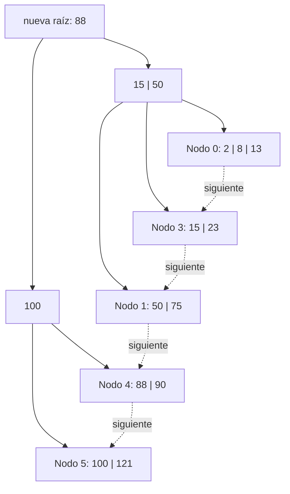

---

## Ejemplos de bajas paso a paso

Se parte del árbol resultante de la construcción anterior.

**Eliminar 8**: se quita del Nodo 0, que queda `[2, 13]` (2 claves). No hay underflow (mínimo ⌈4/2⌉-1 = 1).

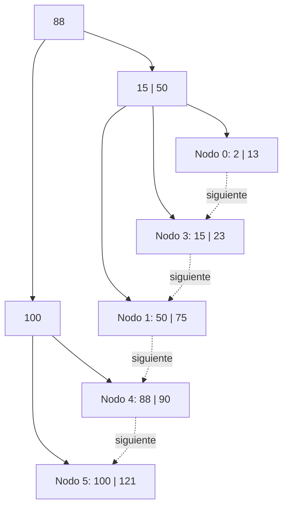

**Eliminar 100**: se quita del Nodo 5, que queda `[121]` (1 clave, sin underflow). La copia de la clave 100 que figura en el índice **no se toca** — sigue sirviendo correctamente como señalador para encaminar las búsquedas, aunque ya no exista como dato real en ninguna hoja.

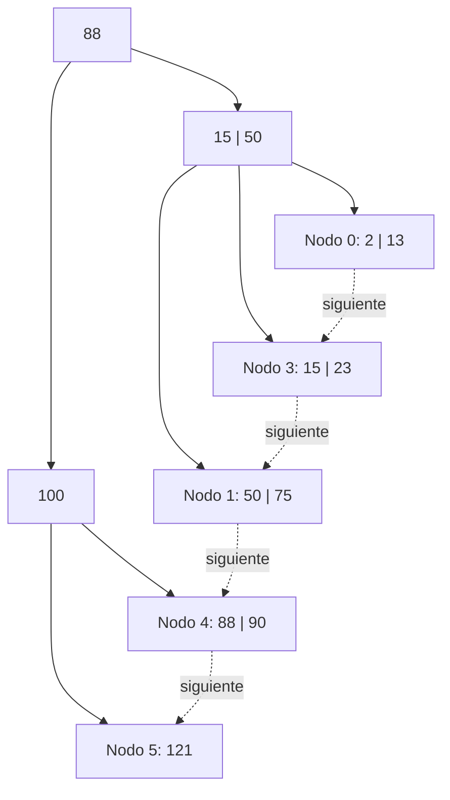

**Eliminar 121**: el Nodo 5 queda **vacío** → underflow. Como es el nodo más a la derecha del árbol, no importa la política configurada: se hace el balanceo de cargas con el único hermano disponible, el Nodo 4 `[88, 90]`. Al redistribuir hay que tener especial cuidado de **no bajar el señalador 100** como si fuera un dato válido (ya no representa ninguna clave real). El balanceo real se hace entre las claves de hoja: el 88 queda en el Nodo 4 y el 90 pasa al Nodo 5; el señalador del índice se actualiza de 100 a 90, que es ahora el valor correcto para guiar la búsqueda.

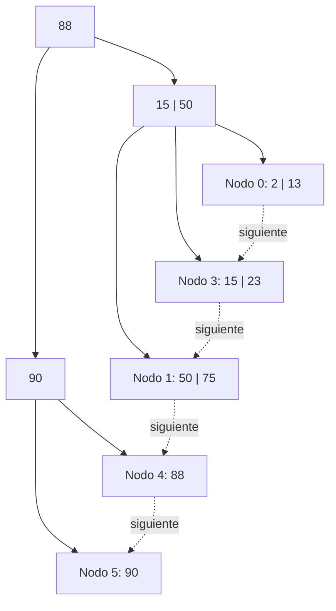

**Eliminar 88**: el Nodo 4 queda **vacío** → underflow. Su único hermano, el Nodo 5 `[90]`, está en el mínimo: no se puede redistribuir. Se **fusionan** los nodos 4 y 5, liberando el Nodo 5. Esto deja al nodo índice `I2` sin claves → **underflow propagado a nivel interno**. Su único hermano interno es `I1` `[15, 50]`, que sí tiene margen: se hace un **balanceo de cargas a nivel medio** entre `I1`, la raíz y `I2`. El subárbol izquierdo (`I1`) queda solo con el 15; la raíz baja su clave (88) hacia `I2`; y el 50 (antigua clave de `I1`) sube a ocupar el lugar de la raíz.

Como consecuencia de este reordenamiento, el nodo que antes era hijo derecho del 50 (el Nodo 1) pasa a ser hijo **izquierdo** del 88, y el nodo fusionado de hojas (resultado de unir 4 y 5) queda como hijo **derecho** del 88.

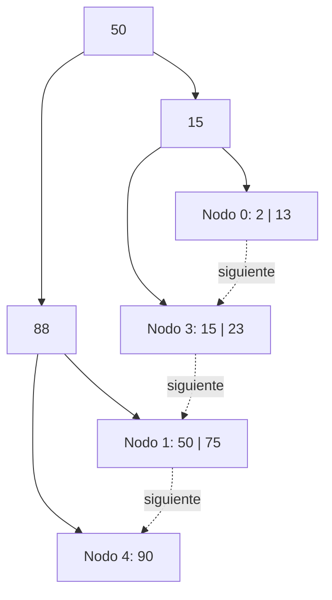

Este caso combina, en un mismo paso, una fusión a nivel de hoja con un balanceo de cargas a nivel interno — al igual que en árbol B, el underflow se resuelve nivel por nivel, intentando siempre primero redistribuir antes de fusionar.

**Eliminar 90**: el Nodo 4 queda **vacío** → underflow. Se puede balancear con el hermano Nodo 1 `[50, 75]` (cuidando, otra vez, de no bajar el 88 como si fuera un dato válido). Tras la redistribución, el Nodo 1 queda con `[50]` y el Nodo 4 con `[75]`, actualizando el señalador correspondiente en el índice a 75.

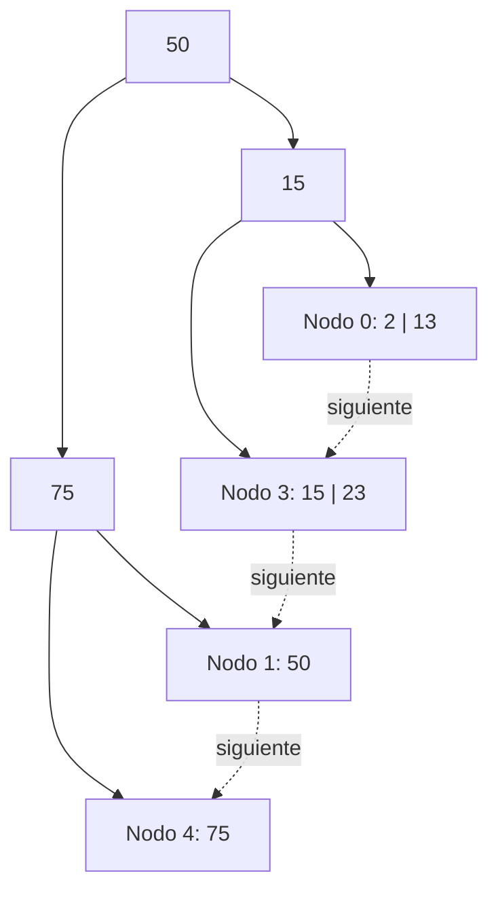

**Eliminar 50**: el Nodo 1 queda **vacío** → underflow. Su único hermano, el Nodo 4 `[75]`, está en el mínimo: no se puede redistribuir. Se **fusionan** el Nodo 1 y el Nodo 4 (queda `[75]`), liberando el Nodo 4. Esto deja a `I2` sin claves → underflow propagado. Su único hermano interno, `I1`, también está en el mínimo (1 clave): tampoco se puede redistribuir, así que se **fusionan** `I1` e `I2` a través de la raíz. La raíz queda vacía y se libera, y como consecuencia **disminuye la altura del árbol**: desaparecen tres nodos en total (el Nodo 4 por la primera fusión de hojas, y `I2` junto con la antigua raíz por la fusión interna), y el árbol queda con un único nivel de índice fusionado como nueva raíz.

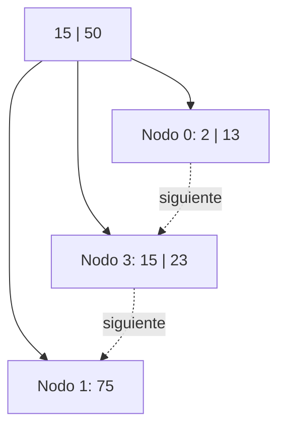

---

## Resumen / reglas de oro de B+

- **Conjunto índice y conjunto secuencia**: las claves válidas están únicamente en las hojas; todo lo que aparece en niveles intermedios y en la raíz son señaladores de búsqueda, eventualmente copias de claves de hojas.
- **Búsqueda**: siempre debe llegar hasta una hoja para confirmar si el elemento existe o no — nunca se resuelve en un nodo intermedio.
- **Inserción / overflow**: igual que en árbol B (dividir y promocionar), pero la promoción **se copia** únicamente cuando el overflow ocurre a nivel de hoja. Si el overflow se propaga a niveles internos, ahí se trata exactamente igual que en árbol B, sin duplicar.
- **Bajas**: siempre ocurren en una hoja, porque ahí están los únicos datos válidos. Las claves de nodos internos no se modifican al eliminar, salvo que dejen de servir como señaladores (por ejemplo, tras una fusión).
- **Underflow**: misma lógica que en árbol B —primero redistribuir según la política vigente, luego fusionar si no es posible—, pero al redistribuir hay que tener cuidado de no convertir un señalador en un dato válido: hay que tomar el valor real de la hoja correspondiente y actualizar el señalador del padre con ese valor.
- **Enlaces entre hojas**: deben mantenerse siempre actualizados en cada alta, baja, división o fusión. Perder un enlace rompe la propiedad de recorrido secuencial y deja de ser un árbol B+ válido.
- **Reducción de altura**: igual que en árbol B, si una fusión deja vacía a la raíz, esta se libera y el nodo fusionado pasa a ser la nueva raíz, disminuyendo la altura del árbol.
