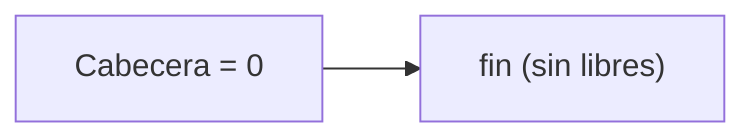
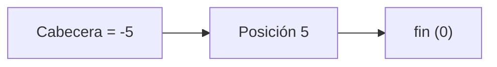
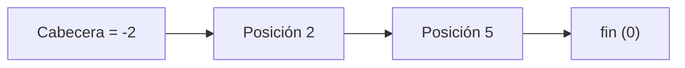
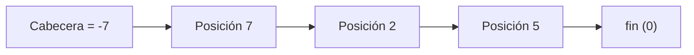

# Archivos: Bajas

## ¿Qué es una baja?

Se denomina proceso de **baja** a aquel que permite quitar información de un archivo: es la eliminación de uno o más elementos del archivo. Por ejemplo, si un archivo tiene 55 elementos y se elimina uno, el archivo debería pasar a tener 54 elementos válidos.

## Modos de baja

El proceso de baja puede llevarse a cabo de dos modos diferentes:

* **Baja física:** consiste en borrar efectivamente la información del archivo, recuperando el espacio físico. El archivo siempre refleja su tamaño real: si tenía 55 elementos y se borra uno, pasa a tener 54.
* **Baja lógica:** consiste en borrar la información del archivo, pero sin recuperar el espacio físico respectivo. La información se "oculta" mediante alguna marca de borrado, de modo que los algoritmos que vuelvan a leer el archivo sepan que ese registro ya no es válido. El espacio en disco sigue ocupado: si de un archivo de 50.000 registros se eliminan lógicamente 10.000, el archivo sigue ocupando el espacio de 50.000.

## Baja Física

Se realiza baja física sobre un archivo cuando un elemento es efectivamente quitado del archivo, decrementando en uno la cantidad de elementos.

* **Ventaja:** en todo momento se administra un archivo de datos que ocupa el lugar mínimo necesario (el tamaño real).
* **Desventaja:** la performance de los algoritmos que implementan esta solución, ya que para mantener el tamaño real es necesario hacer corrimientos o reescrituras, lo que implica muchas operaciones de lectoescritura en disco.

### Técnicas de Baja Física

* **Generar un nuevo archivo con los elementos válidos** (sin copiar los que se desea eliminar). Por ejemplo, en un archivo de calzados, si se quiere eliminar el modelo "Adidas talle 36", se copian al archivo nuevo todos los registros excepto ese.
* **Utilizar el mismo archivo de datos, generando los reacomodamientos que sean necesarios.** Esta técnica solo es aplicable a archivos **sin ordenar**, y solo tiene sentido cuando se trabaja con registros de longitud fija (todos los elementos ocupan exactamente el mismo espacio en disco). Dentro de esta técnica hay dos variantes:
  * Correr todos los registros posteriores al que se quiere eliminar una posición hacia atrás, hasta el fin de archivo. Esto implica muchas escrituras, por lo que solo conviene si se necesita preservar el orden del archivo.
  * **Mover el último registro a la posición que se quiere eliminar y truncar el archivo** en la última posición (es decir, descartar el último registro, dejando el fin de archivo una posición antes). Esto requiere solo una lectoescritura adicional además de la búsqueda del elemento a eliminar, mantiene el tamaño real del archivo y constituye una baja física correcta, siempre que el archivo no esté ordenado (de lo contrario, este movimiento rompería el orden).

### Ejemplo: algoritmo de Baja Física

```pascal
begin {se sabe que existe Carlos Garcia}
    assign (archivo, 'arch_empleados');
    assign (archivo_nuevo, 'arch_nuevo');
    reset (archivo);
    rewrite (archivo_nuevo);
    leer (archivo, reg);
    {se copian los registros previos a Carlos Garcia}
    while (reg.nombre <> 'Carlos Garcia') do begin
        write (archivo_nuevo, reg);
        leer (archivo, reg);
    end;

    {se descarta a Carlos Garcia}
    leer(archivo, reg);
    {se copian los registros restantes}
    while (reg.nombre <> valoralto) do begin
        write(archivo_nuevo, reg);
        leer(archivo, reg);
    end;
    close(archivo_nuevo);
    close(archivo);
{renombrar el archivo original para dejarlo como respaldo}
  rename(archivo,'arch_empleados_old');
{renombrar el archivo temporal con el nombre del original}
  rename(archivo_nuevo, 'arch_empleados');
end.
```

En este ejemplo se aplica la primera técnica (archivo nuevo). Existe la precondición de que Carlos García está garantizado en el archivo, por lo que no hace falta controlar el fin de archivo en el primer `while`. Se leen y copian al archivo nuevo todos los registros anteriores a Carlos García; al encontrarlo, se vuelve a leer (descartándolo, ya que no se escribe en el archivo nuevo) y luego se copian todos los registros restantes hasta el valor centinela. Es importante no olvidar el `close` de ambos archivos, en especial del nuevo, para que las últimas escrituras se bajen a disco.

Como paso adicional —no incluido explícitamente en el código, pero mencionado como alternativa válida— se puede usar `rename` para que el archivo nuevo quede con el nombre del archivo original (renombrando primero el original como respaldo), de modo que los programas que ya usaban ese archivo lo sigan encontrando en la misma ubicación física.

## Baja Lógica

La baja lógica oculta la existencia de uno o varios registros mediante una marca de borrado, sin quitarlos físicamente del archivo.

### Ejemplo: algoritmo de Baja Lógica

```pascal
Begin {se sabe que existe Carlos Garcia}
    assign(archivo, 'arch_empleados');
    reset(archivo);
    leer(archivo, reg);
    {Se avanza hasta Carlos Garcia}
    while (reg.nombre <> 'Carlos Garcia') do
        leer(archivo, reg);
    {Se genera una marca de borrado}
    reg.nombre := '***';
    {Se borra lógicamente a Carlos Garcia}
    seek(archivo, filepos(archivo)-1 );
    write(archivo, reg);
    close(archivo);
end.
```

Se avanza leyendo hasta encontrar a Carlos García (de nuevo, con la precondición de que existe). Al encontrarlo, se le asigna al campo `nombre` la marca de borrado (`'***'`). Como la lectura ya avanzó el puntero una posición, antes de escribir es necesario retroceder con `seek(archivo, filepos(archivo)-1)`, y recién ahí grabar el registro modificado. De ahí en más, cualquier algoritmo que recorra el archivo debe incorporar la lógica de considerar inválido a todo registro cuyo nombre sea `'***'`.

La ventaja de la baja física es tener siempre el espacio real ocupado; la desventaja es la performance. La baja lógica invierte esa relación: es más rápida, pero deja espacio "desperdiciado" en disco por los registros marcados. Dado que hoy es común contar con discos de gran capacidad, esa desventaja de espacio suele ser menos relevante, pero conviene recuperar ese espacio periódicamente.

## Técnicas de recuperación de espacio

* **Recuperación de espacio por compactación:** se utiliza el proceso de baja física periódicamente para compactar el archivo, quitando los registros marcados como eliminados (por ejemplo, aquellos cuyo nombre es `'***'`), con cualquiera de los algoritmos vistos para baja física. En la práctica, esto equivale a aplicar baja física tomando como condición de borrado la marca lógica.
* **Reasignación de espacio:** en lugar de compactar, se reutilizan los lugares marcados como eliminados para el ingreso de nuevos elementos al archivo (altas), recuperando el espacio desperdiciado de a poco a medida que se necesitan nuevos registros.

### Ejemplo de reasignación de espacio: marca de eliminado

Archivo de enteros (NRR 0 a 8). Se eliminan, en orden, las claves: **116, 304, 824**.

**Estado inicial**

| NRR | 0 | 1 | 2 | 3 | 4 | 5 | 6 | 7 | 8 |
|---|---|---|---|---|---|---|---|---|---|
| Valor | 156 | 304 | 228 | 98 | 116 | 504 | 824 | 597 | 15 |

**Paso 1 — Eliminar 116 (NRR 4):** se reemplaza el valor por una marca de eliminado.

| NRR | 0 | 1 | 2 | 3 | 4 | 5 | 6 | 7 | 8 |
|---|---|---|---|---|---|---|---|---|---|
| Valor | 156 | 304 | 228 | 98 | `***` | 504 | 824 | 597 | 15 |

**Paso 2 — Eliminar 304 (NRR 1)**

| NRR | 0 | 1 | 2 | 3 | 4 | 5 | 6 | 7 | 8 |
|---|---|---|---|---|---|---|---|---|---|
| Valor | 156 | `***` | 228 | 98 | `***` | 504 | 824 | 597 | 15 |

**Paso 3 — Eliminar 824 (NRR 6)**

| NRR | 0 | 1 | 2 | 3 | 4 | 5 | 6 | 7 | 8 |
|---|---|---|---|---|---|---|---|---|---|
| Valor | 156 | `***` | 228 | 98 | `***` | 504 | `***` | 597 | 15 |

En un archivo de enteros, en lugar de un asterisco como marca conviene usar un valor negativo, ya que el `***` ilustrativo no sería un valor entero válido: como el archivo solo contiene enteros positivos, cualquier valor negativo sirve sin ambigüedad como marca de borrado.

**Desventaja de esta técnica:** los espacios libres quedan dispersos y no hay forma de saber dónde están sin recorrer todo el archivo. Para reutilizar un espacio eliminado al hacer una alta, sería necesario recorrer registro por registro buscando la marca, lo cual es costoso en un archivo con muchos registros. Para resolver esto se usa la técnica de lista invertida, que mantiene encadenados los espacios libres.

### Ejemplo de reasignación de espacio: lista invertida

En lugar de solo marcar el registro como eliminado, los espacios libres se encadenan entre sí mediante punteros negativos, formando una **lista de libres**, de modo que para reutilizar un espacio ya no hace falta recorrer todo el archivo: alcanza con consultar la cabecera.

La posición 0 es un **registro cabecera**, que no contiene un dato real sino que apunta al primer espacio libre disponible (en un archivo de enteros, se reutiliza uno de los campos del registro para guardar ese número relativo de registro; el número relativo de registro —NRR— es la posición de cada elemento dentro del archivo: 0, 1, 2, etc.). Se eliminan, en el mismo orden, las claves: **116, 304, 824**.

**Estado inicial**

| Posición | 0 (Cabecera) | 1 | 2 | 3 | 4 | 5 | 6 | 7 | 8 | 9 |
|---|---|---|---|---|---|---|---|---|---|---|
| Valor | 0 | 156 | 304 | 228 | 98 | 116 | 504 | 824 | 597 | 15 |



**Paso 1 — Eliminar 116 (posición 5):** la cabecera pasa a apuntar a la posición 5 (se guarda `-5`, en negativo para distinguirlo de un valor de dato válido); la posición 5 guarda el valor anterior de la cabecera (0, que actúa como terminador de la lista).

| Posición | 0 (Cabecera) | 1 | 2 | 3 | 4 | 5 | 6 | 7 | 8 | 9 |
|---|---|---|---|---|---|---|---|---|---|---|
| Valor | -5 | 156 | 304 | 228 | 98 | 0 | 504 | 824 | 597 | 15 |



**Paso 2 — Eliminar 304 (posición 2):** la cabecera pasa a -2; la posición 2 guarda el valor anterior de la cabecera (-5), encadenándose con el espacio libre anterior. Es fundamental no perder ese valor anterior: si se sobrescribiera la cabecera con -2 sin antes guardar -5 en la posición 2, se perdería la referencia al espacio libre 5.

| Posición | 0 (Cabecera) | 1 | 2 | 3 | 4 | 5 | 6 | 7 | 8 | 9 |
|---|---|---|---|---|---|---|---|---|---|---|
| Valor | -2 | 156 | -5 | 228 | 98 | 0 | 504 | 824 | 597 | 15 |



**Paso 3 — Eliminar 824 (posición 7):** la cabecera pasa a -7; la posición 7 guarda el valor anterior de la cabecera (-2).

| Posición | 0 (Cabecera) | 1 | 2 | 3 | 4 | 5 | 6 | 7 | 8 | 9 |
|---|---|---|---|---|---|---|---|---|---|---|
| Valor | -7 | 156 | -5 | 228 | 98 | 0 | 504 | -2 | 597 | 15 |



La lista de espacios libres queda, en orden, encadenada como: **Cabecera → Posición 7 → Posición 2 → Posición 5 → fin**. Esta cadena indica el orden en que esos espacios estarán disponibles para ser reutilizados en futuras altas.

### ¿Por qué se recupera en orden LIFO y no FIFO?

El espacio que se reutiliza primero es siempre el último que se eliminó (es decir, el que está apuntado directamente por la cabecera), por una cuestión de eficiencia: para usar el siguiente espacio libre, solo hace falta leer la cabecera y, al reutilizarlo, actualizar la cabecera con el valor que tenía guardado ese registro. Si en cambio se quisiera recuperar en orden FIFO (el primero eliminado, primero reutilizado), sería necesario recorrer toda la cadena de enlaces hasta llegar al final para encontrar el espacio a reutilizar, y luego recorrerla nuevamente para actualizar correctamente los enlaces. El esquema LIFO minimiza la cantidad de lecturas y escrituras necesarias para recuperar y actualizar la lista de libres.

Por ejemplo, partiendo del estado final del ejemplo anterior (cabecera = -7), si se necesita dar de alta un nuevo elemento, se utiliza directamente la posición 7 (la indicada por la cabecera), y la cabecera se actualiza con el valor que tenía guardado ese registro (-2), quedando lista para la siguiente alta sin necesidad de recorrer el resto de la cadena.

> **Para practicar:** a partir del estado final del ejemplo de lista invertida (cabecera = -7), simular el alta de un nuevo elemento (por ejemplo, el valor 300) reutilizando el espacio libre indicado por la cabecera, y repetir el ejercicio con dos altas más, para ver cómo va actualizándose la cabecera y la cadena de libres en cada paso.
